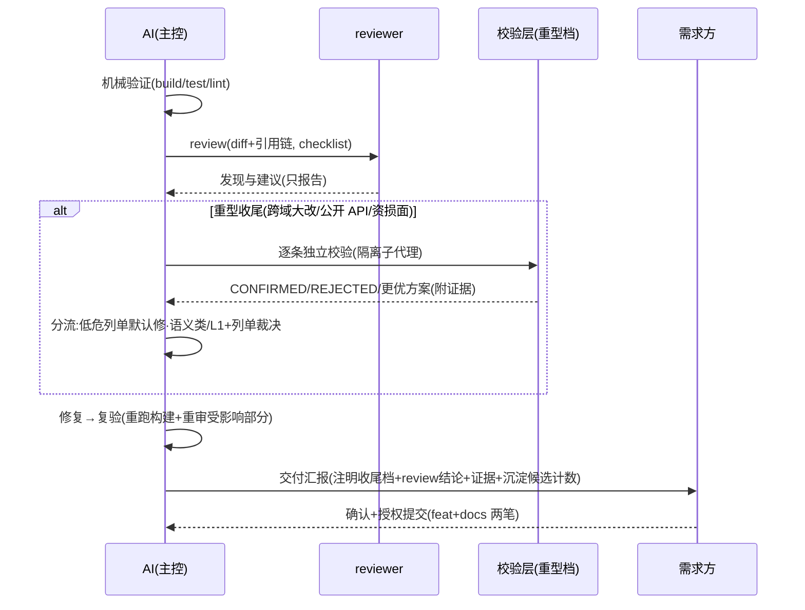

# crules-flutter

面向 **Flutter 工程**的 AI 协作规则 plugin：把「AI 怎么跟你安全地干活」固化成机制——危险命令硬拦、改动先过方案确认、交付必过审查、经验自动沉淀。
独立自持（源自 crules fork，2026-09 起 1.0.0 独立演进，史见 [CHANGELOG](CHANGELOG.md)）；许可 **MIT**（[LICENSE](LICENSE)）。

> 当前状态：1.0.32（版本编年史见 [CHANGELOG](CHANGELOG.md)）

---

## 装完得到什么

| 层 | 你得到 | 你要做的 |
|---|---|---|
| 守护 | hooks 自动生效：破坏性 git/rm 命令硬拦（强推/硬重置等，拦了就请你人工执行）、高危形态（下载执行 / sudo / chmod -R / filter-branch）弹窗由你裁夺、memory 漂移自动记队列、会话收尾提醒补索引 | 无（全自动；高危形态弹窗确认） |
| 分工 | 7 个角色 agent 按职责自动挂载（写 UI → frontend、排障 → error、审查 → reviewer 只报不改…） | 无（自动触发） |
| 规范 | 项目根协作规则（双 Gate 流程 / 证据分级 / 提交纪律）+ Flutter 审查清单 + lint 基线 + 方案骨架 | 接入时必填三处（见下） |
| 沉淀 | 记忆库 8 模板（业务事实 / 技术不变量 / 平台坑库…）+ `/distill` 知识定稿闸 | 日常顺手更新，收尾过闸 |

## 快速开始

```bash
# ① 一次性：装 plugin（git URL 源，user scope，不进任何项目 git）
claude plugin marketplace add https://github.com/BIG-BEARC/crules-flutter.git --scope user
claude plugin install crules-flutter@crules-flutter-market --scope user

# ② 在 Flutter 工程根目录跑（装好 plugin 后任何工程可用；命令带命名空间，裸名不可用）
/crules-flutter:init
```

**init 之后必填三处**（init 会逐处引导）：

1. `CLAUDE.md` §七——技术栈三选一（Riverpod / Bloc / Provider 预设，选定删其余；App 形态另含适配方案与字体策略两选）
2. `CLAUDE.md` §十二——项目附录（项目名 / 构建·分析·测试命令）＋档位预设三选一（默认标准）
3. `.claude/memory/platform-pitfalls.md` 头部——**支持矩阵**（目标平台 + 各端实测版本上限；init 出机械读初稿，人核对补实测）

**装完日常零记忆负担**：agent/skill/hooks 全自动触发；只在交付收尾时走「机械验证 → review → 沉淀」三档化时序（下图，随任务规模裁剪件头），会话结束 Stop hook 会提醒补记忆库索引。

**第一次用？** 15 分钟走一遍最小闭环见 `进阶/上手教程.md`（init 随模板落位到项目根）。

### VSCode 扩展环境（无独立 claude CLI）

上方 `claude plugin marketplace add / install` 需要独立 claude CLI——VSCode 扩展环境（扩展内置 Claude Code、机器无独立 CLI）没有。替代：**用扩展内嵌的 claude 二进制代跑同款命令**（二进制随扩展升级换路径，不写死——在扩展安装目录现查）；装好后一切等价——`/crules-flutter:*` 命令、hooks、`plugin update`（同以内嵌二进制代跑）直接可用。项目内模板升级与 init 的源定位走 cache glob（见下方「升级」节），不依赖独立 CLI。

### 场景 → 入口（权威全表见 `/crules-flutter:help`）

| 场景 | 入口 |
|---|---|
| 新工程接入 | `/crules-flutter:init`（必填三处） |
| 日常开发 / 写方案 / 引依赖 / 排障 | 根 `CLAUDE.md` 双 Gate · flutter-rules skill · `platform-pitfalls` 坑库 · `error` agent |
| 交付收尾 | `checklist.md` + reviewer → `/crules-flutter:distill` |

**出问题看哪**（排查序）：行为不符预期 → `/crules-flutter:help` 查场景归属 → 仍不明 → `memory/MAINTENANCE.md` → `CHANGELOG.md` 查能力引入版本。

### 命令面板（×5）

| 命令 | 用途 |
|---|---|
| `/crules-flutter:init` | 工程接入（落位 + 必填三处引导） |
| `/crules-flutter:help` | 场景使用地图（什么场景用什么） |
| `/crules-flutter:distill [--scope <需求>]` | 知识沉淀定稿（候选分组预览、逐组人工裁决后落盘） |
| `/crules-flutter:diagram <文件>` | 存量人读文档补 mermaid 图 |
| `/crules-flutter:update-memory` | 记忆库索引全量刷新（兜底） |

### 收尾时序三档（review 主工位）

<!-- gen:gear-note -->
<!-- 仓内维护者勿手改：本块由 canonical/gear-note.md 生成 -->
**收尾档按任务规模三档判定，与项目档位无关**：极简（单点修复 / 文案 / 注释，无行为面变化）＝机械验证贴输出 + 一行汇报，review 豁免记 Gate 例外台账、无沉淀件头；标准＝下图主体（现行时序）；重型（跨域大改 / 公开 API / 资损面）＝标准 + 校验层（下图 alt 块）。**项目档位**（init 一问定，写 §十二 附录预设块，无块 = 默认标准）：轻量〔light〕＝记忆库关·编排关·极简收尾占比高；标准〔normal〕＝日常工程默认；完整〔full〕＝编排开·plan-reviewer 默认启用。两轴独立——轻量档大需求仍走 plan-reviewer、大改仍走重型收尾；档位只改行为件头，不减常驻 token。
<!-- /gen:gear-note -->



## init 往工程里放什么

三种情况自动判定：**全新工程** → 直接写入；**带本包版本戳的旧装** → 按升级处理；**已有 CLAUDE.md 且无戳**（老项目）→ **不自动装**，中止转人工合并（防覆盖既有规则）。`memory/` 无论何时**永不覆盖（含 --force）**——落地后即项目制度资产。

| 落位物 | 位置 | 说明 |
|---|---|---|
| `CLAUDE.md`（App / Plugin 模板二选一 + 版本戳） | 项目根 | 协作规则本体 |
| `checklist.md` | 项目根 | 审查清单（通用 10 条编号 0–9 + Flutter 专项） |
| `analysis_options.yaml` | 项目根 | 三态落位：flutter 脚手架默认 → 升级替换（原文件留 `.scaffold-bak`）；已有自定义 → 落伴生文件待人工合并；无 → 写入 |
| `.gitignore` 四行 | 项目根 | memory 本机生成物（索引 / 漂移队列 `.pending-updates*` / review 台账 / Gate 例外台账）自动排除出 git（幂等；1.0.30 起队列行改通配，升级时旧精确行自动迁移） |
| `进阶/` 6 篇 | 项目根 | 上手教程 / 工程化流程 / 审查纪律 / 方案评审闭环 / Agent 编排 / 记忆库体系 |
| `memory/` 8 模板 | `.claude/memory/` | 制度资产（含 `reference-map.md` 分域参考系 / `platform-pitfalls.md` 平台坑库） |

agents 不复制——plugin 已自动挂载 7 角色（`crules-flutter:frontend` 等）。

## 升级

`plugin update` 只更新 plugin 通道（hooks / agents / skill / 命令）；项目内模板升级一条命令（定位 plugin cache 最新版脚本，从那运行）：

```bash
SRC=$(ls -d ~/.claude/plugins/cache/*/crules-flutter/*/scripts/install.sh 2>/dev/null | sort -V | tail -1)
[ -n "$SRC" ] || { echo "❌ 未找到 plugin cache——先装 plugin，或把 SRC 手动指向本仓克隆路径"; exit 1; }
bash "$SRC" <项目根> --app --upgrade    # 巡检版本差 → 确认 → --force 升级（.new 伴生，memory 永不覆盖）
```

手动等价：`check-imports.sh <项目根>` 查版本差 → `install.sh <项目根> --app --force`。

**合并 `.new` 要点**：memory/ 只对照不强合；项目自改的 §七技术栈 / §十二附录是合并主体，勿被新版冲掉——历史逐版本细节查 [CHANGELOG](CHANGELOG.md)。

**记忆库兜底**：`/crules-flutter:update-memory`——索引全量刷新（日常仍以「写代码顺手更新」为主，见 `.claude/memory/MAINTENANCE.md`）。

## 环境要求与更新信任

- **环境要求：macOS / Linux**（hooks 依赖 `python3`，无 python3 时自动回退 `python`）。**Windows 说明**（1.0.17 批F2 更新）：hooks 是**开发机**工具（Claude Code 宿主环境），与「App 的部署目标平台」是两个概念——POS 等 Windows 收银机是 App 跑的地方，不影响 hooks 可用性。**deny-list 已双实现**（1.0.17 起）：Bash 工具会话走 deny-list.py、PowerShell 工具会话走 deny-list.ps1（Windows 无 Git Bash 时 Claude Code 注册 PowerShell 工具——两 matcher 双 handler 都挂）。残余边界：EncodedCommand / 变量拼接构造不拦、**漂移队列与 Stop 提醒仍需 python**（无 python 时缺，终极防线回 Claude Code 原生权限确认）。**Windows 实机验证已完成**（1.0.21，2026-09-17，需求方本机 cp950 繁中底座：`test-self.sh` 22/6 → **28/0**，双驱夹具全绿，ps1 判据面 Windows PowerShell 5.1 与 pwsh 7 实测）——本轮据此收口**隐式码页缺陷族 7 处**（非 UTF-8 码页下 hook 曾整体静默 fail-open；cp936 等码页则 reason 失真）与 rm 白名单归一，详见 [CHANGELOG](CHANGELOG.md) 1.0.21。**触发面闭环 + 启动失败重试（1.0.24，销 1.0.21 两开口）**：`CLAUDE_CODE_USE_POWERSHELL_TOOL=1` 下 PowerShell 工具真实调用 + 破坏字面量 → ps1 闸 deny **实测**；PowerShell 匹配器改字符串形式补 `||` 重试——powershell.exe 启动失败（本机注入型终端管控 agent 致 ≈0.6%/进程）旧形态 = 该次调用闸被**静默绕过**，现启动失败那次 stdin 未读、兜底拿到完整输入照常判定，读后失败落 1.0.22 ask 兜底；旧 npm CLI（2.1.81）剥 `args` 的失效模式随 exec form 取消一并消失，代价是 ps1 匹配器与 py 匹配器共享「hook 执行壳须支持 `||`」既有假设（Git Bash / cmd 成立，PS 5.1 作执行壳不认——py 侧 1.0.0 起同假设）。**闸自身失效兜底（1.0.22）**：官方 hooks 文档口径下**唯一靠退出码就能拦的是 `exit 2`**，`exit 1` 及一切非 0/2 码均为 non-blocking（动作照常执行）→ 未捕获异常与「`||` 兜底链吃空 stdin」两条路都曾是**静默 fail-open**；本版起 **stdin 空 / 未预期异常改判 `ask`** 交需求方当场裁夺（非空非法 JSON 仍维持 F10① fail-open），双实现同判、双侧上回归锁（py 契约锁 4 / ps 黑盒探针 6），A/B 负控实证 PRE 静默放行 → POST ask。**残余**：首解释器被中途 kill 只剩半截 JSON、本文件语法错误、两解释器皆缺、宿主超时四态仍为放行（详见 [CHANGELOG](CHANGELOG.md) 1.0.22 诚实边界）。**PowerShell 原生实现（F2）已落地 1.0.17**（裁决沿革见 CHANGELOG 1.0.17/1.0.23-1.0.25；裁决单原件随 1.0.25 轮次化删除，git 历史可溯）
- **更新信任（供应链）**：本 plugin 的 hooks 在每次 Bash 调用前执行——`plugin update` 后新 hook 代码静默生效，被污染的更新 = 任意代码执行。建议 update 前先看 hooks 变更（`git -C <本仓> diff <旧tag>..<新tag> -- hooks/`）或锁定 commit。

## 停用 / 恢复 / 共存

| 操作 | 命令 |
|---|---|
| 停用（可逆） | `claude plugin disable crules-flutter@crules-flutter-market` |
| 恢复 | `claude plugin enable crules-flutter@crules-flutter-market`（**完整形态**，纯名会 not found；**新会话生效**——当前会话不装载 hooks，别在旧会话验证） |
| 彻底卸 | `claude plugin uninstall crules-flutter@crules-flutter-market` + `claude plugin marketplace remove crules-flutter-market` |

**与其他规则 plugin 共存**：同一项目二选一（勿与其他全量规则包双装）；同机器不同项目各装各的无冲突——万一两套 hooks 同项目双跑：deny-list 并集拦截（任一 deny 即 deny，deny > ask 优先级官方明确，保守无害）、pending-updates 队列按会话分文件（1.0.30 起，各会话互不写同一文件；仅无 session_id 的旧宿主退化为共享单文件，POSIX 经 flock、Windows 原子追加）。

---

## 维护（以下面向本仓维护者）

按触发时机分四组；新义务先归组再落笔，防清单长回平铺一锅粥。

### 发布操作

- 本仓独立演进：bump 双 json → `plugin update` → cache 特征串验证（步骤细节见 `scripts/release.sh` 头注与 CHANGELOG）
- **deny-list 双源同步义务（1.0.17 起）**：判据改 `hooks/deny-list.py` 与 `hooks/deny-list.ps1` **两源同改**（函数对照表在 ps1 文末），夹具单源 `hooks/fixtures/deny-list-cases.json`（lang 标 both/bash/ps），改后两驱动全绿（本机无 pwsh 则 SKIP，CI pwsh 步硬拦）；新增绕过形态 fixture-first

### 每次 minor 例行（发布单，从上到下过一遍）

- **基线复测**：`/context` 快照，**新装 / 消费工程各落一档**——实测数**不落本节**、随 minor CHANGELOG 条落（见下条观测带数①；本节留快照句必过期——1.0.7 的数挂到 1.0.32 才被发现即实证）。口径：15K 线度量**本包模板常驻负担**，单位 **token**（即 `/context` 显示值）；`/context` 的 Memory files 混入项目自身内容——破线先分离归因（模板 vs 项目 CLAUDE.md 膨胀），项目侧膨胀应裁项目侧 / 走记忆库下沉，而非触发模板瘦身（历史测量记录见 CHANGELOG）
- **观测带数**（防度量体系「建了没人看」）：CHANGELOG 的 minor 条目固定带两数——① 常驻基线快照（新装 / 消费工程各一档）② distill 四数（总发现数 / 采纳率 / 误报率 / 按验证状态分桶的误报率——与 distill §7 同源；`<30` 样本记数不计率，**0<N<30 悬空态显式进度行「样本 N/30」、禁渲染「无」**）；数据源 = 消费工程 `.review-ledger`，本仓不汇聚（本机私域口径不变）。**四数止损线**（1.0.9 外审 🟡3 处置；1.0.11 批C 改**时间触发**——版本里程碑可能长期不达，时间线更硬；1.0.31 条件修正）：**2026-12-31 前累计仍未跨 30**（自 1.0.3 建制起）→ 按「治理从简」砍四数、只留 ledger 原始账——不维护一套永不产出的指标；配套：distill §7 空态输出显式异常行（不静默「无数」）、reviewer 复核结论尾固定提醒主控回填。**首个 distill 周期**列观测项第一——它跑通与否决定沉淀闸整套机制是资产还是死重
- **skill 平台坑节扫描**：Flutter / 平台大版本出现 → 扫 skill 坑节标【待重验】→ 核验刷新
- **预设栈审视**：app 模板 §七 预设的包维护态与争议项按「最后核验」日期例行刷新
- **docs 轮次化**：清点 `docs/`——状态戳已「已落地 / 已废弃」且所属批全部落地的方案 / 评审 / 复盘，正文归档或删（结论已被代码与 CHANGELOG 吸收，git 可寻回；**被分发面引用的 docs 先去引用再删**，防悬空指针）；裁决中途的保留至批落地。**裁决索引即状态戳**：每篇头部 `> 状态：…` 必含下一步动作（如「待需求方逐条裁 §6」），全部等待态一查即得——`grep -n "^> 状态" docs/*.md`（读的是本体，无第二份索引可漂移）
- **同文块改动（1.0.12 起）**：四块**逐字同文**内容（档位预设节 / 收尾时序行 / Gate 例外段 / help↔README 档位说明段）已生成化——改 `canonical/<id>.md` 后跑 `python3 scripts/render-blocks.py` 重新生成，**勿直接改目标文件的围栏区**（`<!-- gen:… -->` 之间由生成器接管；CI 生成闸 + 锚串守卫会红）。**尾随空行语义**：canonical 文件尾的空行被剥离（需块内尾随空行须写进正文）

### major 版本前（1.x 升版时跑，minor 不跑）

- **外审**：独立 subagent 全文重读本仓；**风险面必答**——上下文经济（常驻基线 vs 15K 线）/ 实效度量（ledger 四数 / distill 弃用率）/ bus factor / 待裁事项清点；通用面兜底——易用性（含信息架构）/ 方法论深度 / 机制化 / 可维护性 / 分发工程。产出发现走 review-ledger，评级仅趋势参考不作门槛；**覆盖面以账本为准**——外审产物附基于 `find` 全量清单逐项标注的读取台账（已读/部分读/未读），覆盖面声明以台账为准、不以评审者自报为准（自证不可靠，验证须外置；实证：2026-09-15 外审**四次**自报超卖——三次覆盖面〔1/9 references、6 文件、孪生段 81-170 行〕+ 一次**事实声明**〔CHANGELOG 写「副作用已核」实未实跑〕，四次均由外部触发〔质询/评审指令/独立 review〕暴露，主动自查捕获为零）；**角色卡 model 档位复核**——agents frontmatter 硬编码模型代号（opus/sonnet/haiku）随模型演进过期，每次外审点名复核（Agent编排.md 亦自注此义务）

### 原则与观测项（不随版本触发）

- **治理从简**：README + CHANGELOG + 最简检查（五维雷达/评审轮次体系**不引入**——治理成本延后到真有痛感再付）
- **单项开关治理**：模板内单项开关上限 6；既有协作偏好 4 字段（固定语言 / 提交触发词覆写 / 提速档 / 沉淀闸档位）与档位预设并列、不计入上限；开关数超 6 触发「收敛成新档位」复核——治理口径属维护者面，1.0.8 自双模板 §十二 外迁至此（消费面只留行为结果，不留治理规则）
- **定期外审选项保留**（独立 subagent 复审模式可复用，防规则滑向单项目特有）
- **沉淀闸蜜月期**：真实试点上前 5 次 `/distill` 建议全闸档校准（人工改写条目多 = AI 判准偏差信号）；观测项：弃用率、`/context` 常驻快照、skill 触发体积

### 概念地图（维护者速查）

> 全仓机制速览——每行给「一句定义 + 权威落点」；**只索引不复制正文**（正文改动不必同改本表）。新人接手 / 半年后自查先读本表。

| 概念 | 一句定义 | 权威落点 |
|---|---|---|
| 双 Gate | 非平凡改动先需求确认（要解决的问题/范围/验收）、再方案确认（七要素） | 双模板 §三 |
| 收尾三档 | 极简（机械验证+一行）/ 标准（+review）/ 重型（+校验层）——按**任务规模**判 | 双模板 §三 |
| 项目档位 | 轻量〔light〕/ 标准〔normal〕/ 完整〔full〕——init 一次定，改行为件头不减常驻 | 双模板 §十二 |
| 证据 5 级 | 静态 → 构建 → 测试环境 → 目标环境 → 生产，逐级不可互推 | 双模板 §四 |
| 可达性 L0-L2 | 代码路径成立 / 触发条件存在 / 业务真实可达——**AI 能力上限是 L1** | 进阶/审查与复核纪律 |
| 校验层 | review 发现的隔离子代理二次质检（重型收尾专启），三值结论 + 分流 fail-closed | 进阶/审查与复核纪律 |
| 沉淀闸 | 直写（复盘/索引/描述性 patterns）/ 走闸（业务规则/不变量/坑卡）二分 | MAINTENANCE「沉淀直写与走闸」 |
| 沉淀闸档位 | 分流（默认）/ 全闸 / 降级宽松——独立字段，AI 不得自行升降 | distill「档位」 |
| 提速档 | standing instruction 走 Gate 例外，须圈死范围/规模/验证档三要素 | 双模板 §十二 |
| 两类台账 | `.review-ledger`（裁决，供四数聚合）/ `.gate-exceptions`（豁免，供事后审计）——均不进 git | distill §7 / §三 Gate 例外 |
| 观测带数 | 每次 minor 的 CHANGELOG 必带：常驻基线快照 + distill 四数 | README「每次 minor 例行」 |
