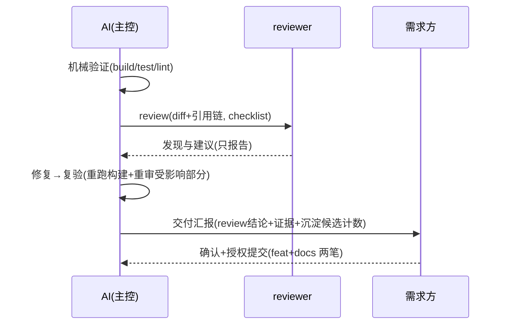

# crules-flutter

面向 **Flutter 工程**的独立协作规则 plugin——通用协作层 fork 自 [crules](https://github.com/BIG-BEARC/crules) 基线 `v74-fork-base`（commit ea4d25c），**此后独立演进、互不依赖**（唯一例外见「与 crules 的关系」）。

> **当前状态：0.4.0 易用性与知识沉淀体系落地**——5 命令面板 / memory 8 模板（含平台坑库与分域参考系）/ 沉淀闸 / review 主工位（设计方案与实施计划见 `docs/`，评审两轮通过）；整合线历史（外审四轮至 0.2.3）见 [CHANGELOG](CHANGELOG.md)，唯批 3b（saas_pos 瘦身）等稳定期。

---

## 怎么用

```bash
# ① 一次性：装 plugin（git URL 源，user scope，不进任何项目 git）
claude plugin marketplace add https://github.com/BIG-BEARC/crules-flutter.git --scope user
claude plugin install crules-flutter@crules-flutter-market --scope user

# ② 在 Flutter 工程根目录跑（装好 plugin 后任何工程可用；命令带命名空间，裸名不可用）
/crules-flutter:init
```

### 命令面板（×5）

| 命令 | 用途 |
|---|---|
| `/crules-flutter:init` | 工程接入（落位 + 必填三处引导） |
| `/crules-flutter:help` | 场景使用地图（什么场景用什么） |
| `/crules-flutter:distill [--scope <需求>]` | 知识沉淀定稿（闸类预览裁决） |
| `/crules-flutter:diagram <文件>` | 存量人读文档补 mermaid 图 |
| `/crules-flutter:update-memory` | 记忆库索引全量刷新（兜底） |

### 场景地图（与 `/crules-flutter:help` 同源；help 为权威全表、此处为压缩视图，语义级同步）

| 场景 | 用什么 |
|---|---|
| 新工程接入 | `/crules-flutter:init` |
| 日常开发 | 根 CLAUDE.md §三双 Gate（superpowers 可叠加） |
| 写设计方案 | flutter-rules skill「方案骨架」节 |
| 引依赖 / 写平台代码 / 升级 | `.claude/memory/platform-pitfalls.md` × skill 平台坑节 |
| 交付收尾 | checklist + review 主工位（下图）→ `/crules-flutter:distill` |
| 排障 | `crules-flutter:error` agent + 坑库检索 |

### 收尾时序（review 主工位）



### 工程接入与升级

`/crules-flutter:init` 的落位物（目标已有 CLAUDE.md 且无本包版本戳 → **不自动装**，转人工合并）：

| 落位物 | 位置 | 说明 |
|---|---|---|
| `CLAUDE.md`（App / Plugin 模板二选一 + 版本戳） | 项目根 | 协作规则本体 |
| `checklist.md` | 项目根 | 审查清单（通用 10 条编号 0–9 + Flutter 专项） |
| `analysis_options.yaml` | 项目根 | 三态落位：flutter 脚手架默认 → 升级替换（原文件留 `.scaffold-bak`）；已有自定义 → 落 `analysis_options.crules-flutter.yaml` 伴生待人工合并；无 → 写入 |
| `进阶/` 5 篇 | 项目根 | 工程化流程 / 审查纪律 / 方案评审闭环 / Agent 编排 / 记忆库体系 |
| `memory/` 8 模板 | `.claude/memory/` | **永不覆盖（含 --force）**——落地后即项目制度资产（含 `reference-map.md` 分域参考系 / `platform-pitfalls.md` 平台坑库：支持矩阵 + 坑卡） |

agents 不复制——plugin 已自动挂载 7 角色（`crules-flutter:frontend` 等）。

**装完必填三处**：① `CLAUDE.md` §七【复制后必填】技术栈三选一（选定后删未选项）；② §十二项目附录（项目名 / 构建·分析·测试命令）；③ **支持矩阵**——`.claude/memory/platform-pitfalls.md` 头部（`/crules-flutter:init` 三段式初稿：机械读 → 人核对 → 人补实测上限）。

**升级**：`plugin update` 只更新 plugin 通道（hooks / agents / skill / 命令）；项目内模板按三步升级——

```bash
# ① 定位源（plugin cache 最大版本；本地开发态可换本仓克隆路径）
SRC=$(ls -d ~/.claude/plugins/cache/*/crules-flutter/*/scripts/install.sh | sort -V | tail -1 | xargs dirname)/..
# ② 查模板版本差
bash "$SRC/scripts/check-imports.sh" <项目根>
# ③ 模板升级：已存在文件出 .new 伴生供对照合并（memory 永不覆盖）
bash "$SRC/scripts/install.sh" <项目根> --app --force
```

**记忆库兜底**：`/crules-flutter:update-memory`——索引全量刷新（日常仍以「写代码顺手更新」为主，见 `.claude/memory/MAINTENANCE.md`）。

### 环境要求与更新信任

- **环境要求：macOS / Linux**（hooks 依赖 `python3` 与 `fcntl`；Windows 上 hook 静默失效，终极防线回到原生权限确认——批 2c 起携带 hooks）
- **更新信任（供应链）**：本 plugin 的 hooks 在每次 Bash 调用前执行——`plugin update` 后新 hook 代码静默生效，被污染的更新 = 任意代码执行。建议 update 前先看 hooks 变更（`git -C <本仓> diff <旧tag>..<新tag> -- hooks/`）或锁定 commit。

### 停用与恢复

| 操作 | 命令 |
|---|---|
| 停用（可逆） | `claude plugin disable crules-flutter@crules-flutter-market` |
| 恢复 | `claude plugin enable crules-flutter@crules-flutter-market`（**完整形态**，纯名会 not found；**新会话生效**——当前会话不装载 hooks，别在旧会话验证） |
| 彻底卸 | `claude plugin uninstall crules-flutter@crules-flutter-market` + `claude plugin marketplace remove crules-flutter-market` |

## 与 crules 的关系（种子库模式）

```text
crules（母版，保持活跃）──fork──► crules-flutter（本包，独立演进）
              ▲ deny-list 安全修复单向同步（CI 比对，见下）
```

- **fork 基线**：`v74-fork-base`（crules 的 CLAUDE.md / 进阶 / hooks / 机制件于此点复制，此后本包自持）
- **边界判据**：与 Dart/Flutter 无关的协作改进 → 在 crules 改，本包自行决定是否跟随；技术栈相关 → 只进本包
- **跟/不跟查表**：crules 的 **deny-list 安全修复必跟**（同步义务机械化，见下）；其余规则演进**默认不跟**；跟则 bump 本包 minor
- **deny-list 同步义务（唯一例外）**：`hooks/deny-list.py` 与 `hooks/test_deny_list.py` 以 crules 为单一权威（红队补丁只发生在母版）——文件头 `SYNCED-FROM: crules@<hash>` 戳 + CI 同步比对步（拉 crules 主分支两文件 diff，不一致 exit 1）。批 2c 落地。
- **双 plugin 共存**（同机器既维护 crules 又开发 Flutter 工程是常态）：**同一项目二选一**（crules 或 crules-flutter，勿双装）；同机器不同项目各装各的无冲突——万一两套 hooks 同项目双跑：deny-list 并集拦截（任一 block 即 block，保守无害）、pending-updates 写同一队列文件经 flock 幂等。

## 维护

- 本仓独立演进：bump 双 json → `plugin update` → cache 特征串验证（纪律继承 crules v31）
- 治理从简：README + CHANGELOG + 最简检查（crules 的五维雷达/评审轮次体系**不复制**——治理成本延后到真有痛感再付）
- 定期外审选项保留（crules 的独立 subagent 复审模式可复用，防规则滑向单项目特有）
- **skill 平台坑节维护义务**（0.4.0 起）：Flutter / 平台大版本出现 → 扫 skill 坑节标【待重验】→ 核验刷新（每次 minor 例行）
- **沉淀闸蜜月期**（0.4.0 起）：真实试点上前 5 次 `/distill` 建议全闸档校准（人工改写条目多 = AI 判准偏差信号）；观测项：弃用率、`/context` 常驻快照、skill 触发体积
