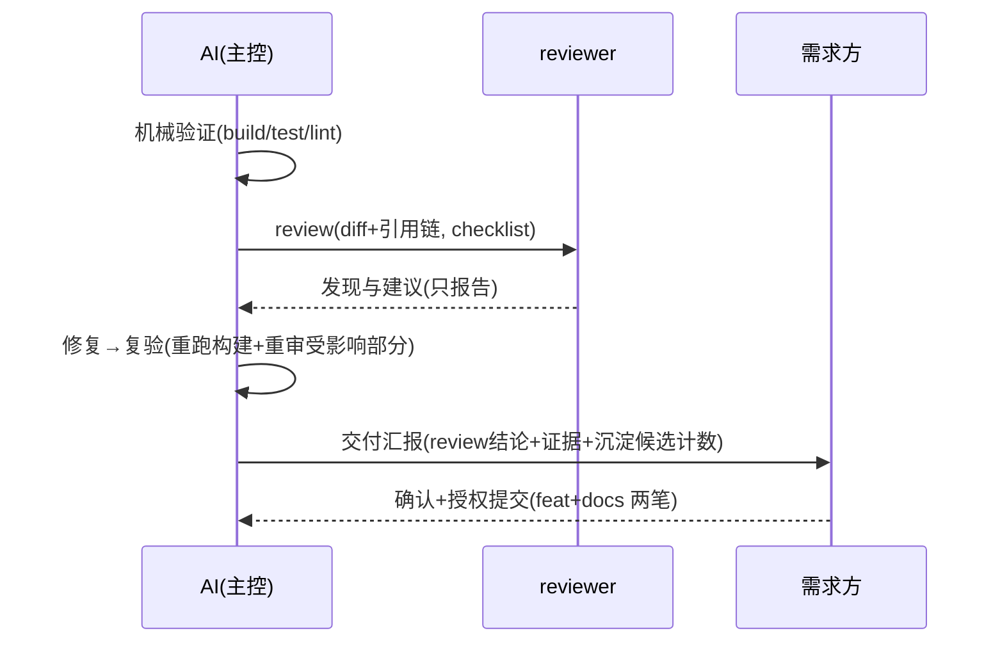

# crules-flutter

面向 **Flutter 工程**的独立协作规则 plugin——**完全独立、无母版依赖**（源自 crules v74 fork，2026-09 起 1.0.0 自持演进；fork 史见 CHANGELOG）。
> 许可：**MIT**（[LICENSE](LICENSE)）——模板 / 脚本 / hooks 全按此分发。

> **当前状态：1.0.4 ledger 外审收口**——「不进 git」变机制（gitignore 指引）+ note 转义约束与坏行容错 + fid 语义；1.0.3 审查质量落账——review 裁决 ledger + distill §7 四数聚合 + reviewer 发现编号化；1.0.2 评审后优化批一（LICENSE + tag 断档修复 + 语义闸 18 断言）；1.0.1 docs 清账（−93%）；1.0.0 独立成库（deny-list Vendor 终态）；常驻基线 14.4K（距 15K 线 0.6K，归因口径见维护节）。

---

## 5 分钟上手路径

> 本节是导览压缩视图；权威全表见 `/crules-flutter:help` 与下方「场景地图」，两处不一致时以彼为准。

- **装**（一次性）：下面「怎么用」两条命令装 plugin + 工程根跑 `/crules-flutter:init`（落位三态：全新 / 升级 / 老项目无戳中止——memory 永不覆盖）
- **日常触发**（全自动，零记忆负担）：写 UI/逻辑/平台代码时对应 agent 按职责自动挂载；写审 Flutter 代码时 flutter-rules skill 按需载入（薄索引 ~4.7KB）；hooks 静默守护（deny-list 拦危险命令 / pending-updates 记 memory 漂移）
- **收尾**：会话结束 Stop hook 提醒你补 memory 索引；交付前 checklist + reviewer 主工位 → `/crules-flutter:distill` 过闸沉淀
- **出问题看哪**（排查序）：行为不符预期 → `/crules-flutter:help` 查场景归属 → 仍不明 → `memory/MAINTENANCE.md`（库自身维护）→ `CHANGELOG.md` 查该能力哪个版本引入

## 怎么用

```bash
# ① 一次性：装 plugin（git URL 源，user scope，不进任何项目 git）
claude plugin marketplace add https://github.com/BIG-BEARC/crules-flutter.git --scope user
claude plugin install crules-flutter@crules-flutter-market --scope user

# ② 在 Flutter 工程根目录跑（装好 plugin 后任何工程可用；命令带命名空间，裸名不可用）
/crules-flutter:init
```

### 命令面板（×5）

| 命令 | 用途 |
|---|---|
| `/crules-flutter:init` | 工程接入（落位 + 必填三处引导） |
| `/crules-flutter:help` | 场景使用地图（什么场景用什么） |
| `/crules-flutter:distill [--scope <需求>]` | 知识沉淀定稿（闸类预览裁决） |
| `/crules-flutter:diagram <文件>` | 存量人读文档补 mermaid 图 |
| `/crules-flutter:update-memory` | 记忆库索引全量刷新（兜底） |

### 场景地图（压缩视图；权威全表见 `/crules-flutter:help`——本节面向**装前** GitHub 读者，只给名词级入口）

| 场景 | 入口 |
|---|---|
| 新工程接入 | `/crules-flutter:init`（三处必填） |
| 日常开发 / 写方案 / 引依赖 / 排障 | 根 `CLAUDE.md` · flutter-rules skill · `platform-pitfalls` 坑库 · `crules-flutter:error` agent |
| 交付收尾 | `checklist.md` + reviewer → `/crules-flutter:distill` |

### 收尾时序（review 主工位）



### 工程接入与升级

`/crules-flutter:init` 的落位物（目标已有 CLAUDE.md 且无本包版本戳 → **不自动装**，转人工合并）：

| 落位物 | 位置 | 说明 |
|---|---|---|
| `CLAUDE.md`（App / Plugin 模板二选一 + 版本戳） | 项目根 | 协作规则本体 |
| `checklist.md` | 项目根 | 审查清单（通用 10 条编号 0–9 + Flutter 专项） |
| `analysis_options.yaml` | 项目根 | 三态落位：flutter 脚手架默认 → 升级替换（原文件留 `.scaffold-bak`）；已有自定义 → 落 `analysis_options.crules-flutter.yaml` 伴生待人工合并；无 → 写入 |
| `进阶/` 5 篇 | 项目根 | 工程化流程 / 审查纪律 / 方案评审闭环 / Agent 编排 / 记忆库体系 |
| `memory/` 8 模板 | `.claude/memory/` | **永不覆盖（含 --force）**——落地后即项目制度资产（含 `reference-map.md` 分域参考系 / `platform-pitfalls.md` 平台坑库：支持矩阵 + 坑卡） |

agents 不复制——plugin 已自动挂载 7 角色（`crules-flutter:frontend` 等）。

**装完必填三处**：① `CLAUDE.md` §七【复制后必填】——技术栈三选一（选定后删未选项），App 形态另含**适配方案三选一 + 字体策略**（公共必选，0.6.0 起）；② §十二项目附录（项目名 / 构建·分析·测试命令）；③ **支持矩阵**——`.claude/memory/platform-pitfalls.md` 头部（`/crules-flutter:init` 三段式初稿：机械读 → 人核对 → 人补实测上限）。

**升级**：`plugin update` 只更新 plugin 通道（hooks / agents / skill / 命令）；项目内模板按三步升级——

```bash
# ① 定位源（plugin cache 最大版本；本地开发态可换本仓克隆路径）
SRC=$(ls -d ~/.claude/plugins/cache/*/crules-flutter/*/scripts/install.sh 2>/dev/null | sort -V | tail -1)
[ -n "$SRC" ] || { echo "❌ 未找到 plugin cache——先装 plugin，或把 SRC 手动指向本仓克隆路径"; exit 1; }
SRC=$(dirname "$SRC")/..
# ② 查模板版本差
bash "$SRC/scripts/check-imports.sh" <项目根>
# ③ 模板升级：已存在文件出 .new 伴生供对照合并（memory 永不覆盖）
bash "$SRC/scripts/install.sh" <项目根> --app --force
```

**记忆库兜底**：`/crules-flutter:update-memory`——索引全量刷新（日常仍以「写代码顺手更新」为主，见 `.claude/memory/MAINTENANCE.md`）。

**跨版本迁移要点**：memory/ 永不覆盖（新增模板自动补齐，既有八文件只人工对照不强合）；agents / hooks / skill / 命令不随模板升级走（plugin 通道自动）；项目自改的 §七技术栈 / §十二附录是合并主体，勿被新版冲掉——历史跨度的逐版本细节查 [CHANGELOG](CHANGELOG.md)。

### 环境要求与更新信任

- **环境要求：macOS / Linux**（hooks 依赖 `python3`；Windows 上 deny-list 硬闸与 Stop 收尾提醒不可用、漂移队列降级为无锁追加——install 时显式警告，终极防线回到原生权限确认）
- **更新信任（供应链）**：本 plugin 的 hooks 在每次 Bash 调用前执行——`plugin update` 后新 hook 代码静默生效，被污染的更新 = 任意代码执行。建议 update 前先看 hooks 变更（`git -C <本仓> diff <旧tag>..<新tag> -- hooks/`）或锁定 commit。

### 停用与恢复

| 操作 | 命令 |
|---|---|
| 停用（可逆） | `claude plugin disable crules-flutter@crules-flutter-market` |
| 恢复 | `claude plugin enable crules-flutter@crules-flutter-market`（**完整形态**，纯名会 not found；**新会话生效**——当前会话不装载 hooks，别在旧会话验证） |
| 彻底卸 | `claude plugin uninstall crules-flutter@crules-flutter-market` + `claude plugin marketplace remove crules-flutter-market` |

## 与其他规则 plugin 共存

**同一项目二选一**（勿与其他全量规则包双装）；同机器不同项目各装各的无冲突——万一两套 hooks 同项目双跑：deny-list 并集拦截（任一 block 即 block，保守无害）、pending-updates 写同一队列文件经 flock 幂等。

## 维护

- 本仓独立演进：bump 双 json → `plugin update` → cache 特征串验证（纪律承本仓 v31 先例）
- 治理从简：README + CHANGELOG + 最简检查（五维雷达/评审轮次体系**不引入**——治理成本延后到真有痛感再付）
- 定期外审选项保留（独立 subagent 复审模式可复用，防规则滑向单项目特有）
- **skill 平台坑节维护义务**（0.4.0 起）：Flutter / 平台大版本出现 → 扫 skill 坑节标【待重验】→ 核验刷新（每次 minor 例行）
- **预设栈审视义务**（0.5.1 起）：app 模板 §七 预设的包维护态与争议项按「最后核验」日期例行刷新，与坑节维护义务并列（每次 minor）
- **常驻基线实测**（2026-09-08 双测落档，真实消费工程 saas-suite `/context` 快照）：上午 **11.5k** → 复测 **14.4k**（CLAUDE.md 11.1→14.0k）——**距 15K 触发线仅 0.6k**，但增量**全部来自消费工程自身 CLAUDE.md 增长**（本包侧 Skills 8.1→8.0k 持平、agents 151→294 微增；0.6.3 新增两份 references 确认未占常驻——按需 Read 生效）。**口径区分（触发线裁决时必看）**：15K 线（0.4.x 常驻治理设计档定档，原档已删、口径以本节为准）度量的是**本包模板常驻负担**，`/context` 的 Memory files 混入项目自身内容——破线时先分离归因（模板贡献 vs 项目自身 CLAUDE.md 膨胀），项目侧膨胀应裁项目 CLAUDE.md / 走记忆库下沉，而非触发 B2 模板瘦身；后续每次 minor 复测一次
- **沉淀闸蜜月期**（0.4.0 起）：真实试点上前 5 次 `/distill` 建议全闸档校准（人工改写条目多 = AI 判准偏差信号）；观测项：弃用率、`/context` 常驻快照、skill 触发体积
