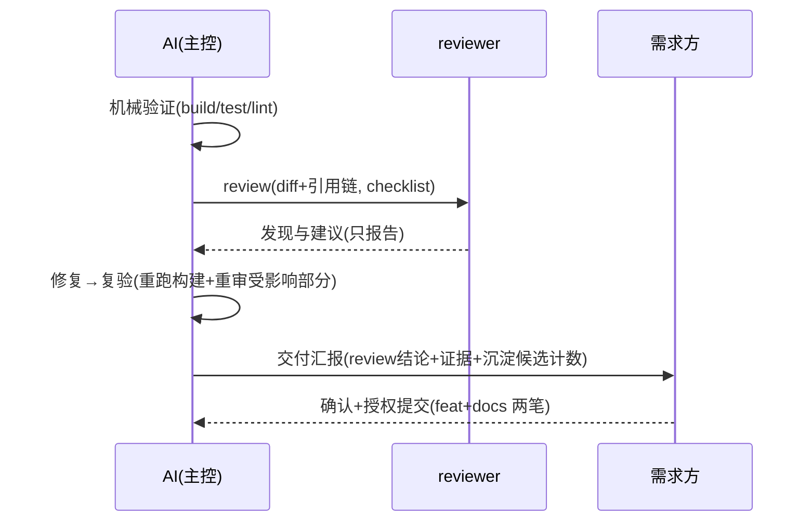

# crules-flutter

面向 **Flutter 工程**的 AI 协作规则 plugin：把「AI 怎么跟你安全地干活」固化成机制——危险命令硬拦、改动先过方案确认、交付必过审查、经验自动沉淀。
独立自持（源自 crules fork，2026-09 起 1.0.0 独立演进，史见 [CHANGELOG](CHANGELOG.md)）；许可 **MIT**（[LICENSE](LICENSE)）。

> 当前状态：1.0.6（版本编年史见 CHANGELOG）· 消费工程实测常驻基线 14.4K（治理口径见维护节）

---

## 装完得到什么

| 层 | 你得到 | 你要做的 |
|---|---|---|
| 守护 | hooks 静默生效：破坏性 git/rm 命令硬拦（强推/硬重置等，拦了就请你人工执行）、memory 漂移自动记队列、会话收尾提醒补索引 | 无（全自动） |
| 分工 | 7 个角色 agent 按职责自动挂载（写 UI → frontend、排障 → error、审查 → reviewer 只报不改…） | 无（自动触发） |
| 规范 | 项目根协作规则（双 Gate 流程 / 证据分级 / 提交纪律）+ Flutter 审查清单 + lint 基线 + 方案骨架 | 接入时必填三处（见下） |
| 沉淀 | 记忆库 8 模板（业务事实 / 技术不变量 / 平台坑库…）+ `/distill` 知识定稿闸 | 日常顺手更新，收尾过闸 |

## 快速开始

```bash
# ① 一次性：装 plugin（git URL 源，user scope，不进任何项目 git）
claude plugin marketplace add https://github.com/BIG-BEARC/crules-flutter.git --scope user
claude plugin install crules-flutter@crules-flutter-market --scope user

# ② 在 Flutter 工程根目录跑（装好 plugin 后任何工程可用；命令带命名空间，裸名不可用）
/crules-flutter:init
```

**init 之后必填三处**（init 会逐处引导）：

1. `CLAUDE.md` §七——技术栈三选一（Riverpod / Bloc / Provider 预设，选定删其余；App 形态另含适配方案与字体策略两选）
2. `CLAUDE.md` §十二——项目附录（项目名 / 构建·分析·测试命令）
3. `.claude/memory/platform-pitfalls.md` 头部——**支持矩阵**（目标平台 + 各端实测版本上限；init 出机械读初稿，人核对补实测）

**装完日常零记忆负担**：agent/skill/hooks 全自动触发；只在交付收尾时走「机械验证 → review → 沉淀」时序（下图），会话结束 Stop hook 会提醒补记忆库索引。**第一次用？** 15 分钟走一遍最小闭环见 `进阶/上手教程.md`（init 随模板落位到项目根）。

### 场景 → 入口（权威全表见 `/crules-flutter:help`）

| 场景 | 入口 |
|---|---|
| 新工程接入 | `/crules-flutter:init`（必填三处） |
| 日常开发 / 写方案 / 引依赖 / 排障 | 根 `CLAUDE.md` 双 Gate · flutter-rules skill · `platform-pitfalls` 坑库 · `error` agent |
| 交付收尾 | `checklist.md` + reviewer → `/crules-flutter:distill` |

**出问题看哪**（排查序）：行为不符预期 → `/crules-flutter:help` 查场景归属 → 仍不明 → `memory/MAINTENANCE.md` → `CHANGELOG.md` 查能力引入版本。

### 命令面板（×5）

| 命令 | 用途 |
|---|---|
| `/crules-flutter:init` | 工程接入（落位 + 必填三处引导） |
| `/crules-flutter:help` | 场景使用地图（什么场景用什么） |
| `/crules-flutter:distill [--scope <需求>]` | 知识沉淀定稿（候选分组预览、逐组人工裁决后落盘） |
| `/crules-flutter:diagram <文件>` | 存量人读文档补 mermaid 图 |
| `/crules-flutter:update-memory` | 记忆库索引全量刷新（兜底） |

### 收尾时序（review 主工位）



## init 往工程里放什么

三种情况自动判定：**全新工程** → 直接写入；**带本包版本戳的旧装** → 按升级处理；**已有 CLAUDE.md 且无戳**（老项目）→ **不自动装**，中止转人工合并（防覆盖既有规则）。`memory/` 无论何时**永不覆盖（含 --force）**——落地后即项目制度资产。

| 落位物 | 位置 | 说明 |
|---|---|---|
| `CLAUDE.md`（App / Plugin 模板二选一 + 版本戳） | 项目根 | 协作规则本体 |
| `checklist.md` | 项目根 | 审查清单（通用 10 条编号 0–9 + Flutter 专项） |
| `analysis_options.yaml` | 项目根 | 三态落位：flutter 脚手架默认 → 升级替换（原文件留 `.scaffold-bak`）；已有自定义 → 落伴生文件待人工合并；无 → 写入 |
| `.gitignore` 三行 | 项目根 | memory 本机生成物（索引/漂移队列/review 台账）自动排除出 git（幂等） |
| `进阶/` 6 篇 | 项目根 | 上手教程 / 工程化流程 / 审查纪律 / 方案评审闭环 / Agent 编排 / 记忆库体系 |
| `memory/` 8 模板 | `.claude/memory/` | 制度资产（含 `reference-map.md` 分域参考系 / `platform-pitfalls.md` 平台坑库） |

agents 不复制——plugin 已自动挂载 7 角色（`crules-flutter:frontend` 等）。

## 升级

`plugin update` 只更新 plugin 通道（hooks / agents / skill / 命令）；项目内模板升级一条命令（定位 plugin cache 最新版脚本，从那运行）：

```bash
SRC=$(ls -d ~/.claude/plugins/cache/*/crules-flutter/*/scripts/install.sh 2>/dev/null | sort -V | tail -1)
[ -n "$SRC" ] || { echo "❌ 未找到 plugin cache——先装 plugin，或把 SRC 手动指向本仓克隆路径"; exit 1; }
bash "$SRC" <项目根> --app --upgrade    # 巡检版本差 → 确认 → --force 升级（.new 伴生，memory 永不覆盖）
```

手动等价：`check-imports.sh <项目根>` 查版本差 → `install.sh <项目根> --app --force`。

**合并 `.new` 要点**：memory/ 只对照不强合；项目自改的 §七技术栈 / §十二附录是合并主体，勿被新版冲掉——历史逐版本细节查 [CHANGELOG](CHANGELOG.md)。

**记忆库兜底**：`/crules-flutter:update-memory`——索引全量刷新（日常仍以「写代码顺手更新」为主，见 `.claude/memory/MAINTENANCE.md`）。

## 环境要求与更新信任

- **环境要求：macOS / Linux**（hooks 依赖 `python3`；Windows 上 deny-list 硬闸与 Stop 收尾提醒不可用、漂移队列降级为无锁追加——install 时显式警告，终极防线回到原生权限确认）
- **更新信任（供应链）**：本 plugin 的 hooks 在每次 Bash 调用前执行——`plugin update` 后新 hook 代码静默生效，被污染的更新 = 任意代码执行。建议 update 前先看 hooks 变更（`git -C <本仓> diff <旧tag>..<新tag> -- hooks/`）或锁定 commit。

## 停用 / 恢复 / 共存

| 操作 | 命令 |
|---|---|
| 停用（可逆） | `claude plugin disable crules-flutter@crules-flutter-market` |
| 恢复 | `claude plugin enable crules-flutter@crules-flutter-market`（**完整形态**，纯名会 not found；**新会话生效**——当前会话不装载 hooks，别在旧会话验证） |
| 彻底卸 | `claude plugin uninstall crules-flutter@crules-flutter-market` + `claude plugin marketplace remove crules-flutter-market` |

**与其他规则 plugin 共存**：同一项目二选一（勿与其他全量规则包双装）；同机器不同项目各装各的无冲突——万一两套 hooks 同项目双跑：deny-list 并集拦截（任一 block 即 block，保守无害）、pending-updates 写同一队列文件经 flock 幂等。

---

## 维护（以下面向本仓维护者）

- 本仓独立演进：bump 双 json → `plugin update` → cache 特征串验证（步骤细节见 `scripts/release.sh` 头注与 CHANGELOG）
- 治理从简：README + CHANGELOG + 最简检查（五维雷达/评审轮次体系**不引入**——治理成本延后到真有痛感再付）
- 定期外审选项保留（独立 subagent 复审模式可复用，防规则滑向单项目特有）
- **major 版本前外审**（1.x 升版时跑，minor 不跑）：独立 subagent 全文重读本仓；**风险面必答**——上下文经济（常驻基线 vs 15K 线）/ 实效度量（ledger 四数 / distill 弃用率）/ bus factor / 待裁事项清点；通用面兜底——易用性（含信息架构）/ 方法论深度 / 机制化 / 可维护性 / 分发工程。产出发现走 review-ledger，评级仅趋势参考不作门槛
- **skill 平台坑节维护义务**：Flutter / 平台大版本出现 → 扫 skill 坑节标【待重验】→ 核验刷新（每次 minor 例行）
- **预设栈审视义务**：app 模板 §七 预设的包维护态与争议项按「最后核验」日期例行刷新，与坑节维护义务并列（每次 minor）
- **docs 轮次化义务**（每次 minor）：清点 `docs/`——状态戳已「已落地 / 已废弃」且所属批全部落地的方案 / 评审 / 复盘，正文归档或删（结论已被代码与 CHANGELOG 吸收，git 可寻回；**被分发面引用的 docs 先去引用再删**，防悬空指针）；裁决中途的保留至批落地。**裁决索引即状态戳**：每篇头部 `> 状态：…` 必含下一步动作（如「待需求方逐条裁 §6」），全部等待态一查即得——`grep -n "^> 状态" docs/*.md`（读的是本体，无第二份索引可漂移）
- **常驻基线**：每次 minor 用真实消费工程 `/context` 快照复测（最新落档 14.4k，距 15K 触发线 0.6k——增量来自消费工程自身 CLAUDE.md 增长，本包侧持平）。
  口径（触发线裁决必看）：15K 线度量**本包模板常驻负担**，`/context` 的 Memory files 混入项目自身内容——破线先分离归因（模板 vs 项目 CLAUDE.md 膨胀），项目侧膨胀应裁项目侧 / 走记忆库下沉，而非触发模板瘦身（历史测量记录见 CHANGELOG）
- **观测带数义务**（每次 minor，防度量体系「建了没人看」）：CHANGELOG 的 minor 条目固定带两数——① 常驻基线快照（`/context` 实测字符数）② distill 四数（裁决总数 / verified=推断 数 / 驳回数 / 推断级误报率；`<30` 样本只记数不计率）；数据源 = 消费工程 `.review-ledger`，本仓不汇聚（本机私域口径不变）
- **沉淀闸蜜月期**：真实试点上前 5 次 `/distill` 建议全闸档校准（人工改写条目多 = AI 判准偏差信号）；观测项：弃用率、`/context` 常驻快照、skill 触发体积
