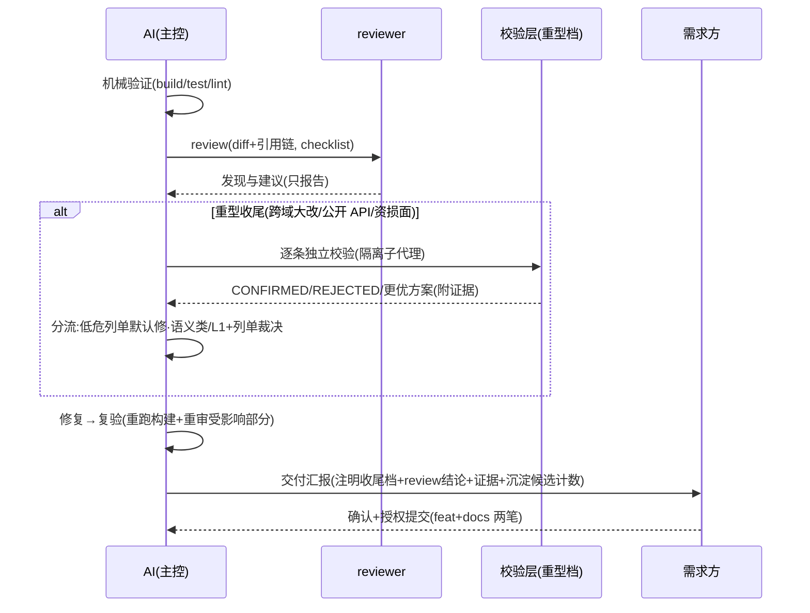

# /crules-flutter:help

> **同源声明**：本文件与 README「场景 → 入口」节**同源**——本文件为权威全表、README 为压缩视图，语义级同步（防新孪生漂移）。

## 场景 → 动作 → 用什么

| 场景 | 动作 | 用什么 |
|---|---|---|
| 新工程接入 | 装规则 + 必填引导 | `/crules-flutter:init`（三处必填：§七 / §十二〔含档位预设三选一〕/ 支持矩阵） |
| 日常开发 | 双 Gate 走流程 | 根 `CLAUDE.md` §三；superpowers 可叠加（brainstorming / writing-plans / TDD） |
| 写设计方案 | 套骨架 + 配图 | **flutter-rules** skill「方案骨架」`references/design-doc.md`（裁剪档位 / 图型对照 / Gate 映射） |
| 引依赖 | 坑库×矩阵筛 | `.claude/memory/platform-pitfalls.md`（T1）+ skill 平台坑节 |
| 写平台代码 | 涉域查坑 | 坑库（T2）+ skill 平台坑节（预置首批） |
| 交付收尾 | review + 自测 + 沉淀 | `checklist.md` + 收尾三档（下图）；沉淀候选 `/crules-flutter:distill` |
| 升级（SDK / 依赖） | 区间穿越 | 坑库筛「归属=Flutter SDK」（T3）+ 重跑相关自测用例 |
| 知识维护 | 蒸馏 / 刷新 | `/crules-flutter:distill --scope <需求>`；`/crules-flutter:update-memory` |
| 排障 | 错误排查 | `crules-flutter:error` agent + 坑库检索 |
| 存量文档补图 | 图型对照补 mermaid | `/crules-flutter:diagram <文件>` |

## 收尾时序三档（review 主工位）

<!-- gen:gear-note -->
<!-- 仓内维护者勿手改：本块由 canonical/gear-note.md 生成 -->
**收尾档按任务规模三档判定，与项目档位无关**：极简（单点修复 / 文案 / 注释，无行为面变化）＝机械验证贴输出 + 一行汇报，review 豁免记 Gate 例外台账、无沉淀件头；标准＝下图主体（现行时序）；重型（跨域大改 / 公开 API / 资损面）＝标准 + 校验层（下图 alt 块）。**项目档位**（init 一问定，写 §十二 附录预设块，无块 = 默认标准）：轻量〔light〕＝记忆库关·编排关·极简收尾占比高；标准〔normal〕＝日常工程默认；完整〔full〕＝编排开·plan-reviewer 默认启用。两轴独立——轻量档大需求仍走 plan-reviewer、大改仍走重型收尾；档位只改行为件头，不减常驻 token。
<!-- /gen:gear-note -->

## 全景（plugin 自动挂载，无需复制）

- **命令 ×5**：init / update-memory / help / distill / diagram
- **agents ×7**：frontend / backend / i18n / platform / error / reviewer / plan-reviewer（出场时机见 `进阶/Agent编排.md`）
- **skill**：flutter-rules（技术规范参考 + 方案骨架 + 平台坑节 + 状态管理 / 测试选型 / dart-flutter 映射速查）
- **hooks ×4**：deny-list（PreToolUse 安全闸：破坏命令硬拦 deny + 高危形态弹窗确认 ask）/ pending-updates（PostToolUse 漂移队列，1.0.30 起按会话分文件）/ stop-reminder（Stop 收尾提醒，只读本会话队列）/ compliance-audit（SessionEnd 遵守度事实账：每会话终结落一行计数到 `.compliance-log`，只记不判、不含对话内容，1.0.37）（供应链说明见 README）
- **模板**：根 CLAUDE.md（App / Plugin 二选一）+ checklist + 进阶 6 篇 + memory 8 模板

## 冲突时听谁的（优先级链）

| 优先级 | 裁决方 |
|---|---|
| 1 | 需求方当前指令 |
| 2 | 项目根 `CLAUDE.md`（模板） |
| 3 | superpowers / dart-flutter skills |
| 4 | flutter-rules skill |
| 5 | 模型默认行为 |

> 两件**独立于链外、恒在生效**：deny-list hook（破坏性命令硬闸，无放行机制——确认后也须人工执行；高危形态〔下载执行 / sudo / chmod -R / filter-branch〕另走 warn 层弹窗，由需求方裁夺放行，1.0.9）；`analysis_options.yaml` lint（静态层硬拦，不经判断）。规则「时严时松」的观感多半来自高优先级项覆盖了低优先级项——按本表归因，别猜。

## 最小概念五条（新消费者先装进脑子的）

1. **双 Gate**：非平凡改动先需求确认、再方案确认，两道 Gate 过了才动手（模板 §三）
2. **证据 5 级**：声明「完成 / 修复」前必须跑验证贴输出，禁笼统「已验证」（模板 §四）
3. **只报不改**：reviewer / plan-reviewer 两角色只输出发现与建议，修哪些由需求方裁决、修复由主控执行
4. **memory 永不覆盖**：`.claude/memory/` 落地后即项目制度资产，升级只对照不强合；知识定稿走 `/crules-flutter:distill` 闸
5. **上手路径**：15 分钟走一遍第一次闭环见 `进阶/上手教程.md`（init 随模板落位项目根）

其余概念（收尾三档 / 项目档位 / 校验层 / 沉淀闸…）不必预习——真实会话里 AI 按规则主动走位，你只需认得它在干什么；想先查全景见 README「概念地图」表。
