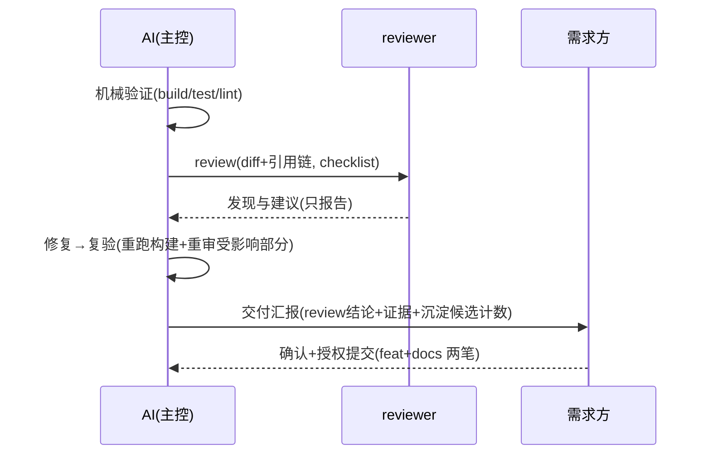
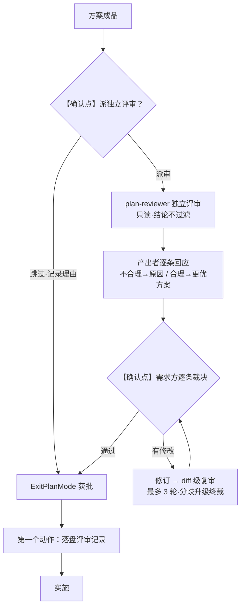
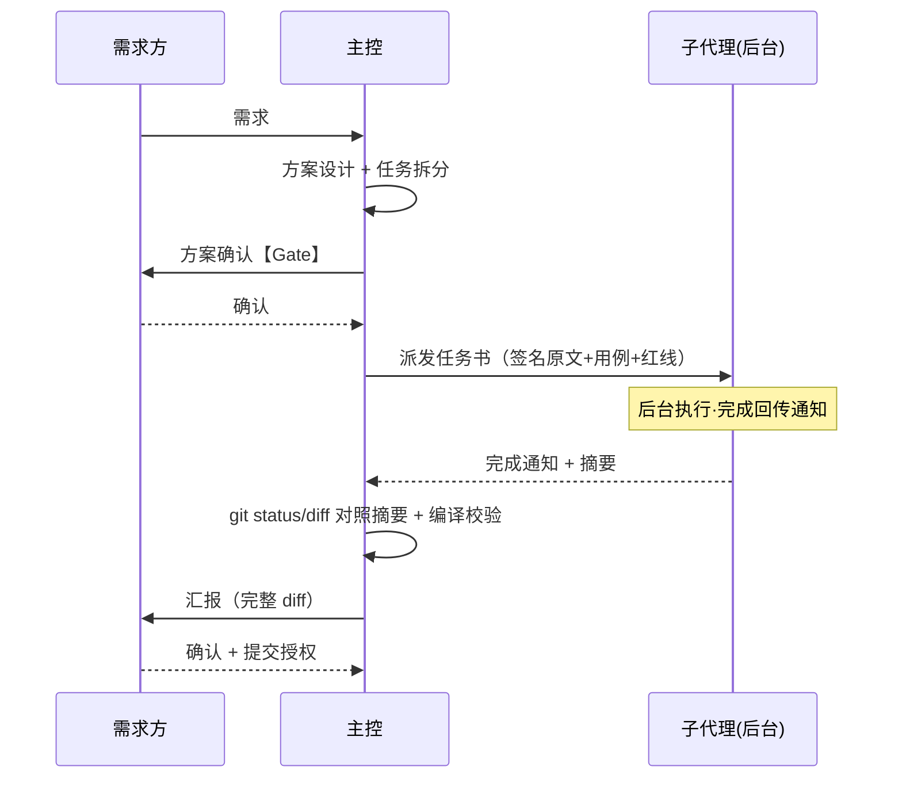

# crules-flutter 0.4.0 易用性与知识沉淀体系 · 实施计划

> **For agentic workers:** REQUIRED SUB-SKILL: Use superpowers:subagent-driven-development (recommended) or superpowers:executing-plans to implement this plan task-by-task. Steps use checkbox (`- [ ]`) syntax for tracking.

**Goal:** 落地设计方案 v2.1（`docs/设计方案-2026-09-04-易用性与知识沉淀体系.md`）——5 命令面板、沉淀闸体系、memory 模板 6→8、skill 方案骨架与平台坑节预置、review 主工位、脚本与验收扩展，一次 0.4.0（minor）收口。

**Architecture:** 三批落地（批 1 机制与模板 → 批 2 内容与命令 → 批 3 示范与验证），批间无硬依赖、文件级可回退。模板类改动走局部 Edit（禁整文件重写）；孪生物（app/plugin CLAUDE.md、twin:mem-files 双侧、help.md ↔ README 使用节）同源对照改。

**Tech Stack:** 纯文档 / 模板 / bash 仓（无 Dart 代码）。验证 = `scripts/test-self.sh` 断言 + grep 一致性检查 + 消费态模拟首验。

---

## 执行纪律（本仓根规则摘录，压过 skill 默认）

- **本仓根**：`/Users/chuxiong/Downloads/ai-code/flutter`。跨仓 / 跨目录一律绝对路径（Bash 会话间 cwd 会重置）。
- **提交策略（CLAUDE.md §二）**：skill 内建的 commit / push 步骤**一律不执行**。本计划各批末尾的「提交检查点」= 提示需求方可提交（附建议 message），等 `commit` / `提交` 关键词触发。
- **TDD 适配**：本仓「测试」= `scripts/test-self.sh`。批 1 先扩断言（红）→ 实施（绿）；文档内容任务以 grep / 目检验收。
- **修订用局部 Edit**：所有已有文件的改动逐段 Edit；仅新文件用 Write。
- **本计划自身已过方案 Gate**（设计方案 v2.1 独立评审两轮通过 + writing-plans 产物）——执行时不再重复需求 Gate；发现计划与实际文件冲突时停下报告，不自行改道。

---

# 批 0 · 前置核对

### Task 0: 基线与待确认项核对

**Files:** 无改动（只读核对，结论记入批 1 交付汇报）

- [ ] **Step 1: 跑基线 test-self（当前应全绿）**

Run: `bash /Users/chuxiong/Downloads/ai-code/flutter/scripts/test-self.sh`
Expected: `== 脚本自测：PASS=8 FAIL=0 ==`，exit 0。若非全绿，先停下报告（基线即红则本计划前提不成立）。

- [ ] **Step 2: memory git 分层 ↔ feat+docs 两笔衔接核对（设计 §9 第 1 项）**

Run: `grep -n -A 6 'git 分层' /Users/chuxiong/Downloads/ai-code/crules/memory/MAINTENANCE.md`

核对母版 v61 收口后的单一权威原文。预期结论（须与实际输出对照后确认，不符则停下报告）：**git 分层管的是消费项目 `.claude/memory/` 内制度资产的纳管；feat+docs 两笔管的是 crules-flutter 仓自身的提交粒度——两者不同层，无冲突**。结论一行记入批 1 交付汇报（「设计 §9 第 1 项已核对」）。

- [ ] **Step 3: 确认工作区基线**

Run: `git -C /Users/chuxiong/Downloads/ai-code/flutter status --short`
Expected: 仅 `docs/设计方案-2026-09-04-*.md` 与本计划文件未提交，无其他改动。

---

# 批 1 · 机制与模板

### Task 1: test-self.sh 断言扩展（先红）

**Files:**
- Modify: `scripts/test-self.sh`（在 L29 `rm -rf /tmp/cf-ao1 /tmp/cf-ao2` 之后、L31 `# 幂等断言` 注释之前插入）

- [ ] **Step 1: 插入三断言块**

用 Edit 在 `rm -rf /tmp/cf-ao1 /tmp/cf-ao2` 行后插入（old_string = 该行 + 空行 + `# 幂等断言：同输入两次运行结论一致且均 block（双 plugin 共存的可测背书）`，new_string = 该行 + 空行 + 下方整块 + 空行 + 原注释行）：

```bash
# 0.4.0 批1断言（设计 §5 test-self 行）：落位 8 模板 / init 三处必填 / twin 一致性
T4=/tmp/cf-pitfalls; mkdir -p "$T4"
bash $SRC/scripts/install.sh $T4 --app >/dev/null 2>&1
nm=$(ls "$T4/.claude/memory"/*.md 2>/dev/null | wc -l | tr -d ' ')
[ "$nm" = "8" ] && { PASS=$((PASS+1)); echo "PASS  memory 落位 8 模板"; } || { FAIL=$((FAIL+1)); echo "FAIL  memory 应落位 8 模板（实为 $nm）"; }
rm -rf "$T4"
grep -q '支持矩阵' "$SRC/commands/init.md" && grep -q '矩阵' "$SRC/scripts/install.sh" && { PASS=$((PASS+1)); echo "PASS  init 必填三处引导（init.md + install.sh 下一步提示均含矩阵）"; } || { FAIL=$((FAIL+1)); echo "FAIL  init 必填三处缺矩阵引导"; }
tw1=$(sed -n '/twin:mem-files/,/^$/p' "$SRC/memory/README.md" | grep -c '^| `')
tw2=$(sed -n '/twin:mem-files/,/^$/p' "$SRC/进阶/记忆库体系.md" | grep -c '^| `')
act=$(ls "$SRC"/memory/*.md | grep -v 'README.md' | wc -l | tr -d ' ')
lst=$(sed -n '/twin:mem-files/,/^$/p' "$SRC/memory/README.md" | grep -oE '`[A-Za-z-]+\.md`' | sort -u | wc -l | tr -d ' ')
[ "$tw1" = "$tw2" ] && [ "$act" = "$lst" ] && [ "$tw1" -ge 7 ] && { PASS=$((PASS+1)); echo "PASS  twin:mem-files 一致（双侧 $tw1 行，实际模板 $act = 表列 $lst）"; } || { FAIL=$((FAIL+1)); echo "FAIL  twin:mem-files 漂移（tw1=$tw1 tw2=$tw2 act=$act lst=$lst）"; }
```

注：`grep -oE` 的模式里是反引号包 `[A-Za-z-]+\.md`——`indexes/*.md`、`decisions/...` 含 `/` 与 `*` 不会被误计。

- [ ] **Step 2: 跑测确认红**

Run: `bash /Users/chuxiong/Downloads/ai-code/flutter/scripts/test-self.sh`
Expected: `PASS=9 FAIL=2`——红的是「8 模板」（实为 6）与「init 三处缺矩阵」；twin 断言此时应 PASS（守卫既有一致，防后续单侧编辑）。其余 8 项原有断言保持 PASS。

### Task 2: memory/reference-map.md 新模板（第 7）

**Files:**
- Create: `memory/reference-map.md`

- [ ] **Step 1: Write 全文**

```markdown
# reference-map.md · 分域调研参考系

> 用途：需求 / 方案涉及成熟领域时先查本图——看谁、查什么、去哪查（NAVIGATION「其他」表索引本文件）。
> 纪律：**只存指针不存结论**（结论会过期，指针指向活的源）。新参考系 = 规范性条目，走 `/crules-flutter:distill` 闸入库（查证源指针必填）。
> 本文件为**模板**——分域行按项目实际改写（标【示例】行为设计稿自带参考，非本项目事实）。

## 项目域：saas-cashier · 餐饮 SaaS 收银（Android / iOS / Windows 多端）【示例·按项目改写】

## 同行产品参考：美团商家版 / 银豹 / 纳客 / 客如云 —— 官网功能页 / 帮助中心【示例】

## 打印领域：芯烨 Xprinter / 佳博 Gainscha —— 云打印协议 / ESC/POS / 厂家开放平台【示例】

## 平台坑调研源（通用，勿删）

- Flutter issue tracker：https://github.com/flutter/flutter/issues
- 包 repo issues（pub.dev 包页直达）
- 平台厂商文档：Android Developers / Apple Developer / Microsoft Learn
```

- [ ] **Step 2: 验证**

Run: `ls /Users/chuxiong/Downloads/ai-code/flutter/memory/*.md | wc -l` → 7（含 README）。

### Task 3: memory/platform-pitfalls.md 新模板（第 8）

**Files:**
- Create: `memory/platform-pitfalls.md`

- [ ] **Step 1: Write 全文**

```markdown
# platform-pitfalls.md · 平台坑库

> 用途：引依赖（T1）/ 写平台代码（T2）/ 升级（T3）前查本库；**支持矩阵是所有平台判据的基线**。
> 坑卡模板为**全字段权威**：症状 / 规避必填，根因查明后填；**归属**为层级归属（独立于根因查明可填），是 T0–T5 检索键。
> 状态规则：已修复**不删卡**（标「已修复于 vX」——老版本环境仍在）。

## 支持矩阵【装完必填·第三处】

> init 三段式生成初稿：①机械读（平台目录 + minSdk + Podfile）→ ②人核对 → ③人补实测上限。
> 矩阵与 build.gradle / Podfile 打架 = 配置漂移信号，须报告修正。

| 平台 | 支持区间 / 判据 | 实测上限 | 备注 |
|---|---|---|---|
| Android | 【待填·init 三段式生成】 | 【待填·人补】 | minSdk 源：android/app/build.gradle |
| iOS | 【待填·init 三段式生成】 | 【待填·人补】 | 下限源：ios/Podfile platform :ios |
| Windows | 【待填·init 三段式生成】 | 【待填·人补】 | |
| macOS / Linux / Web | 【待填·按需增删本行】 | | 无该平台目录即删行 |

**消费端兜底**：坑检查读到 `【待填` = 判据缺失，当场顶回「请先填矩阵」，不静默盲查。

## 坑卡（新卡按以下结构追加，一卡一节）

```markdown
## [<暴露平台>] <一句话症状>
- 归属：OS 平台 / Flutter SDK / 三方依赖 / 未定性 ← 层级归属，独立于根因查明可填（提闸必填，T0–T5 检索键；「未定性」不参与 T1/T3 精确检索、T2 可见）
- 触发场景：<何时踩到> ｜ 症状：<现象> ｜ 根因：<查明后填> ｜ 规避：<换库/条件引入/钉版本等>
- 区间：<平台 × 依赖或 SDK × 版本，交叉积>
- 状态：未修复｜已修复于 vX（不删卡，老环境仍在） ｜ 最后核验：<日期>
- 出处：复盘链接 + 官方 issue
```
```

（注：文件内嵌套代码围栏——落盘时外层坑卡示例用三反引号 markdown 围栏即可，本计划用四反引号展示是为转义。）

- [ ] **Step 2: 验证（占位符无版本数字 + 无项目样例）**

Run: `grep -c '【待填·init 三段式生成】' /Users/chuxiong/Downloads/ai-code/flutter/memory/platform-pitfalls.md` → ≥3
Run: `grep -E 'Win7|permission_handler|26\.x' /Users/chuxiong/Downloads/ai-code/flutter/memory/platform-pitfalls.md` → 无输出（坑卡样例已移 skill，模板不自带真实样例）
Run: `ls /Users/chuxiong/Downloads/ai-code/flutter/memory/*.md | wc -l` → 8

### Task 4: twin:mem-files 表 +2 行（双侧同步）

**Files:**
- Modify: `memory/README.md:22`（INVARIANTS 行后）
- Modify: `进阶/记忆库体系.md:26`（INVARIANTS 行后）

- [ ] **Step 1: memory/README.md 加两行**

Edit old_string：

```
| `INVARIANTS.md` | 技术不变量（任何路径都必须成立，硬约束·测试拦） | 改约束密集模块前 Read |
| `indexes/*.md` | 各核心目录的代码索引 | 在该目录工作前 Read |
```

new_string：

```
| `INVARIANTS.md` | 技术不变量（任何路径都必须成立，硬约束·测试拦） | 改约束密集模块前 Read |
| `reference-map.md` | 分域调研参考系（只存指针不存结论） | 涉成熟领域做方案前 Read |
| `platform-pitfalls.md` | 平台坑库（支持矩阵 + 结构化坑卡） | 引依赖 / 写平台代码 / 升级前 Read |
| `indexes/*.md` | 各核心目录的代码索引 | 在该目录工作前 Read |
```

- [ ] **Step 2: 进阶/记忆库体系.md 加同样两行**

Edit old_string：

```
| `INVARIANTS.md` | 技术不变量（任何路径都必须成立） | 改约束密集模块前 Read |
| `indexes/*.md` | 各核心目录的代码索引 | 在该目录工作前 Read |
```

new_string：

```
| `INVARIANTS.md` | 技术不变量（任何路径都必须成立） | 改约束密集模块前 Read |
| `reference-map.md` | 分域调研参考系（只存指针不存结论） | 涉成熟领域做方案前 Read |
| `platform-pitfalls.md` | 平台坑库（支持矩阵 + 结构化坑卡） | 引依赖 / 写平台代码 / 升级前 Read |
| `indexes/*.md` | 各核心目录的代码索引 | 在该目录工作前 Read |
```

- [ ] **Step 3: 验证**

Run: `bash /Users/chuxiong/Downloads/ai-code/flutter/scripts/test-self.sh 2>&1 | grep twin`
Expected: `PASS  twin:mem-files 一致（双侧 9 行，实际模板 7 = 表列 7）`

### Task 5: memory/NAVIGATION.md +2 索引行

**Files:**
- Modify: `memory/NAVIGATION.md:54`（「其他」表，`| 调试相关 |` 行后）

- [ ] **Step 1: 加两行**

Edit old_string：

```
| 调试相关 | [debug.md](indexes/debug.md) | `<debug-dir>` |
| 项目特有代码模式 | [../patterns.md](patterns.md) | — |
```

new_string：

```
| 调试相关 | [debug.md](indexes/debug.md) | `<debug-dir>` |
| 同行 / 领域参考系（谁值得看、去哪查） | [reference-map.md](reference-map.md) | — |
| 平台坑（支持矩阵 / 坑卡检索） | [platform-pitfalls.md](platform-pitfalls.md) | — |
| 项目特有代码模式 | [../patterns.md](patterns.md) | — |
```

### Task 6: memory/MAINTENANCE.md 沉淀纪律小节

**Files:**
- Modify: `memory/MAINTENANCE.md:30-32`（「判定标准」行后、「维护时机优先级」节前插入新节）

- [ ] **Step 1: 插入小节**

Edit old_string：

```
**判定标准**：如果改动会让「未来 AI 找东西的路径」发生变化，就必须更新。

## 维护时机优先级
```

new_string：

```
**判定标准**：如果改动会让「未来 AI 找东西的路径」发生变化，就必须更新。

## 沉淀直写与走闸（v0.4.0）

写完代码 / 修完 bug 后的知识落点分两档（完整闸流程见 `/crules-flutter:distill` 命令）：

| 落点 | 闸级 |
|---|---|
| `docs/复盘-*.md`（踩坑叙事）· NAVIGATION 机械索引 · patterns.md **描述性**条目（代码 ≥2 处实证，附两处 file:line + 日期） | **直写**（随手层，AI 自主，零仪式） |
| patterns.md **规范性**条目 · business-rules.md · INVARIANTS.md · 坑卡 · reference-map.md 新参考系 | **走闸**（等 `/crules-flutter:distill` 分组预览裁决后局部 Edit 落盘） |

- **【待蒸馏】标记格式**：复盘文件中候选段落紧跟一行 `**【待蒸馏】**：<一句话候选>`——`/distill` 按 `grep -rn '【待蒸馏】' docs/` 清点队列
- 坑卡**归属**字段（OS 平台 / Flutter SDK / 三方依赖 / 未定性）= 层级归属，独立于根因查明可填，T0–T5 检索键
- **无人值守硬线**：后台 agent 独立完成的需求，闸类落点一律不写（复盘直写等人回来过闸）；NAVIGATION 机械索引豁免

## 维护时机优先级
```

- [ ] **Step 2: 验证**

Run: `grep -c '【待蒸馏】' /Users/chuxiong/Downloads/ai-code/flutter/memory/MAINTENANCE.md` → ≥1

### Task 7: app/CLAUDE.md 四处改（预算 ≤10 行）

**Files:**
- Modify: `app/CLAUDE.md:27`（§一 依赖红线）、`app/CLAUDE.md:75` 后（§三 收尾时序注）、`app/CLAUDE.md:94` 后（§三 方案 Gate 指针）、`app/CLAUDE.md:152`（§五 完成定义）

- [ ] **Step 1: 依赖红线 +1 步（坑库×矩阵，T1）**

Edit old_string：

```
- **外部依赖与网络操作先确认**：新增 / 升级依赖（含 `flutter pub add`）、下载并执行脚本（如 `curl | bash`）、访问外部服务前，先说明理由、影响、回退方式并获确认；敏感代码与生产数据不外发
```

new_string：

```
- **外部依赖与网络操作先确认**：新增 / 升级依赖（含 `flutter pub add`）、下载并执行脚本（如 `curl | bash`）、访问外部服务前，先说明理由、影响、回退方式并获确认；敏感代码与生产数据不外发；引原生 / 平台依赖前先过**坑库×矩阵**检查（`.claude/memory/platform-pitfalls.md`——矩阵未填先补，坑卡命中则换库 / 钉版本 / 条件引入）
```

- [ ] **Step 2: 收尾时序注（§三，superpowers 注后）**

Edit old_string：

```
> superpowers 叠加时：需求 Gate 用 `brainstorming`（HARD-GATE：未获设计批准禁写码）、方案 Gate 用 `writing-plans`、实施用 TDD、评审用 `requesting-code-review`——skill 是增强，Gate 不被绕过。skill 不可用的环境降级为文本确认（编号选项列表 / 方案七要素列全后停下等回复）。
```

new_string：

```
> superpowers 叠加时：需求 Gate 用 `brainstorming`（HARD-GATE：未获设计批准禁写码）、方案 Gate 用 `writing-plans`、实施用 TDD、评审用 `requesting-code-review`——skill 是增强，Gate 不被绕过。skill 不可用的环境降级为文本确认（编号选项列表 / 方案七要素列全后停下等回复）。
> 收尾时序：机械验证 → **review**（`checklist.md`，diff 为圆心、引用链为半径）→ 自测 → 交付汇报（含 review 结论 + 沉淀候选提示）→ 授权提交（feat + docs 两笔）。
```

- [ ] **Step 3: 方案 Gate +1 指针行**

Edit old_string：

```
修改前**必须**列出：① 受影响文件 ② 修改位置 ③ 当前实现 / 问题 ④ 修改方式或 Diff 方向 ⑤ 对用户 / 数据 / 网络 / 设备 / 已有功能的影响 ⑥ 预期效果 ⑦ 风险、回退方式、验证方法。按规模裁剪：极简改动只需 ①+④+⑦。方案获明确确认后才能动手。
```

new_string：

```
修改前**必须**列出：① 受影响文件 ② 修改位置 ③ 当前实现 / 问题 ④ 修改方式或 Diff 方向 ⑤ 对用户 / 数据 / 网络 / 设备 / 已有功能的影响 ⑥ 预期效果 ⑦ 风险、回退方式、验证方法。按规模裁剪：极简改动只需 ①+④+⑦。方案获明确确认后才能动手。
> 方案文档写法（章节骨架 / 裁剪档位 / 配图约定）见 **flutter-rules** skill「方案骨架」节——写方案时按需加载。
```

- [ ] **Step 4: 完成定义 +1 判据（§五）**

Edit old_string：

```
任务**同时满足**以下全部条件才算完成：已交付确认的目标产物；实际改动未超出确认范围；已按风险执行对应验证（§四）并按证据等级准确报告；未验证项、已知风险和范围外问题已明确说明；没有覆盖或提交无关改动；没有未经授权的提交、推送或外部写入。
```

new_string：

```
任务**同时满足**以下全部条件才算完成：已交付确认的目标产物；实际改动未超出确认范围；已按风险执行对应验证（§四）并按证据等级准确报告；未验证项、已知风险和范围外问题已明确说明；没有覆盖或提交无关改动；没有未经授权的提交、推送或外部写入。交付汇报必含 **review 结论**与**沉淀候选提示**（一行候选计数；直写类已随手落，闸类待 `/crules-flutter:distill`——可显式跳过并记 Gate 例外）。
```

- [ ] **Step 5: 验证行数预算**

Run: `git -C /Users/chuxiong/Downloads/ai-code/flutter diff --stat app/CLAUDE.md`
Expected: `+7` 左右（≤10 行）。

### Task 8: plugin/CLAUDE.md 四处改（同源对照）

**Files:**
- Modify: `plugin/CLAUDE.md:27`、`plugin/CLAUDE.md:70` 后、`plugin/CLAUDE.md:87` 后、`plugin/CLAUDE.md:144`

与 Task 7 同内容、锚点措辞不同（plugin 版原文差异已核对）。**两文件四处逐一对照改完才算本任务完成（孪生警讯）。**

- [ ] **Step 1: 依赖红线 +1 步**

Edit old_string：

```
- **外部依赖与网络操作先确认**：新增 / 升级依赖（含 `flutter pub add`）、下载并执行脚本、访问外部服务前，先说明理由、影响、回退方式并获确认；敏感代码与生产数据不外发
```

new_string：

```
- **外部依赖与网络操作先确认**：新增 / 升级依赖（含 `flutter pub add`）、下载并执行脚本、访问外部服务前，先说明理由、影响、回退方式并获确认；敏感代码与生产数据不外发；引原生 / 平台依赖前先过**坑库×矩阵**检查（`.claude/memory/platform-pitfalls.md`——矩阵未填先补，坑卡命中则换库 / 钉版本 / 条件引入）
```

- [ ] **Step 2: 收尾时序注**

Edit old_string：

```
> superpowers 叠加时：需求 Gate 用 `brainstorming`（HARD-GATE）、方案 Gate 用 `writing-plans`、实施用 TDD、评审用 `requesting-code-review`——skill 是增强，Gate 不被绕过。skill 不可用的环境降级为文本确认（编号选项 / 方案七要素列全后停下等回复）。
```

new_string：

```
> superpowers 叠加时：需求 Gate 用 `brainstorming`（HARD-GATE）、方案 Gate 用 `writing-plans`、实施用 TDD、评审用 `requesting-code-review`——skill 是增强，Gate 不被绕过。skill 不可用的环境降级为文本确认（编号选项 / 方案七要素列全后停下等回复）。
> 收尾时序：机械验证 → **review**（`checklist.md`，diff 为圆心、引用链为半径）→ 自测 → 交付汇报（含 review 结论 + 沉淀候选提示）→ 授权提交（feat + docs 两笔）。
```

- [ ] **Step 3: 方案 Gate +1 指针行**

Edit old_string：

```
修改前列出：① 受影响文件 ② 修改位置 ③ 当前实现 / 问题 ④ 修改方式 ⑤ 对**下游使用者** / 数据 / 已有功能的影响 ⑥ 预期效果 ⑦ 风险、回退、验证方法。按规模裁剪：极简改动只需 ①+④+⑦。方案获明确确认后才能动手。
```

new_string：

```
修改前列出：① 受影响文件 ② 修改位置 ③ 当前实现 / 问题 ④ 修改方式 ⑤ 对**下游使用者** / 数据 / 已有功能的影响 ⑥ 预期效果 ⑦ 风险、回退、验证方法。按规模裁剪：极简改动只需 ①+④+⑦。方案获明确确认后才能动手。
> 方案文档写法（章节骨架 / 裁剪档位 / 配图约定）见 **flutter-rules** skill「方案骨架」节——写方案时按需加载。
```

- [ ] **Step 4: 完成定义 +1 判据**

Edit old_string：

```
任务**同时满足**以下全部条件才算完成：已交付确认的目标产物；实际改动未超出确认范围；已按风险执行对应验证（§四）并按证据等级准确报告；未验证项、已知风险和范围外问题已明确说明；没有覆盖或提交无关改动；没有未经授权的提交、推送或外部写入。
```

new_string：与 Task 7 Step 4 的 new_string 完全相同（两模板 §五 原文一致）。

- [ ] **Step 5: 孪生对照验证**

Run: `diff <(grep -c 'crules-flutter:distill' /Users/chuxiong/Downloads/ai-code/flutter/app/CLAUDE.md) <(grep -c 'crules-flutter:distill' /Users/chuxiong/Downloads/ai-code/flutter/plugin/CLAUDE.md)` → 无输出（两侧计数一致，各 ≥1）
Run: `git -C /Users/chuxiong/Downloads/ai-code/flutter diff --stat plugin/CLAUDE.md` → `+7` 左右（≤10 行）。

### Task 9: commands/init.md 必填三处 + 矩阵三段式

**Files:**
- Modify: `commands/init.md:41-45`（步骤 4 重写）+ 新增步骤 5 小节

- [ ] **Step 1: 步骤 4 引导必填 2 → 3 项**

Edit old_string：

```
1. **§七【复制后必填】**：技术栈三选一（App）或插件类型二选一（Plugin）——逐项问清后**删掉未选项**、填「本项目最终技术栈/类型」行
2. **§十二项目附录 3 必填**：项目名 / 构建·分析·测试命令 / （协作偏好可选项提示：固定语言、提交触发词覆写、提速档）
3. 提示：flutter-rules skill 与 7 个 agent 已随 plugin 就位（无需复制）；导入巡检 `bash <源>/scripts/check-imports.sh <项目根>`
```

new_string：

```
1. **§七【复制后必填】**：技术栈三选一（App）或插件类型二选一（Plugin）——逐项问清后**删掉未选项**、填「本项目最终技术栈/类型」行
2. **§十二项目附录 3 必填**：项目名 / 构建·分析·测试命令 / （协作偏好可选项提示：固定语言、提交触发词覆写、提速档、沉淀闸档位）
3. **支持矩阵（`.claude/memory/platform-pitfalls.md` 头部）**：按步骤 5 三段式生成初稿并引导核对补全
4. 提示：flutter-rules skill 与 7 个 agent 已随 plugin 就位（无需复制）；导入巡检 `bash <源>/scripts/check-imports.sh <项目根>`
```

- [ ] **Step 2: 步骤 4 与「依据」节之间插入步骤 5 小节**

Edit old_string：

```
## 依据
```

new_string：

```
### 5. 支持矩阵三段式（自动初稿 → 人核对 → 人补）

**① 机械读（AI 执行——读得到才填）**：

- 平台目录存在性：`ls <项目根>` 看 `android/ ios/ windows/ macos/ linux/ web/` 哪些在——目录在 ≠ 发版支持，仅作初稿
- Android 下限：`grep -n 'minSdk' android/app/build.gradle*`；值为 `flutter.minSdkVersion` 间接引用时写「flutter.minSdkVersion（随 SDK，当时解析值：<值>）」
- iOS 下限：`grep -n 'platform :ios' ios/Podfile`
- **失败分支**：`build.gradle.kts` 等变体 / 解析失败 / 文件缺失 → **保留占位符 `【待填·init 三段式生成】`**，显式报告未解析原因，**不瞎填**

**② 人核对（AI 呈初稿，需求方裁决）**：生成了目录但从未发版的平台划掉；构建下限 ≠ 实际支持下限的改正。

**③ 人补（工程内查不到，问需求方）**：各平台**实测支持上限** + 现场设备实态（通常一行）。

初稿写入矩阵表后标「待核对」，②③ 完成后才去掉。矩阵格式与消费端兜底（读占位符即顶回）见 `.claude/memory/platform-pitfalls.md` 头部说明。

## 依据
```

- [ ] **Step 3: 验证（test-self 断言转绿）**

Run: `bash /Users/chuxiong/Downloads/ai-code/flutter/scripts/test-self.sh 2>&1 | grep 三处`
Expected: 此刻仍 FAIL（install.sh echo 未改，Task 13 转 green）——本步只验证 init.md 侧：`grep -c '三段式' /Users/chuxiong/Downloads/ai-code/flutter/commands/init.md` → 3（勘误：初版写 ≥4 为计数笔误，给定内容实含 3 处——条目 3 交叉引用 / 步骤 5 标题 / 占位符）。

### Task 10: commands/help.md 新增

**Files:**
- Create: `commands/help.md`

- [ ] **Step 1: Write 全文**

````markdown
---
description: crules-flutter 使用地图——什么场景用什么（命令 / agents / skill / hooks / 模板全景 + 收尾时序）
---

# /crules-flutter:help

> **同源声明**：本文件与 README「怎么用 / 工程接入与升级」节**同源**——改动双侧同步（防新孪生漂移）。

## 场景 → 动作 → 用什么

| 场景 | 动作 | 用什么 |
|---|---|---|
| 新工程接入 | 装规则 + 必填引导 | `/crules-flutter:init`（三处必填：§七 / §十二 / 支持矩阵） |
| 日常开发 | 双 Gate 走流程 | 根 `CLAUDE.md` §三；superpowers 可叠加（brainstorming / writing-plans / TDD） |
| 写设计方案 | 套骨架 + 配图 | **flutter-rules** skill「方案骨架」节（裁剪档位 / 图型对照 / Gate 映射） |
| 引依赖 | 坑库×矩阵筛 | `.claude/memory/platform-pitfalls.md`（T1）+ skill 平台坑节 |
| 写平台代码 | 涉域查坑 | 坑库（T2）+ skill 平台坑节（预置首批） |
| 交付收尾 | review + 自测 + 沉淀 | `checklist.md` + 收尾时序（下图）；沉淀候选 `/crules-flutter:distill` |
| 升级（SDK / 依赖） | 区间穿越 | 坑库筛「归属=Flutter SDK」（T3）+ 重跑相关自测用例 |
| 知识维护 | 蒸馏 / 刷新 | `/crules-flutter:distill --scope <需求>`；`/crules-flutter:update-memory` |
| 排障 | 错误排查 | `crules-flutter:error` agent + 坑库检索 |
| 存量文档补图 | 图型对照补 mermaid | `/crules-flutter:diagram <文件>` |

## 收尾时序（review 主工位）



## 全景（plugin 自动挂载，无需复制）

- **命令 ×5**：init / update-memory / help / distill / diagram
- **agents ×7**：frontend / backend / i18n / platform / error / reviewer / plan-reviewer（出场时机见 `进阶/Agent编排.md`）
- **skill**：flutter-rules（技术规范参考 + 方案骨架 + 平台坑节）
- **hooks ×3**：deny-list 等安全闸（供应链说明见 README）
- **模板**：根 CLAUDE.md（App / Plugin 二选一）+ checklist + 进阶 5 篇 + memory 8 模板
````

- [ ] **Step 2: 验证**

Run: `head -3 /Users/chuxiong/Downloads/ai-code/flutter/commands/help.md` → frontmatter 完整（description 一行）。
注：本命令**不加** `disable-model-invocation`（help 允许模型触发）。

### Task 11: commands/distill.md 新增

**Files:**
- Create: `commands/distill.md`

- [ ] **Step 1: Write 全文**

````markdown
---
description: 沉淀定稿——把复盘与【待蒸馏】队列经质量闸裁决后落盘 memory / 坑卡（用户触发，支持 --scope）
---

# /crules-flutter:distill [--scope <需求/上线批次>]

把稳定下来的知识从「随手层」定稿进「制度层」。**触发时机由需求方判定**：上线 / 交付 / bug 修复后。

## 流程

### 1. 定范围

- 有 `--scope`：只清点该需求 / 批次相关的复盘与候选
- 无 `--scope`：全量清点

### 2. 队列清点

- `grep -rn '【待蒸馏】' docs/` ——停车场候选
- 通读 `docs/复盘-*.md`——未标但值得升格的补充提名

### 3. 入库资格五问（每条前置过滤）

| # | 测试 | 拦截的污染形态 |
|---|---|---|
| 1 | 行为测试：未来会话会因此改变行为吗 | 复述 diff（git 自答的废话） |
| 2 | 自答测试：git log / grep / 读代码能回答吗 | 同上 |
| 3 | 时效测试：一年后还成立吗 | 临时当永久（版本号类事实） |
| 4 | 证据测试：来源链（需求方原话 / 写入点 file:line） | 推测当事实（命名推断） |
| 5 | 归位测试：是 memory 的事吗（协作规则归 CLAUDE.md、代码风格归 skill） | 错家双份维护 |

### 4. 目的地 × 闸级

| 目的地 | 条目性质 | 闸级 | 必填字段 |
|---|---|---|---|
| `docs/复盘-*.md` | 踩坑叙事 / 演进时间线 | **直写** | 日期 |
| NAVIGATION.md | 机械索引 | **直写** | — |
| patterns.md · 描述性 | 现状如此（代码 ≥2 处） | **直写** | 两处 file:line + 日期 |
| patterns.md · 规范性 | 以后这么写（新决策） | **走闸** | 需求方拍板记录 |
| business-rules.md | 业务事实 | **全走闸** | file:line 或需求方确认+日期 |
| INVARIANTS.md | 硬约束 | **全走闸** | 可执行检查（模板既有字段） |
| platform-pitfalls.md 坑卡 | 平台坑（§坑卡模板） | **走闸** | 归属 / 区间 / 状态 / 最后核验 / 出处 |
| reference-map.md | 新领域参考系 | **走闸**（规范性） | 查证源指针 |

### 5. 闸运行（走闸条目）

- **预览 = 落盘原文**（所见即所得，禁摘要），按目标文件分组编号
- 三操作：**新增 N / 修订 M / 建议废弃 K**——新知识与既有条目矛盾必须消解，禁止并排矛盾
- 裁决选项（`AskUserQuestion` 逐组呈现）：采纳 / 改写后采纳 / 丢弃 / 降级到复盘
- **局部 Edit 落盘**，禁整文件重写；写前查重，相近条目合并修订
- 闸类**新条目正文** ≤5 行（坑卡 / INVARIANTS 等模板格式化条目按其字段走，不受此限）
- 字段凑不齐 = 自动不过闸（结构性过滤器）

### 6. 坑卡提炼（涉平台坑时）

按 `platform-pitfalls.md` 坑卡模板提炼：**归属**（OS 平台 / Flutter SDK / 三方依赖 / 未定性——层级归属，根因黑盒不挡过闸）/ 区间 / 状态 / 最后核验 / 出处（复盘链接 + 官方 issue；查不到出处标「未查证」，**不入库**）。跨项目复现 / 框架级坑 → 提名进 flutter-rules skill 平台坑节（fork 维护者裁决）。

### 7. 收尾

- **文档状态戳**：本次蒸馏触到的方案 / 复盘文档，头部状态行更新（如 讨论稿 → 已落地 · 日期）
- 已处置候选的【待蒸馏】标记清除
- 汇报：新增 N / 修订 M / 废弃 K / 丢弃 D / 降级 L + 未过闸原因

## 档位（「沉淀闸档位」——独立字段，与「信任档位」区隔，勿混写）

| 档位 | 语义 | 变更方式 |
|---|---|---|
| 分流（默认） | 上表 | — |
| 全闸（收紧） | 蜜月期校准（建议前 5 次全闸；人工改写条目多 = AI 判准偏差信号）/ 敏感项目 | 需求方显式声明 |
| 降级宽松 | 规范条目落复盘标【待升格】，等人认领 | 需求方显式声明 |

声明位置：项目附录「协作偏好」的「沉淀闸档位」字段一行。AI **不得自行升降档**。「规范条目直写 patterns」**不设档**——信息来源边界，非偏好。

## 硬线

- **无人值守**：后台 agent 独立完成的需求，闸类落点一律不写（复盘直写等人回来过闸）；NAVIGATION 机械索引豁免（防检索断链，漂移由 `/crules-flutter:update-memory` 兜底）
- **演进 / 时间线**只进人读文档（可配 mermaid timeline）；memory 只收无时间态规则 + 一行历史佐证注脚
````

- [ ] **Step 2: 验证**

Run: `grep -c '走闸' /Users/chuxiong/Downloads/ai-code/flutter/commands/distill.md` → ≥6；`grep -c '五问'` → ≥1。

### Task 12: commands/diagram.md 新增

**Files:**
- Create: `commands/diagram.md`

- [ ] **Step 1: Write 全文**

````markdown
---
description: 给存量人读文档补 mermaid 图——按内容形态选图型；AI 常驻文件（CLAUDE.md / memory）拒加图
---

# /crules-flutter:diagram <文件>

给**已存在的人读文档**补图（新方案写作时直接用 flutter-rules skill「方案骨架」的图型标注，不必事后补）。

## 图型对照

| 内容形态 | 图型 |
|---|---|
| 流程 / 决策 | flowchart |
| 调用链 / 交互时序 | sequenceDiagram |
| 数据模型 | erDiagram |
| 状态流转 | stateDiagram |
| 演进编年 | timeline |
| 规则 / 枚举 / 对比 | 表格（不是 mermaid） |
| 命名 / 协议 / 正则 | 代码块（不是 mermaid） |

## 流程

1. Read 目标文件，找「纯文字描述结构 / 流程 / 时序」的段落
2. 按上表选型；已有文字保留（图是增效不是替代），图插在段落**之后**
3. mermaid 语法自查：节点 / 箭头 / 引号闭合——渲染不出 = 未完成
4. 呈现 diff 给需求方过目后才算完（定位是「人工审后补图」）

## 守门（机械分支，先于一切）

- 目标命中 **根 CLAUDE.md / `.claude/memory/*`**（AI 常驻上下文文件）→ **显式拒绝并说明原因**（图对 AI 无增益、白耗每会话 token），不静默跳过
- 一次一个文件；全文重构式改写**禁止**（只插图不改写正文）
````

- [ ] **Step 2: 验证**

Run: `ls /Users/chuxiong/Downloads/ai-code/flutter/commands/` → `diagram.md  distill.md  help.md  init.md  update-memory.md` 五件齐。

### Task 13: scripts/install.sh「下一步」echo 补矩阵必填项

**Files:**
- Modify: `scripts/install.sh:71`

- [ ] **Step 1: Edit**

old_string：

```
echo "== 下一步 == ① 完成 CLAUDE.md §七【复制后必填】三选一 ② 填 §十二附录 ③ 有 .new 文件时对照合并后替换 ④ flutter-rules skill 与 7 agents 已随 plugin 就位"
```

new_string：

```
echo "== 下一步 == ① 完成 CLAUDE.md §七【复制后必填】三选一 ② 填 §十二附录 ③ 填 .claude/memory/platform-pitfalls.md 支持矩阵（/crules-flutter:init 三段式初稿） ④ 有 .new 文件时对照合并后替换 ⑤ flutter-rules skill 与 7 agents 已随 plugin 就位"
```

- [ ] **Step 2: 验证（断言转绿）**

Run: `bash /Users/chuxiong/Downloads/ai-code/flutter/scripts/test-self.sh 2>&1 | grep 三处`
Expected: `PASS  init 必填三处引导（init.md + install.sh 下一步提示均含矩阵）`

### Task 14: scripts/check-imports.sh + memory 演进提示

**Files:**
- Modify: `scripts/check-imports.sh`（`exit 0` 前插入）

- [ ] **Step 1: Edit**

old_string：

```
else echo "🟢 未检出 crules-flutter 戳（早期安装或非本包装载）"
fi
exit 0
```

new_string：

```
else echo "🟢 未检出 crules-flutter 戳（早期安装或非本包装载）"
fi

# memory 模板演进提示（v0.4.0）——只报告「源侧新增文件」+「源仓 git 两版本间模板 diff」，
# 不做目标全量比对（项目自定义内容会全成噪音）；KEEP 语义下机制演进靠人合并
if [ -d "$TARGET/.claude/memory" ]; then
  for f in "$SRC"/memory/*.md; do b=$(basename "$f")
    [ -f "$TARGET/.claude/memory/$b" ] || echo "🟡 memory 新模板未落位：$b（KEEP 语义不自动补——人工对照源模板合并）"
  done
  if [ -n "$STAMP" ] && [ "$STAMP" != "$SRC_VER" ] && git -C "$SRC" rev-parse --is-inside-work-tree >/dev/null 2>&1; then
    git -C "$SRC" diff --name-only "v$STAMP" HEAD -- memory/ 2>/dev/null | while read -r m; do
      echo "🟡 memory 模板演进（v$STAMP→v$SRC_VER）：$m——人工对照合并"
    done
  fi
fi
exit 0
```

- [ ] **Step 2: 验证**

Run: `T=/tmp/cf-ci; rm -rf "$T"; mkdir -p "$T/.claude/memory"; printf 'x\n' > "$T/.claude/memory/NAVIGATION.md"; printf '# c\n' > "$T/CLAUDE.md"; bash /Users/chuxiong/Downloads/ai-code/flutter/scripts/check-imports.sh "$T"`
Expected: 含「🟡 memory 新模板未落位」多条（旧装工程视角）；`rm -rf "$T"` 清理。
注：git 两版本 diff 仅源仓为 git clone 时生效（cache 安装态无 .git，静默跳过——报告里不虚称）。

### Task 15: 版本 bump + CHANGELOG（先 bump 再验——0.2.2「验旧不验新」教训）

**Files:**
- Modify: `.claude-plugin/plugin.json:3`、`.claude-plugin/marketplace.json:10`、`CHANGELOG.md:2` 后插入

- [ ] **Step 1: plugin.json**

Edit old_string `"version": "0.3.0",` → new_string `"version": "0.4.0",`

- [ ] **Step 2: marketplace.json**

Edit old_string `"version": "0.3.0",` → new_string `"version": "0.4.0",`

- [ ] **Step 3: CHANGELOG 插 0.4.0 段**

Edit old_string：

```
# crules-flutter CHANGELOG

## 0.3.0 · 跟随 crules v77——外部行为准则残差 3 条镜像
```

new_string：

```
# crules-flutter CHANGELOG

## 0.4.0 · 易用性与知识沉淀体系（设计方案 v2.1 落地）

- **命令 ×3 新增**：`/help`（场景使用地图）/ `/distill`（沉淀定稿闸——五问 / 闸表 / 三操作 / 档位 / 坑卡归属）/ `/diagram`（存量文档补图，常驻文件拒加图）——与 init / update-memory 组成 5 命令面板
- **memory 模板 6 → 8**：`reference-map.md`（分域参考系，只存指针不存结论）+ `platform-pitfalls.md`（支持矩阵【装完必填·第三处】+ 结构化坑卡带**归属**字段：OS 平台 / Flutter SDK / 三方依赖 / 未定性）；NAVIGATION / MAINTENANCE / memory README / 记忆库体系 twin 表同步 +2
- **init 必填两处 → 三处**：+支持矩阵**三段式自动初稿**（①机械读：平台目录 + minSdk + Podfile，kts 变体 / 失败保留占位符并报告 → ②人核对 → ③人补实测上限）；install.sh「下一步」echo 同步
- **两 CLAUDE.md 模板**各 +7 行：完成定义 +review 结论与沉淀候选判据 / 方案 Gate +骨架指针行 / 依赖红线 +坑库×矩阵步 / §三 +收尾时序注（两模板同源对照改）
- **脚本**：check-imports +memory 演进提示（源侧新增 + git 两版本 diff，不做目标全量比对）；test-self 扩三断言（8 模板 / 三处必填 / twin 一致性）
- 批 2（skill 骨架与坑节预置 / checklist 差集标注 / review 主工位两进阶篇）与批 3（README 重写 / 进阶配图 / fork-coverage 记账）见后续 CHANGELOG 补记或本段追加

## 0.3.0 · 跟随 crules v77——外部行为准则残差 3 条镜像
```

（批 2 / 批 3 完成后把最后一条「批 2…批 3…」占位行改写为实际内容——本计划 Task 22 / Task 26 各有对应步骤。）

- [ ] **Step 4: 验证**

Run: `python3 -c 'import json;print(json.load(open("/Users/chuxiong/Downloads/ai-code/flutter/.claude-plugin/plugin.json"))["version"], json.load(open("/Users/chuxiong/Downloads/ai-code/flutter/.claude-plugin/marketplace.json"))["plugins"][0]["version"])'`
Expected: `0.4.0 0.4.0`

### Task 16: 批 1 验收（全绿 + 消费态首验 + twin 人肉核对留痕）

**Files:** 无新改动（验证与记录）

- [ ] **Step 1: test-self 全绿**

Run: `bash /Users/chuxiong/Downloads/ai-code/flutter/scripts/test-self.sh`
Expected: `== 脚本自测：PASS=11 FAIL=0 ==`，exit 0。

- [ ] **Step 2: 消费态模拟首验（工作区路径直跑）**

```bash
T=/tmp/cf-e2e; rm -rf "$T"; mkdir -p "$T"
bash /Users/chuxiong/Downloads/ai-code/flutter/scripts/install.sh "$T" --app
ls "$T/.claude/memory/"           # 8 个 .md
grep -c '【待填·init 三段式生成】' "$T/.claude/memory/platform-pitfalls.md"   # ≥3
grep -oE '<!-- crules-flutter: v[0-9.]+' "$T/CLAUDE.md"                        # v0.4.0
bash /Users/chuxiong/Downloads/ai-code/flutter/scripts/check-imports.sh "$T"   # ✅ 版本一致，无 🟡
rm -rf "$T"
```

- [ ] **Step 3: twin 一致性人肉核对（CI 无 twin 步属既有缺口，本轮留痕兜底）**

```bash
sed -n '/twin:mem-files/,/^$/p' /Users/chuxiong/Downloads/ai-code/flutter/memory/README.md
echo ---
sed -n '/twin:mem-files/,/^$/p' /Users/chuxiong/Downloads/ai-code/flutter/进阶/记忆库体系.md
echo ---
ls /Users/chuxiong/Downloads/ai-code/flutter/memory/
```

三侧目检：双侧表各 9 行、内容一致；实际 7 个模板文件（除 README）全部在表。核对记录（一行结论）写入批 1 交付汇报。

- [ ] **Step 4: 提交检查点（不执行，提示需求方）**

建议 message：`feat: 0.4.0 批1——机制与模板（memory 8 模板 / 沉淀闸 MAINTENANCE 节 / 矩阵三段式 / help+distill+diagram 三命令 / install·check-imports·test-self 扩展）`。等需求方 `commit` 关键词。

---

# 批 2 · 内容与命令

### Task 17: 平台坑预置首批调研查证（timebox 90 分钟）

**Files:**
- Create: `docs/调研-2026-09-04-平台坑预置首批.md`（调研记录，Task 18 的查证值来源）

> 这是本计划**唯一的调研型任务**：坑卡版本区间 / issue 编号属外部事实，**查证纪律禁止凭训练记忆预写**（CLAUDE.md「不虚构事实」红线）。Task 18 的 iOS / Android 两卡以本任务查证值为准填入；查不到出处的条目标「未查证」**不预置**。

- [ ] **Step 1: 逐卡查证（WebSearch / WebFetch）**

| 卡 | 查证问题 | 信源 |
|---|---|---|
| permission_handler × Win7 | 哪些版本区间在 Win7 启动闪退？有无官方 issue / changelog 声明 Win7 不支持？ | pub.dev permission_handler changelog + repo issues（搜 `Windows 7 crash startup`） |
| iOS 26.x tabbar/draw | 哪些 Flutter 版本受影响？修复落在哪个版本？issue 链接？ | flutter/flutter issue tracker（搜 `iOS 26 tabbar` / `iOS 26 draw`）+ release notes |
| Android 兼容基线 | scoped storage（API 29+）/ photo picker（API 33+ / 兼容库）/ back gesture（API 33+ predictive back）各自的触发区间与官方文档链接 | Android Developers 官方文档三篇 |

每卡产出字段：`归属 / 触发场景 / 症状 / 根因（查到才填）/ 规避 / 区间 / 状态 / 最后核验（今日）/ 出处（链接列表）`。

- [ ] **Step 2: 落盘调研记录**

写入 `docs/调研-2026-09-04-平台坑预置首批.md`：每卡一节，全字段 + 原始链接。头部声明「timebox 90 分钟，超时未查证的条目按未查证处理不预置」。

- [ ] **Step 3: 验收**

Run: `grep -c 'http' /Users/chuxiong/Downloads/ai-code/flutter/docs/调研-2026-09-04-平台坑预置首批.md` → ≥5（每卡至少 1–2 个出处链接）。
首批条目总数 ≤10（三卡制，Android 一卡多区间合并）。

### Task 18: SKILL.md——description 触发词 + 方案骨架 + 配图约定 + 平台坑节预置

**Files:**
- Modify: `skills/flutter-rules/SKILL.md:3`（frontmatter description）
- Modify: `skills/flutter-rules/SKILL.md:40` 后（Project Structure 节后插入两节）
- Modify: `skills/flutter-rules/SKILL.md` 文末（Accessibility 节后追加平台坑节）

- [ ] **Step 1: description 补触发词（可达性前提）**

Edit old_string：

```
description: Flutter/Dart 技术最佳实践参考——写/审 Flutter 代码时查找风格、架构、主题、布局、颜色、字体、无障碍等规范细节用（按需加载的参考库，非常驻）。与 dart-flutter skills 重叠处以 skill 为准，本 skill 是补充参考（清单/规范类内容为主）。
```

new_string：

```
description: Flutter/Dart 技术最佳实践参考——写/审 Flutter 代码时查找风格、架构、主题、布局、颜色、字体、无障碍等规范细节用；写设计方案 / 出方案时用「方案骨架」节（章节模板 / 裁剪档位 / 配图约定）；引平台依赖或排查平台坑时查「平台坑库」节（按需加载的参考库，非常驻）。与 dart-flutter skills 重叠处以 skill 为准，本 skill 是补充参考（清单/规范类内容为主）。
```

- [ ] **Step 2: Project Structure 节后插入「方案骨架」与「配图约定」两节**

Edit old_string：

```
## Project Structure
* **Standard Structure:** Assumes a standard Flutter project structure with
  `lib/main.dart` as the primary application entry point.

## Flutter style guide
```

new_string：

``````markdown
## Project Structure
* **Standard Structure:** Assumes a standard Flutter project structure with
  `lib/main.dart` as the primary application entry point.

## 方案骨架（写设计方案时用）

**单一模板 + 裁剪档位**。写方案时复制以下骨架按需裁剪：

```text
# <方案名>
> 状态（讨论稿→已确认→已落地/已废弃·指向取代者）· 日期 · 关联需求 · 面向对象

1 目标与范围        要解决什么 / 不做什么 / 老行为变更清单        [需求 Gate ①②③④]
2 核心决策          编号，每条一句话可独立成立                    [方案浓缩·前置]
3 现状              timeline / sequence / 问题表                  [新功能可整节省略]
3.5 行业参考        参考对象 / 关键做法 / 对本方案的启示 / 出处链接 [涉成熟领域必填·查项目 memory/reference-map.md]
4 目标方案          候选对比（含平台矩阵可行性列）→ flowchart / 组件职责表 / 规则表 / ER / 接口定义
5 影响面            用户 / 数据 / 已有功能 + 平台矩阵影响行         [方案 Gate ⑤]
6 测试与验收
  6.1 验收标准表    WHAT——业务级判据                              [需求 Gate ⑤]
  6.2 自测用例表    HOW——前置/步骤/预期/平台(矩阵)/结果证据        [涉平台/资损强制]
7 分阶段落地        大需求保留                                     [裁剪点]
8 风险与回退                                                      [方案 Gate ⑦]
9 待确认事项        问题 / 责任 / 是否阻塞                         [需求 Gate ⑥]
```

- **裁剪档位**：极简改动 = 1 / 2 / 6.1 / 8 四节；标准 = 全 9 节；大需求（新页面 / 跨模块 / 多端）= 全节 + 独立评审（`plan-reviewer`，见项目根 CLAUDE.md §三）
- **6.2 自测用例表生命周期**：方案期写（test-first 前移，写不出用例 = 验收标准不合格）→ 交付期执行（结果列挂证据分级，矩阵列全绿 = 完成定义达标）→ 回归期复用（修 bug / 升级后重跑，成为常驻回归资产）；可自动化项优先固化真测试代码，表内记指针
- **行业参考查证纪律**：参考条目必须查证带链接出处；查不到标「未查证·凭记忆」——防 AI 凭训练记忆编造同行行为

## 配图约定（人读文档配什么图）

| 内容形态 | 图型 |
|---|---|
| 流程 / 决策 | flowchart |
| 调用链 / 交互时序 | sequenceDiagram |
| 数据模型 | erDiagram |
| 状态流转 | stateDiagram |
| 演进编年 | timeline |
| 规则 / 枚举 / 对比 | 表格 |
| 命名 / 协议 / 正则 | 代码块 |

边界：**AI 常驻上下文文件不加图**（根 CLAUDE.md / `.claude/memory/*`——图对 AI 无增益、白耗每会话 token）。存量文档补图用 `/crules-flutter:diagram`。

## Flutter style guide
``````

（注：new_string 含嵌套围栏，落盘时外层用三个反引号结束即可；「## Flutter style guide」为保留的原文件锚点，勿重复插入。）

- [ ] **Step 3: 文末追加平台坑节（预置首批）**

Edit old_string：

```
* **Screen Reader Testing:** Regularly test your app with **TalkBack (Android) and
  VoiceOver (iOS)**.
```

new_string：

````markdown
* **Screen Reader Testing:** Regularly test your app with **TalkBack (Android) and
  VoiceOver (iOS)**.

## 平台坑库（预置首批 · 维护者策展）

> **定位**：框架级通用坑住本节（跨项目复现）；项目相关坑住消费工程 `.claude/memory/platform-pitfalls.md`。项目坑跨项目复现后经 `/crules-flutter:distill` 提名进本节（fork 维护者裁决）。
> **入预置门槛**（满足其一，防 stale 大杂烩）：①我们 / 同行实证踩过 ②官方 issue / release notes 明示版本区间 ③常见矩阵区间内高概率触发。每条带出处与「最后核验」；查不到出处标「未查证」**不预置**。首批 ≤10 条宁缺毋滥（Android 允许一卡多区间合并）。
> **维护义务**：Flutter / 平台大版本出现 → 扫本节标【待重验】→ 核验刷新——此后每次 minor 的例行内容（「技术栈相关 → 只进本包」查表逻辑）。

### 三方依赖

## [Windows 7] permission_handler 初始化导致启动闪退

- 归属：三方依赖
- 触发场景：Win7 目标机上启动即崩（permission_handler 平台初始化路径） ｜ 症状：启动闪退、无有效日志 ｜ 根因：平台 API 缺失路径未守护（实证黑盒，查明后补） ｜ 规避：Win7 在支持矩阵内时——条件引入 / 换库 / 钉兼容版本
- 区间：Windows 7 × permission_handler <Task 17 查证值>
- 状态：未修复 ｜ 最后核验：<Task 17 定>
- 出处：实证复盘（升格自原模板样例卡）+ <Task 17 查证 issue 链接>

### Flutter SDK

## [iOS 26.x] tabbar / draw 渲染异常

- 归属：Flutter SDK
- 触发场景 / 症状 / 根因 / 规避 / 区间 / 状态 / 出处：**以 Task 17 调研记录的查证值为准填入**（实证 + flutter/flutter issue tracker 查证补区间；禁凭记忆写版本号）

### OS 平台

## [Android] 版本兼容基线（一卡多区间合并）

- 归属：OS 平台
- 覆盖：scoped storage / photo picker / back gesture 等——**各区间与官方文档出处以 Task 17 调研记录为准填入**（T3 升级 / targetSdk 变化时筛本卡；矩阵变化时重验）
````

（Win7 卡的区间 / 核验两处 `<Task 17 查证值>` 占位在执行时必须替换为调研记录实值——这是「查证纪律禁预写」的显式例外，非计划遗漏；iOS / Android 两卡同理。填入后本文件不得残留任何 `<Task 17` 字样：`grep -c 'Task 17' skills/flutter-rules/SKILL.md` → 0。）

- [ ] **Step 4: 验证**

Run: `grep -c '方案骨架' /Users/chuxiong/Downloads/ai-code/flutter/skills/flutter-rules/SKILL.md` → ≥2；`grep -c '入预置门槛'` → ≥1；`grep -c 'Task 17'` → 0；`grep -c '未查证' skills/flutter-rules/SKILL.md` → 0（有未查证条目则该条不预置）。

### Task 19: checklist.md 差集标注 + 计数修正

**Files:**
- Modify: `checklist.md:3`（头注）、`checklist.md:9`（节标题）、`checklist.md:21`（条目 4）、`checklist.md:25`（条目 6）、`checklist.md:27`（条目 7）、`checklist.md:29` 后（新增条目 9 + 标注注）、`checklist.md:35`（Flutter 专项引言）

- [ ] **Step 1: 头注与节标题计数修正（实为 9 类编号 0–8）**

Edit old_string（头注行内片段）：

```
本文件自持（不依赖 crules 包）：通用 8 大类（自 crules 审查与复核纪律 fork）+ Flutter 专项。
```

new_string：

```
本文件自持（不依赖 crules 包）：通用 10 条·编号 0–9（0–8 fork 自 crules 审查纪律，9 资损红线为 0.4.0 新增）+ Flutter 专项。
```

Edit old_string：

```
## 通用 Review Checklist（8 大类，fork 自 crules）
```

new_string：

```
## 通用 Review Checklist（10 条·编号 0–9，fork 自 crules + 0.4.0 增补）
```

- [ ] **Step 2: 条目 4 改写（吞异常禁令 + 边界场景 Flutter 化——并入）**

Edit old_string：

```
**4. 边界处理**：Loading 有反馈；Error 有用户可见提示；Empty 有占位；网络异常有兜底（离线 / 重试）；输入校验走统一工具；长操作（外设通信 / 上传 / 长连接）有超时与断连处理。
```

new_string：

```
**4. 边界处理**：Loading 有反馈；Error 有用户可见提示；Empty 有占位；网络异常有兜底（离线 / 重试）；输入校验走统一工具；长操作（外设通信 / 上传 / 长连接）有超时与断连处理；**吞异常禁令**——`catch (_) {}` / catch 无日志 / unawaited Future / errorBuilder 返回空不记录，处置三态（处理 / 上抛 / 记录后降级）禁止第四态（吞）；边界场景清单——null / async 时序（取消 / 竞态）/ 生命周期（dispose 后回调）/ 弱网离线 / 超长列表 / 权限拒绝 / 多语言长度 / 平台矩阵各端。
```

- [ ] **Step 3: 条目 6 改写（关键节点日志 + 敏感交叉 + 机械项归位——并入）**

Edit old_string：

```
**6. 代码规范**：文件头注释（如项目要求）；无调试日志（**`avoid_print` lint 已拦**，抽查即可）；无硬编码 URL / 密钥；命名规范；**无新引入 lint 警告（`flutter analyze` 零 warning 是硬门——模板自带 `analysis_options.yaml` 基线）**；import 分组有序。
```

new_string：

```
**6. 代码规范**：文件头注释（如项目要求）；无调试日志（**`avoid_print` lint 已拦**，抽查即可）；无硬编码 URL / 密钥；命名规范；**无新引入 lint 警告（`flutter analyze` 零 warning 是硬门——模板自带 `analysis_options.yaml` 基线）**；import 分组有序；资损线（支付 / 订单 / 打印 / 同步）结构化日志带追溯上下文——orderId 可记，**token / 密钥 / 完整卡号永不入日志**；机械项（analyzer / lint 违规）归 CI 基线，不占人审注意力。
```

- [ ] **Step 4: 条目 7 改写（兼容性硬判据——并入）**

Edit old_string：

```
**7. 功能完整性**：spec 功能点均已实现（非 stub）；用户可完成完整流程；关键路径无崩溃；新增入口 / 路由已注册。
```

new_string：

```
**7. 功能完整性**：spec 功能点均已实现（非 stub）；用户可完成完整流程；关键路径无崩溃；新增入口 / 路由已注册；老行为变更清单（方案 §1）外的行为变化 = 回归 bug。
```

- [ ] **Step 5: 条目 8 后新增条目 9 + 差集标注注**

Edit old_string：

```
**8. Git 规范**：commit message 清晰；不提交不该入库的生成文件；不提交调试临时代码。

---
```

new_string：

```
**8. Git 规范**：commit message 清晰；不提交不该入库的生成文件；不提交调试临时代码。

**9. 资损红线【0.4.0 新增】**：金额计算（精度 / 舍入）、幂等（重复提交 / 重试）、状态机非法迁移、并发扣减——涉钱 diff 强制逐项过。

> **0.4.0 增补差集标注**（对 crules 基线 0–8 的差集，验收看归位）：吞异常形态学→改写并入 4 ｜ 资损红线→新增为 9 ｜ 关键节点日志 + 敏感数据交叉引用→并入 6 ｜ 边界场景 Flutter 化→并入 4 ｜ 兼容性硬判据→并入 7 ｜ 机械项归位→并入 6（零 warning 硬门既有）。

---
```

- [ ] **Step 6: Flutter 专项引言计数同步**

Edit old_string：

```
在通用 8 大类之上，Flutter 项目额外查：
```

new_string：

```
在通用 10 条（编号 0–9）之上，Flutter 项目额外查：
```

- [ ] **Step 7: 验证**

Run: `grep -c '0.4.0' /Users/chuxiong/Downloads/ai-code/flutter/checklist.md` → ≥3；`grep -c '8 大类'` → 0（旧计数零残留）；`grep -c '资损红线'` → ≥2。

### Task 20: 进阶/审查与复核纪律.md——review 主工位与范围小节

**Files:**
- Modify: `进阶/审查与复核纪律.md:79-81`（「两阶段审查（编排）」节末、「Review Checklist」节前插入）

- [ ] **Step 1: 插入小节**

Edit old_string：

```
所有 🔴（必须修）项修复后才算通过。

---

## Review Checklist（逐条对照）
```

new_string：

````markdown
所有 🔴（必须修）项修复后才算通过。

## review 主工位与范围（v0.4.0）

**时机（嵌交付流水线，非独立仪式）**：

```text
方案 Gate ──► 实施 ──► 机械验证 ──► ★review ──► 自测执行 ──► 交付汇报 ──► 授权提交
(plan-reviewer)          (build/test    (主工位)    (6.2×矩阵)  (必含review    (feat+docs
                          /lint/CI)                              结论+证据)     两笔)
```

- 卡位理由：review 是静态问题的最晚便宜点——先审后测省一轮真机重跑
- **review 修复后的复验 = 重跑受影响构建 / 测试 + 重审修复涉及的部分**（与工程化流程 §5 表述对齐；复验不是第三轮全量审查）
- 分级触发：极简改动 = 主 agent 对照 `checklist.md` 自查；普通需求 = `reviewer` agent 独立上下文 + 人审关键 diff；涉资损 / 跨模块 = 强制 `reviewer` agent + 人审
- 特殊时机：后台 agent 完成即审（根规则 §六 diff 展示即 review 面）；大需求分阶段节点审
- 交付汇报模板（含 review 结论位 / 沉淀候选位）见 [`工程化流程.md`](工程化流程.md) §7——单一权威

**范围**：diff 为圆心、**引用链为半径**——改共享物（组件 / 函数签名 / 公共配置 / 文案 Key）时引用点全工程级纳入（教训：只分析被改文件，校验不到其他调用方）。

---

## Review Checklist（逐条对照）
````

- [ ] **Step 2: 验证**

Run: `grep -c '主工位' /Users/chuxiong/Downloads/ai-code/flutter/进阶/审查与复核纪律.md` → ≥2。

### Task 21: 进阶/工程化流程.md——§5 时序对齐 + §7 模板两位

**Files:**
- Modify: `进阶/工程化流程.md:92`（§5 末条）
- Modify: `进阶/工程化流程.md:132` 后（§7 模板「验证证据」节后插入两节）

- [ ] **Step 1: §5「最终编译校验」改写为复验**

Edit old_string：

```
- 两阶段都通过后，主控才执行最终编译校验
```

new_string：

```
- 两阶段都通过后进入**复验**：重跑受影响构建 / 测试 + 重审修复涉及的部分（与 [`审查与复核纪律.md`](审查与复核纪律.md)「review 主工位」对齐——先审后测，复验 ≠ 第三轮全量审查）
```

- [ ] **Step 2: §7 模板插入 Review 结论 + 沉淀候选两位**

Edit old_string：

```
## 验证证据
- 静态：<结果或未执行>
- 构建：<结果或未执行>
- 测试环境：<结果或未执行>
- 目标环境：<结果或未执行>

## 未完成与风险
```

new_string：

```
## 验证证据
- 静态：<结果或未执行>
- 构建：<结果或未执行>
- 测试环境：<结果或未执行>
- 目标环境：<结果或未执行>

## Review 结论
- 分级：<自查 / reviewer agent / 强制 reviewer + 人审>
- 发现与处置：<N 条已修复 / M 条遗留（原因）>；复验：<重跑构建结果 + 重审范围>

## 沉淀候选
- <一行：候选 N 条已暂存复盘（【待蒸馏】标记），知识稳定后 `/crules-flutter:distill`；直写类已落 <位置>>

## 未完成与风险
```

- [ ] **Step 3: 验证**

Run: `grep -c '复验' /Users/chuxiong/Downloads/ai-code/flutter/进阶/工程化流程.md` → ≥2；`grep -c '沉淀候选'` → ≥1。

### Task 22: 批 2 验收 + CHANGELOG 补记

**Files:**
- Modify: `CHANGELOG.md`（0.4.0 段末行改写）

- [ ] **Step 1: 可达性与出处自查**

```bash
grep -c '写设计方案' /Users/chuxiong/Downloads/ai-code/flutter/skills/flutter-rules/SKILL.md   # ≥1（description 触发词）
grep -c 'Task 17' /Users/chuxiong/Downloads/ai-code/flutter/skills/flutter-rules/SKILL.md      # 0（占位清零）
grep -c '未查证' /Users/chuxiong/Downloads/ai-code/flutter/skills/flutter-rules/SKILL.md       # 0（无未查证入预置）
grep -cE '最后核验' /Users/chuxiong/Downloads/ai-code/flutter/skills/flutter-rules/SKILL.md    # ≥3（每卡有）
```

骨架可达性目检（测试环境证据级）：模拟「写方案」触发路径——新会话中 SKILL.md 的 description 含「写设计方案 / 出方案」触发词即满足可达性前提；在交付汇报中说明此项为静态验证（真实触发频率挂蜜月期观测，不入本轮验收）。

- [ ] **Step 2: CHANGELOG 0.4.0 段补记批 2**

Edit old_string：

```
- 批 2（skill 骨架与坑节预置 / checklist 差集标注 / review 主工位两进阶篇）与批 3（README 重写 / 进阶配图 / fork-coverage 记账）见后续 CHANGELOG 补记或本段追加
```

new_string：

```
- **skill**（批 2）：方案骨架全文（裁剪档位 / 图型 / Gate 映射 / 行业参考槽位 / 6.2 自测用例表）+ 配图约定 + 平台坑节**预置首批**（三归属分节：Win7 permission_handler / iOS 26.x / Android 基线一卡多区间，每条带出处与最后核验）+ description 补「写设计方案」触发词
- **review 增强**（批 2）：checklist 差集标注增补（吞异常形态学 / 资损红线新增为条目 9 / 关键节点日志 / 敏感交叉 / 边界 Flutter 化 / 兼容性硬判据 / 机械项归位）；审查纪律 +「review 主工位与范围」节；工程化流程 §5 时序对齐（复验 = 重跑构建 + 重审）+ §7 模板并入 Review 结论位 / 沉淀候选位
- 批 3（README 重写 / 进阶配图 / fork-coverage 记账）完成后本段补记
```

- [ ] **Step 3: 提交检查点（不执行，提示需求方）**

建议 message：`feat: 0.4.0 批2——skill 方案骨架与平台坑预置首批 / checklist 差集标注 / review 主工位两进阶篇`。

---

# 批 3 · 示范与验证

### Task 23: README.md 使用面重写（局部 Edit，非整写）

**Files:**
- Modify: `README.md:5`（状态行）、`README.md:18` 后（使用节补三小节）、`README.md:27`（checklist 行计数）、`README.md:30`（memory 行 6→8）、`README.md:34`（必填两处→三处）、`README.md:75-79`（维护节追加）

- [ ] **Step 1: 状态行刷新**

Edit old_string：

```
> **当前状态：整合线批 1-4 完成，独立外审四轮收口（P1×5 / N1-N6 / F1-F2，至 0.2.3）**——模板本尊 / 知识层 / 基建含 CI 同步比对 / saas_pos 上移（方案见 crules 仓 `docs/整合方案-crules-flutter.md`，外审处置留痕 [fork-coverage](docs/fork-coverage.md)）；唯批 3b（saas_pos 瘦身）等稳定期。
```

new_string：

```
> **当前状态：0.4.0 易用性与知识沉淀体系落地**——5 命令面板 / memory 8 模板（含平台坑库与分域参考系）/ 沉淀闸 / review 主工位（设计方案与实施计划见 `docs/`，评审两轮通过）；整合线历史（外审四轮至 0.2.3）见 [CHANGELOG](CHANGELOG.md)，唯批 3b（saas_pos 瘦身）等稳定期。
```

- [ ] **Step 2: 「怎么用」代码块后插入命令面板 + 场景地图 + 收尾时序**

Edit old_string（README.md:17-20 四行原文——init 命令行 / 安装代码块围栏闭合 / 空行 / 下一节标题）：

````
/crules-flutter:init
```

### 工程接入与升级
````

（上面代码块第一行在 README 原文与下方 new_string 中均为 `/crules-flutter:init`——以 README 实际字节为准。）

new_string（同四行，在围栏闭合与 `### 工程接入与升级` 之间插入三小节；首行原样保留）：

````markdown
/crules-flutter:init
```

### 命令面板（×5）

| 命令 | 用途 |
|---|---|
| `/crules-flutter:init` | 工程接入（落位 + 必填三处引导） |
| `/crules-flutter:help` | 场景使用地图（什么场景用什么） |
| `/crules-flutter:distill [--scope <需求>]` | 知识沉淀定稿（闸类预览裁决） |
| `/crules-flutter:diagram <文件>` | 存量人读文档补 mermaid 图 |
| `/crules-flutter:update-memory` | 记忆库索引全量刷新（兜底） |

### 场景地图（与 `/crules-flutter:help` 同源，双侧同步）

| 场景 | 用什么 |
|---|---|
| 新工程接入 | `/crules-flutter:init` |
| 日常开发 | 根 CLAUDE.md §三双 Gate（superpowers 可叠加） |
| 写设计方案 | flutter-rules skill「方案骨架」节 |
| 引依赖 / 写平台代码 / 升级 | `.claude/memory/platform-pitfalls.md` × skill 平台坑节 |
| 交付收尾 | checklist + review 主工位（下图）→ `/crules-flutter:distill` |
| 排障 | `crules-flutter:error` agent + 坑库检索 |

### 收尾时序（review 主工位）


````

- [ ] **Step 3: 落位物表三处改（checklist 计数 / memory 6→8 点名）**

Edit old_string：

```
| `checklist.md` | 项目根 | 审查清单（通用 8 类 + Flutter 专项） |
```

new_string：

```
| `checklist.md` | 项目根 | 审查清单（通用 10 条编号 0–9 + Flutter 专项） |
```

Edit old_string：

```
| `memory/` 6 模板 | `.claude/memory/` | **永不覆盖（含 --force）**——落地后即项目制度资产 |
```

new_string：

```
| `memory/` 8 模板 | `.claude/memory/` | **永不覆盖（含 --force）**——落地后即项目制度资产（含 `reference-map.md` 分域参考系 / `platform-pitfalls.md` 平台坑库：支持矩阵 + 坑卡） |
```

- [ ] **Step 4: 必填两处 → 三处**

Edit old_string：

```
**装完必填两处**：① `CLAUDE.md` §七【复制后必填】技术栈三选一（选定后删未选项）；② §十二项目附录（项目名 / 构建·分析·测试命令）。
```

new_string：

```
**装完必填三处**：① `CLAUDE.md` §七【复制后必填】技术栈三选一（选定后删未选项）；② §十二项目附录（项目名 / 构建·分析·测试命令）；③ **支持矩阵**——`.claude/memory/platform-pitfalls.md` 头部（`/crules-flutter:init` 三段式初稿：机械读 → 人核对 → 人补实测上限）。
```

- [ ] **Step 5: 维护节追加两行（skill 坑节维护义务 + 蜜月期校准）**

Edit old_string：

```
- 定期外审选项保留（crules 的独立 subagent 复审模式可复用，防规则滑向单项目特有）
```

new_string：

```
- 定期外审选项保留（crules 的独立 subagent 复审模式可复用，防规则滑向单项目特有）
- **skill 平台坑节维护义务**（0.4.0 起）：Flutter / 平台大版本出现 → 扫 skill 坑节标【待重验】→ 核验刷新（每次 minor 例行）
- **沉淀闸蜜月期**（0.4.0 起）：真实试点上前 5 次 `/distill` 建议全闸档校准（人工改写条目多 = AI 判准偏差信号）；观测项：弃用率、`/context` 常驻快照、skill 触发体积
```

- [ ] **Step 6: 验证（README 与实际行为一致——0.2.4 教训）**

```bash
grep -c '必填三处' /Users/chuxiong/Downloads/ai-code/flutter/README.md        # ≥1
grep -c '8 模板' /Users/chuxiong/Downloads/ai-code/flutter/README.md           # ≥1
grep -c '必填两处\|6 模板\|8 大类' /Users/chuxiong/Downloads/ai-code/flutter/README.md  # 0（旧表述零残留）
```

### Task 24: 进阶配图示范（flowchart / sequence 各 ≥1）

**Files:**
- Modify: `进阶/方案评审闭环.md:66` 后（闭环流转 text 块后插 flowchart）
- Modify: `进阶/Agent编排.md:86` 后（任务拆分与调度节末插 sequence）

- [ ] **Step 1: 方案评审闭环.md 插 flowchart**

Edit old_string：

````
7. 判据：评审结论在手且无待消解项 + 需求方明示通过 → ExitPlanMode 请求批准 → 获批后第一个动作落盘评审记录 → 进实施
```
````

new_string：

````
7. 判据：评审结论在手且无待消解项 + 需求方明示通过 → ExitPlanMode 请求批准 → 获批后第一个动作落盘评审记录 → 进实施
```


````

（执行注：old_string 取「7. 判据：…进实施」整行 + 其后的 text 围栏闭合三反引号；new_string 在围栏闭合后追加 mermaid 块。）

- [ ] **Step 2: Agent编排.md 插 sequence**

Edit old_string：

```
**并行（无文件冲突、无依赖）**：`frontend` 写页面骨架 + `backend` 写业务/数据层同时进行；`i18n` 补翻译 + `reviewer` 审查同时进行。
```

new_string：

````
**并行（无文件冲突、无依赖）**：`frontend` 写页面骨架 + `backend` 写业务/数据层同时进行；`i18n` 补翻译 + `reviewer` 审查同时进行。


````

- [ ] **Step 3: 验证**

Run: `grep -c 'mermaid' /Users/chuxiong/Downloads/ai-code/flutter/进阶/方案评审闭环.md` → ≥1；`grep -c 'mermaid' /Users/chuxiong/Downloads/ai-code/flutter/进阶/Agent编排.md` → ≥1。

### Task 25: docs/fork-coverage.md 记账

**Files:**
- Modify: `docs/fork-coverage.md`（文末追加第六节）

- [ ] **Step 1: 追加**

Edit old_string：

```
## 五、外审 P1 收口轮（0.2.0，2026-08-27）
```

（定位锚——在文件末尾追加新节，执行时以文件实际末行为准追加下方内容。）

追加内容：

```markdown

## 六、0.4.0 边界记账（易用性与知识沉淀体系）

| 项 | 决议 |
|---|---|
| 本轮通用机制（沉淀闸双层 / 方案骨架 / 配图约定 / T0–T5 坑检查时序 / review 主工位 / token 晋升制 / distill 闸运行规则） | **不反哺 crules 母版**——本包独立演进；母版是否吸收另议（触发：维护者在母版工作中感到同痛点） |
| 技术栈相关内容（skill 坑节预置首批 / 矩阵三段式 / 坑卡归属三分 / Flutter 边界场景清单） | 只进本包（「技术栈相关 → 只进本包」查表逻辑） |
| 设计全文 | `docs/设计方案-2026-09-04-易用性与知识沉淀体系.md`（v2.1，独立评审两轮通过）；实施计划 `docs/实施计划-2026-09-04-易用性与知识沉淀体系.md` |
```

- [ ] **Step 2: 验证**

Run: `grep -c '六、0.4.0' /Users/chuxiong/Downloads/ai-code/flutter/docs/fork-coverage.md` → 1。

### Task 26: 整体走查 + 0.4.0 收口

**Files:**
- Modify: `CHANGELOG.md`（0.4.0 段批 3 补记）
- 走查对象：全仓（grep 级 + 消费态终验）

- [ ] **Step 1: CHANGELOG 0.4.0 段补记批 3（消掉占位行）**

Edit old_string：

```
- 批 3（README 重写 / 进阶配图 / fork-coverage 记账）完成后本段补记
```

new_string：

```
- **README 使用面重写**（批 3）：5 命令面板 + 场景地图（与 `/help` 同源，双侧同步义务）+ 收尾时序 sequence 图；落位物表 memory 6→8（点名 `reference-map` / `platform-pitfalls`）；必填两处→三处（+支持矩阵三段式）；维护节 + skill 坑节维护义务 + 沉淀闸蜜月期说明
- **示范与记账**（批 3）：进阶配图示范两处（方案评审闭环 flowchart / Agent编排 sequenceDiagram）；[fork-coverage §六](docs/fork-coverage.md) 0.4.0 边界记账（通用机制不反哺母版 / 技术栈相关只进本包）
```

- [ ] **Step 2: 全仓旧表述残留清零**

```bash
cd /Users/chuxiong/Downloads/ai-code/flutter
grep -rn '8 大类\|必填两处\|6 模板' --exclude-dir=.git --exclude-dir=docs --exclude=CHANGELOG.md .
```

Expected: **无输出**（零残留）。说明：`docs/`（设计方案 / 复盘引用旧计数属讨论记录）与 `CHANGELOG.md`（历史版本条目，如 0.1.0「memory 6 模板」、0.2.4「必填两处」）按史实保留，不改写历史。

- [ ] **Step 3: 版本一致性**

```bash
cd /Users/chuxiong/Downloads/ai-code/flutter
grep '"version"' .claude-plugin/plugin.json .claude-plugin/marketplace.json   # 两处均 0.4.0
sed -n '1,3p' CHANGELOG.md                                                     # 顶部为 ## 0.4.0
```

- [ ] **Step 4: test-self 全量终验**

Run: `bash /Users/chuxiong/Downloads/ai-code/flutter/scripts/test-self.sh`
Expected: `PASS=11 FAIL=0`（11 断言含批 1 扩展三断言）。

- [ ] **Step 5: 消费态终验（--app 与 --plugin 双模式）**

批 2 / 批 3 改动（skill / README / 进阶篇）理论上不触安装链路，此步为全量收口兜底（0.2.2「未 bump 先验 cache」纪律——版本已在 Task 15 bump，此处直跑工作区版即可）：

```bash
cd /Users/chuxiong/Downloads/ai-code/flutter
rm -rf /tmp/cf-final-app /tmp/cf-final-plugin
mkdir -p /tmp/cf-final-app /tmp/cf-final-plugin
bash scripts/install.sh /tmp/cf-final-app --app    >/dev/null 2>&1 && echo APP-OK
bash scripts/install.sh /tmp/cf-final-plugin --plugin >/dev/null 2>&1 && echo PLUGIN-OK
ls /tmp/cf-final-app/.claude/memory/*.md | wc -l   # 8
grep -c '【待填·init 三段式生成】' /tmp/cf-final-app/.claude/memory/platform-pitfalls.md  # ≥3（矩阵三平台行）
grep -m1 'crules-flutter@' /tmp/cf-final-app/CLAUDE.md                            # 含 0.4.0
bash scripts/check-imports.sh /tmp/cf-final-app                                    # ✅ 无新演进提示
rm -rf /tmp/cf-final-app /tmp/cf-final-plugin
```

（`rm -rf /tmp/cf-final-*` 目标为 /tmp 下本测试自建目录，执行前按红线确认语境说明即可。）

- [ ] **Step 6: README 与实际一致性目检**

对照 Step 5 的落位产物核对 README 落位物表逐行（文件在 / 不在 / 语义描述）——0.2.4「README 落后实际两版」教训的复检。发现不一致 → 修 README，不走捷径。

- [ ] **Step 7: 交付汇报（dogfood 新模板）**

按 Task 21 更新后的 `进阶/工程化流程.md` §7 模板向需求方交付汇报——必须含 **Review 结论**位（本轮走查 = review 面，发现与处置逐条）与**沉淀候选**位（一行计数提示，如「候选 2 条已暂存复盘：twin 断言 CI 化待痛感 / 蜜月期 N 取值待试点定」）；证据按 §四分级标注（本轮为静态 + 构建级验证，真实触发频率挂蜜月期观测）。

- [ ] **Step 8: 提交检查点（不执行，提示需求方）**

建议 message：`feat: 0.4.0 批3——README 使用面重写 / 进阶配图示范 / fork-coverage 记账收口`。

三批全部合入后 0.4.0 收口；`release.sh` 是否打 tag 由需求方另行决定（不入本计划）。

---

## 计划后待办（不阻塞收口，转需求方 / 试点）

| 事项 | 责任 | 触发 |
|---|---|---|
| 沉淀闸蜜月期观测启动（前 5 次 `/distill` 建议全闸；弃用率 / `/context` 常驻快照 / skill 触发体积） | 需求方 | 真实试点首次 distill |
| 真实试点工程选择与观察清单启动 | 需求方 | 0.4.0 落地后 |
| 蜜月期 N 取值确认（当前建议 5）与校准记录位置 | 需求方 | 蜜月期结束时 |
| CI twin 断言步（test-self 已有本地兜底，CI 化留痛感触发） | 维护者 | twin 漂移实际发生时 |
| custom_lint 机械化坑检查（二期） | 维护者 | 某条坑复现两次且 Gate 拦不住 |


