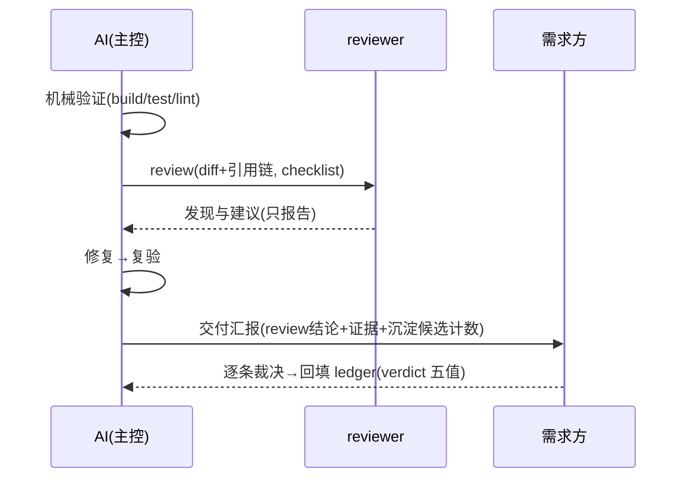
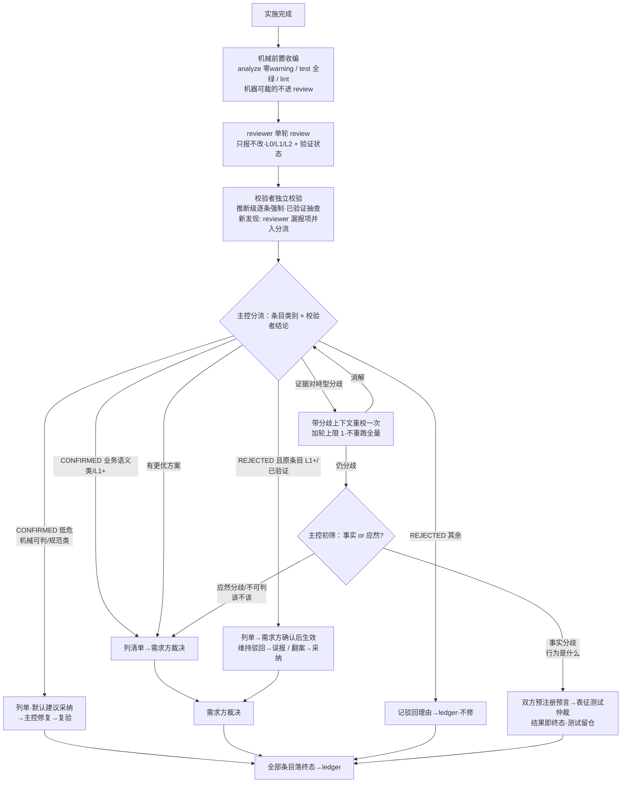

# Review 结果校验机制

> 状态：**已确认**（R3 隔离复审〔评审档 §E〕：无 major；4 minor 定稿批已补——文内〔R3 复审发现 N〕标记）· 日期：2026-09-14 · 关联需求：会话内提出「任务实现后 review → 校验 review 结果 → 最多 3 轮直到无异议」（轮数已裁为上限 1） · 面向对象：crules-flutter 维护者/需求方
> 裁剪档位：标准（全 9 节）——机制类方案，跨 reviewer / ledger / 收尾时序多处。
> R1 评审记录：plan-reviewer 隔离评审，原文已归档 [评审档 §D](评审-plan-review结果校验机制.md)；major #1-#5、minor #6-#12 全部消解。〔m10 内注随本稿补于 §6.2——补注即销〕
> R2 评审记录：两轮隔离评审已落盘 [评审-plan-review结果校验机制.md](评审-plan-review结果校验机制.md)（§A 主会话轮 + §B plan-reviewer 轮 + §C 合并表）。R3 处置依据 = §C 合并表 + [裁决单 §4](裁决单-2026-09-14-校验与档位化两案合并.md)（2026-09-14 全按建议裁：A-D1(a) 弃用 L0 直修 / A-D2(b) REJECTED 分层生效 / A-D3(a) 新发现出口 / A-D4 接受上限 1 / A-D5 建议包〔Q1=sonnet、Q4=沿用五值、Q6=映射表随本稿定〕/ A-D6(a) 事实分歧判据+盲测预注册）+ §1.2 机械处置 13 项。

## 1 目标与范围

**要解决什么**：现行收尾时序中，reviewer 产出的发现只有「需求方逐条裁决」一条出口——误报靠需求方人肉质检（ledger 的 verdict 虽已能事后记「误报」，但**裁决时无前置质检**）；reviewer 的盲区（如需求 Gate 阶段就没问到的约束）也无人复核。本方案为 review 结果引入**校验层**，在裁决前过滤误报、给「更优方案」类发现一条结构化出口。

**不做什么**：
- 不改变 reviewer「只报不改」边界与现行输出协议（L0/L1/L2 可达性分级 + 验证状态，角色卡零改动）
- 不新增 ledger 字段、不扩 verdict 枚举（**Q4 已裁：沿用五值**，distill 聚合公式不动；五值与流程终态的映射表见 §4.5）
- 不做全自动改码——业务语义类与 L1 及以上裁决权仍归需求方（根 CLAUDE.md §五不变）；**无任何免审直修路径**（A-D1(a)）
- 不覆盖方案评审子系统（plan-reviewer）现有闭环

**老行为变更清单**（A-D1/A-D2 裁决后如实扩列）：收尾时序「review → 修复」之间插入可选校验步；交付汇报的 review 结论措辞增加「校验结论」维度；**REJECTED 中原条目 L1+/已验证者须需求方确认后生效——新增需求方触点（A-D2(b)）**；低危 CONFIRMED 改「列单 + 默认建议采纳」（原「L0 直接修」路径撤销，A-D1(a)）。reviewer 角色卡不改。

## 2 核心决策（R3：裁决并入后重排）

1. **review 结果不裸信**——每条发现经独立校验后才进入裁决与修复。〔⚠️ 设计选择，依据 §3.5 对标行 2〕
2. **异质性双保险**——上下文隔离必须 + 模型档位差；**Q1 已裁：校验者 sonnet 起步**（与 reviewer=opus 异档），档位随演进复核。〔✅ 已裁（2026-09-14）；原「须有差异」按 R2 minor 6 修正为「隔离必须、档位已定不豁免」〕
3. **单轮为默认，分歧驱动加轮、上限 1 轮**——只对分歧条目加轮，不对全量重跑；可测分歧落测试仲裁，不可测取舍升级需求方。〔⚠️ 设计选择；**上限 3→1 收窄已经裁决单 A-D4 显式确认**，不再悬置〕
4. **机械检查前置**——现状收尾时序第一步已是机械验证（build/test/lint），本决策**真实增量**仅为 Q3 待裁项；增量未裁前 C3 相对 C2 的优势以「已前置项收编」计。〔❓ 挂 §9-Q3〕
5. **全部条目落终态**——含 REJECTED 及驳回理由，逐条 JSONL 追加 `.review-ledger`（复用既有字段）；「无异议」不是终止条件，「全部条目有终态」才是。〔✅ 与 distill.md:63 既有口径对齐〕
6. **分流轴 = 条目类别 × 校验者结论**（A-D1(a)）——类别分**机械可判 / 规范类 / 业务语义类**（低危 = 前两类）；**弃用「L0=规范类」命名与免审直修**（L0 是可达性等级非内容类别，`进阶/审查与复核纪律.md:26-30`；原路由把证据最弱档免审直修，方向倒置）。低危 CONFIRMED 列单 + 默认建议采纳；业务语义类与 L1+ 列单等需求方裁决。〔✅ 已裁〕
7. **REJECTED 分层生效**（A-D2(b)）——原条目 **L1+/已验证** 的 REJECTED **须需求方确认后生效**：维持驳回→落误报、翻案→落采纳；**其余 REJECTED 默认生效**，记驳回理由落 ledger、可事后回查。「reviewer 坚持」谓词弃用——单轮隔离 reviewer 无从获取坚持态，**分歧由证据对峙定义**（§4.2）。〔✅ 已裁〕
8. **测试仲裁边界与中立性**（A-D6(a)）——仅**事实分歧**（行为是什么）进表征测试；**应然分歧**（该不该）直接升级需求方（走测试会把现状缺陷钉成终态）；**盲测式预注册**：分歧双方先各写预言结果再跑测试；分类与仲裁结论落 ledger 可审计（主控为被审代码生产者的利害冲突以此设防）。〔✅ 已裁〕
9. **校验者补盲出口**（A-D3(a)）——校验者读 diff 时发现的 reviewer 漏报新问题**并入分流 E**（标注来源=校验者新发现，随条目正常走类别×结论分流）；P3 盲区未消除，但补盲有通道。〔✅ 已裁〕

## 3 现状

现行收尾时序（根 CLAUDE.md §三 / help 同源图）：

问题表：

| # | 问题 | 后果 |
|---|---|---|
| P1 | reviewer 误报无**前置**质检——ledger 的 verdict/误报率是事后度量，裁决时需求方仍须逐条判真伪 | 裁决负担重；误报被顺手采纳引入坏改动 |
| P2 | 「更优方案」类发现无结构化出口 | 要么被当普通条目混过，要么丢失 |
| P3 | reviewer 盲区不可见 | 需求阶段漏问的约束在 review 层同样漏（同源上下文假设）——R3 起校验者新发现并入分流（决策 9），盲区获直接补盲通道 |
| P4 | ledger 误报数据**采信依赖需求方裁决时的判断力**——事后聚合能算出误报率，但无法在裁决前拦截 | 沉淀层度量滞后，防不住当次坏改动 |

## 3.5 行业基线与确定性分级（沉淀类必填）

| 维度 | 行业通用做法 | 本项目对照 | 结论 |
|---|---|---|---|
| 评审结果二次校验 | 常见做法是「两人签字制」（author + reviewer 双确认），机器层靠 CI 必绿 | 本项目 reviewer 单签，需求方人肉质检 | ⚠️ 转述·凭记忆（未逐案查证） |
| 辩论环（generator-critic / debate） | LLM 工程实践确认多 agent 辩论环存在迎合性收敛与收益递减问题；同源模型盲区相关 | 提出的「3 轮无异议」正踩此坑 | ⚠️ 转述·凭记忆 |
| 测试仲裁 | 「可测分歧写表征测试锁行为」是 TDD/特征测试标准用法 | 本项目 TDD 纪律（§九）已具备落点 | ✅ 亲验（plugin/CLAUDE.md §九，232-245 行） |
| review 准确率度量 | 业界少有系统性度量（review 意见采纳率有统计，误报率罕见入账） | 本项目 ledger 已有 verdict 五值 + distill 误报率聚合——已具备，非本方案新增；本方案增量是「裁决前拦截」 | ⚠️ 前半句亲验（distill.md:63）；「表征测试留仓与 verified 分桶形成度量闭环」为推断 ❓（挂 §9-Q7） |

> ❓ 级条目已列入 §9。

## 4 目标方案

### 4.1 候选对比（含 P1 降级档）

| 候选 | 描述 | 优点 | 缺点 | 平台矩阵 | 结论 |
|---|---|---|---|---|---|
| C0 现状 | review → 需求方逐条裁决 | 零新增成本 | P1-P4 全在 | 无涉 | 基线 |
| C1 需求方原案 | review → 校验 → 3 轮直到无异议 → 按结论改 | 有质检意识 | 迎合性收敛（假收敛）；多轮全量成本；裁决权外放 agent | 无涉 | 否 |
| C2 异质单轮 + 分歧加轮 | 校验者异质上下文/档位；仅分歧条目加 1 轮 | 成本可控；过滤误报 | 分歧仍靠观点对观点 | 无涉 | **采纳骨架** |
| C2′ 仅裁决辅助 | 不做前置拦截；校验者结论按 verified 分桶排序，随发现清单呈现供裁决参考 | 零流程改动、成本最低 | P1「裁决前拦截」病灶仍在 | 无涉 | **P1 降级选项**（试点不顺退此档） |
| C3a = C2 + 已前置项收编 | 现有机械验证明确为 review 前置，能机器裁的不进 review | 零改造，纯时序明确化 | 无新增 | 无涉 | **采纳** |
| C3b = C3a + 真实增量 | 增量内容（`dart fix` 预跑、收紧项）全部悬于 Q3 | 潜在再减 review 条目量 | 未裁前不成立 | 无涉 | **待 Q3 裁**（不作采纳依据） |

### 4.2 目标流程（C2 + C3a；R3 按裁决重绘）

**分歧定义与加轮规则**（上限 1 轮，A-D4 已裁）：分歧 = **证据对峙**——校验者结论与条目主张互斥且各有证据（含「更优方案 vs 原实现」）；「reviewer 坚持」谓词弃用（单轮隔离 reviewer 无从获取）。「校验者间互斥」的唯一来源是**重校轮**产出（单校验者协议不变）：加轮 = 带分歧上下文重校一次，重校与首次互斥仍对峙 → I 闸；消解 → 回 E。不重跑全量。

**类别判定判据与低危否决闭环**（〔R3 复审发现 2/3〕补）：分流承重判据只钉一条——**涉行为取舍 / 业务规则 / 需求意图 = 业务语义类；类别存疑一律升业务语义类**（fail-closed：机械可判与规范类同走 F，边界不承重，误升仅多一次需求方过目）；分类结论随条目记入 ledger `note` 字段（复用既有字段，不违 Q4——A3 可逐条回查）。低危 CONFIRMED 默认修复在交付汇报 / 授权提交时被需求方否决 → **回滚该改动**，verdict 落「误报」（校验层放行失准，计入误报率分子——与 §4.5 度量口径对齐）。

### 4.3 职责表

| 角色 | 职责 | 边界 |
|---|---|---|
| 主控 | 机械前置、分流（类别×结论）、事实/应然初筛、预注册主持、修复、复验、ledger 回填 | 分类与仲裁结论落 ledger 可审计；不替需求方裁业务语义类/L1+ |
| reviewer | 单轮 review，现行输出协议不变（L0/L1/L2 + 验证状态 + 证据） | 只报不改；角色卡零改动 |
| 校验者 | 逐条出 CONFIRMED / REJECTED / 更优方案，附证据；**新发现（reviewer 漏报）随结论上报并入分流** | 只校验不改码；会话上下文隔离；sonnet 档（Q1 已裁） |
| 需求方 | 业务语义类/L1+、更优方案、L1+/已验证 REJECTED 确认、应然分歧裁决 | 唯一改边界授权方 |

### 4.4 校验者隔离协议

- **输入**：发现条目原文、diff、需求确认记录（Gate 产物）、**checklist 与相关 memory/业务规则只读引用**——隔离的是 reviewer 的会话历史与措辞倾向，**不是共享的静态规则基线**；无规则基线则反向误杀
- **上下文**：新起子代理会话，不复用 reviewer 上下文；不给 reviewer 会话历史与对需求方的措辞倾向
- **模型档位**：**sonnet 起步（Q1 已裁）**，与 reviewer=opus 异档；档位随演进复核
- **校验范围（分桶差异化）**：**推断级条目强制逐条校验；已验证（带 file:line）条目抽查**——误报重灾在推断级（distill.md:63 verified 分桶自证），已验证条目误报率低，全量逐条成本收益失衡
- **输出**：每条一行结构化结论 `{id, verdict, reason, evidence}`，REJECTED 须附可复核证据
- **反向误杀监测**：REJECTED 条目理由与证据 **100% 落 ledger 可人工回查**；试点期**人工抽检误杀**并记录（A5）——不设机制内产不出的阈值触发器

### 4.5 verdict 映射表（Q6 已裁，随 R3 定稿）

| 流程终态 | verdict 落值 | 聚合口径影响 |
|---|---|---|
| 低危 CONFIRMED（列单默认建议采纳，需求方接受） | 采纳 | — |
| 低危 CONFIRMED（需求方否决默认修复，〔R3 复审发现 3〕） | 误报（回滚该改动） | 误报率分子——校验层放行失准的质量信号 |
| 业务语义类/L1+ CONFIRMED（需求方裁决） | 采纳 / 改写采纳 | — |
| 更优方案（需求方采纳新方案） | 原条目→搁置；新方案改动→改写采纳 | 搁置不计误报——不对原实现判真伪 |
| REJECTED（L1+/已验证）· 需求方维持驳回 | 误报 | 误报率分子 |
| REJECTED（L1+/已验证）· 需求方翻案 | 采纳 | — |
| REJECTED 其余（默认生效） | 误报 | 误报率分子——自此同时度量校验层驳回质量（**公式不变、语义扩展**，Q4 沿用五值） |
| 测试仲裁（事实分歧） | 按结果落采纳 / 误报 | — |

## 5 影响面

| 对象 | 影响 |
|---|---|
| 用户（需求方） | 裁决负担**净预期下降**（误报前置过滤）；负担上升情形有二：① 校验者反向误杀未被证据复核拦住 ② 更优方案条目涌入清单——兜底见 §8；**新增触点：L1+/已验证 REJECTED 确认（A-D2(b)，噪音换知情权）** |
| 数据 | `.review-ledger` **不新增字段、不扩枚举**（Q4 已裁沿用五值）；distill 聚合公式不动，映射见 §4.5 |
| 已有功能 | 收尾时序插入一个可选校验步；reviewer / plan-reviewer 角色卡零改动 |
| 平台矩阵 | 无涉——纯协作层机制 |
| 姊妹方案 | 校验层在其 §4.2 矩阵归位（标准档=大改任务启用 / 完整档=默认启用〔=重型收尾必含、常规收尾默认不含、全量启用走单开——B 案 R2 复审发现 4 同步〕，X-2 已裁）；两案 P0 同批定稿、试点合并双采证（X-1 已裁）；**收尾时序图改版随 B 案 P1b 同批落（X-1 指派触点，本方案不再单列）**〔R3 复审发现 1〕 |

**成本**（⚠️ 定性）：每次收尾多一个校验子代理（推断级逐条 + 已验证抽查，较全量逐条降一档）；分歧条目加轮时再加。相对多轮全量定性为显著更低；精确比值不做承诺。

## 6 测试与验收

### 6.1 验收标准表

| # | 判据 |
|---|---|
| A1 | REJECTED / 更优方案的**产出率有记录**（主判据）；试点 3 任务窗口内出现次数为**观察项非硬门**（防 Goodhart——无误报的任务不该制造驳回） |
| A2 | 全部 review 条目在 ledger 中有终态（含驳回理由），无「悬空条目」 |
| A3 | 业务语义类与 L1+ 条目无一例由 agent 直接拍板修复 |
| A4 | 机制文档（收尾时序更新或进阶篇）与 help/README 同源声明同步 |
| A5 | 反向误杀可审计：REJECTED 条目理由 100% 可人工回查 + **试点期人工抽检误杀并记录** |

### 6.2 自测用例表

| 前置 | 步骤 | 预期 | 平台(矩阵) | 结果证据 |
|---|---|---|---|---|
| 有真实 diff 的任务收尾 | 跑完整流程含校验步 | 每条发现均有终态落 ledger | 无涉 | 待执行 |
| reviewer 报 1 条规范类低危 CONFIRMED | 走 F 分支至交付汇报 | 列单随交付汇报呈现、主控已修复并复验、ledger 落采纳；需求方否决时落误报并回滚（〔R3 复审发现 4〕） | 无涉 | 待执行 |
| reviewer 报 1 条疑似误报（推断级） | 校验者独立验证 | REJECTED 带可复核证据，不修 | 无涉 | 待执行 |
| reviewer 报 1 条 L1+ 被 REJECTED | 走 H1 分支 | 列单需求方确认后生效（维持→误报 / 翻案→采纳） | 无涉 | 待执行 |
| 1 条事实分歧 | 预注册预言后落表征测试 | 测试结果给出终态，预言记录留 ledger，测试代码留仓 | 无涉 | 待执行 |
| 1 条应然分歧 | 主控初筛 | 直接升级需求方，不进测试 | 无涉 | 待执行 |
| 校验者发现 reviewer 漏报项 | 新发现并入分流 | 随类别×结论分流落终态，来源标注 | 无涉 | 待执行 |

〔R1 m10 内注（R3 补）：「平台(矩阵)」列 v1 缺、R2 已补列——**补注即销**。〕

## 7 分阶段落地

1. **P0 协议先行**：本稿隔离复审通过 → 转已确认（Q1/Q4/Q6 已随裁决单 2026-09-14 裁毕，§4.4/§4.5 已落）
2. **P1 试点**：真实任务收尾手动执行（不写自动化），按 §6.2 采证；A1 以 3 任务窗口计；**与姊妹方案 B 案试点同任务双采证（X-1 已裁）——试点须含 ≥1 标准/重型档任务，否则校验层无 review 结果可采证**；不顺则退 C2′（仅裁决辅助）
3. **P2 制度化**：试点通过后——**新增校验者角色卡（tools 锁 Read/Glob/Grep + model=sonnet）**、ledger 口径按 §4.5 映射对齐 distill、是否写进阶篇由需求方裁〔收尾时序图改版（CLAUDE.md §三 + help 同源）已随 B 案 P1b 文档批同批落（X-1 指派；R3 复审发现 1：原留 A-P2 与裁决拆分不对齐，移出）〕
4. **P3 度量复盘**：累计 ≥3 任务后统计 REJECTED 率与人工抽检误杀率，验证 §9-Q7（度量闭环推断），决定机制去留或调档

## 8 风险与回退

| 风险 | 缓解 | 回退 |
|---|---|---|
| 校验者迎合 reviewer（假校验） | 上下文隔离协议（§4.4）+ A1 三任务窗口卡杀伤力 | 机制整体降级回 C0 或退 C2′ |
| **校验者反向误杀真发现** | 静态规则基线共享 + REJECTED 强制附可复核证据 + A5 人工抽检 | **收紧为 REJECTED 全量列单（A-D2(a) 档）** |
| 成本超预期 | 单轮默认、分歧才加轮、机械前置减少进 review 条目量、已验证抽查 | 校验步改「仅 L1+ 密集任务启用」 |
| 应然分歧误进测试仲裁 | I 闸判据「行为是什么」+ 不可判默认升级 | — |
| 主控利害方（写测试者=被审代码生产者） | 盲测式预注册 + 分类与仲裁结论落 ledger 可审计 | 测试改由校验者写（A-D6(b) 档） |
| 与 superpowers `requesting-code-review` 冲突 | skill 为增强、Gate 不被绕过——校验步挂在 review 之后、授权提交之前 | 按 §二 skill 冲突条款处理 |

## 9 待确认事项

| # | 问题 | 责任方 | 阻塞 |
|---|---|---|---|
| Q1 | ~~校验者模型档位~~ **已裁（2026-09-14，裁决单 A-D5）：sonnet 起步** | — | 已销 |
| Q2 | 「更优方案」类发现是否也走表征测试仲裁，还是一律列清单给需求方？ | 需求方 | 否（默认后者） |
| Q3 | 机械前置的真实增量（C3b：`dart fix` 预跑？零 warning 之外的收紧项？）具体指什么？ | 需求方 | 否（默认 C3a 即止） |
| Q4 | ~~verdict 沿用五值还是扩枚举~~ **已裁：沿用五值**（distill 聚合公式不动，映射见 §4.5） | — | 已销 |
| Q5 | 行业基线表 ⚠️ 级结论是否接受「凭记忆」标注，还是要求补充查证后定稿？ | 需求方 | 否 |
| Q6 | ~~映射表归属与时机~~ **已裁：随 R3 定稿一并定**——§4.5 落地 | — | 已销 |
| Q7 | 「表征测试留仓与 verified 分桶形成度量闭环」（原 §3.5 后半句推断）是否成立——P3 复盘以数据裁 | 需求方 | 否 |
| 记录 | 轮数上限 3→1 收窄：**已裁接受（A-D4，2026-09-14）** | — | 已销 |
