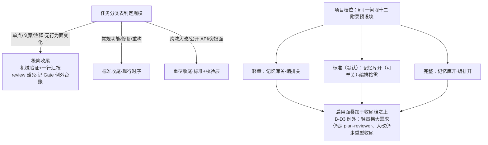

# 档位化裁剪与配置项（消解流程五缺点）

> 状态：**已确认——P1a/P1b 已落地（2026-09-14，标注见 §7；断言 22→24），待 P2 试点**（R2 隔离复审〔评审档 R2 复审节〕：发现 1〔major——影响面落点错标 / X-1 指派触点缺项 / 升级噪声口径失真，三者同根〕定稿批行级消解，机制未动；发现 2-5〔minor〕同批补齐——文内〔R2 复审发现 N〕标记）· 日期：2026-09-14 · 关联需求：会话内列出的现行流程五缺点（收尾不裁剪 / 串行等待 / 规则密度漂移 / 评审非独立 / 小项目收益递减）+「加 light/normal 模式」与「搞成配置项」两条提议 · 面向对象：crules-flutter 维护者/需求方
> 裁剪档位：标准（全 9 节）——机制类方案，触 init / 根模板附录 / help / 断言脚本多处。
> 姊妹方案：`docs/方案-2026-09-14-review结果校验机制.md`（R3）——其「校验层」在本方案 §4.2 矩阵归位（标准档=大改任务启用 / 完整档=默认启用），两案互引不重复。
> R2 修订记录（2026-09-14，依据 [裁决单 §4](裁决单-2026-09-14-校验与档位化两案合并.md)）：B-D1(a) 次选路线——**条目级标记层与装配式裁撤**，档位差异改由 §十二 附录三段预设块承载（单一权威）；B-D2 预授权并入提速档；B-D3 收尾档与项目档位解耦；B-D4 中文命名；B-D5(a) 记忆库标准档=开；B-D6 极简豁免记台账；X-1 排期解环+试点合并。v1 评审发现处置去向见 [评审-plan-档位化裁剪与配置项.md](评审-plan-档位化裁剪与配置项.md)。

## 1 目标与范围

**要解决什么**：现行规则为复杂/多人工程设计，对所有消费者无差别生效——小项目背全额机制成本（缺点 5）、高频小改动走全额收尾件头（缺点 1）、需求方不在线时串行 Gate 阻塞吞吐（缺点 2）、防漂移靠人工同源声明（缺点 3）、评审异质性有结构上限（缺点 4）。

**不做什么**：
- 不改协作红线与双 Gate 的**存在性**——裁剪的是「适用面与件头重量」，不是删 Gate（Gate 例外条款不变）
- 不产出三份规则拷贝（§2 决策 1）
- **不做条目级档位标记（`[L+]`/`[F]` 已裁撤）**——标记不减常驻 token（CLAUDE.md 全文常驻），只新增跨文件断言面与升级合并噪声（v1 评审发现 1/2/7/8，B-D1）
- **不做装配式裁剪**（install.sh 按档机械裁剪——否决理由见 §4.1 C5）
- 不解决评审异质性的结构极限——只收到「隔离协议 + 上游加宽」的可达上限（§2 决策 6，如实声明）
- deny-list / 协作红线 / lint **不可配置**（§4.4 清单）
- **轻量档不做文本瘦身**——收敛的是行为件头（收尾/必读面），不是常驻 token（诚实降级，A3 已撤行数比）

**老行为变更清单**：init 引导加一问（项目档位）；§十二 附录新增三段档位预设块；双模板第三节正文两处——收尾时序条文化三档（并入任务分类表）+ 需求 Gate 提问清单 checklist 化（〔R2 复审发现 1/5：正文改动不止附录，如实扩列〕）；收尾时序 help/README 同源图改版（X-1 指派触点，随 P1b 同批落）；help/README 同源断言扩面（附录块↔help↔README↔第三节收尾行 四方）。现有消费者**不重跑 init 则零变化**——默认 = 标准 = 现行行为，**零破坏迁移**（含记忆库：现行两模板 §十二 默认带 @NAVIGATION 行，矩阵标准档=开，与现行一致——B-D5(a)）。

## 2 核心决策

1. **两轴一源（无标记版）**：项目档位（init 一次选，预设捆绑）+ 任务规模（每次任务裁剪，扩展现有任务分类表至收尾时序）；规则文档**只此一份、正文无标记**，档位差异以 **§十二 附录三段预设块**承载（单一权威清单）。〔✅ B-D1(a) 已裁；标记层撤——「常驻收敛」卖点在标记机制下不可达，撤标记即撤伪承诺〕
2. **配置项为第二层覆写**：≤6 个单项开关进 §十二 附录，档位给默认值、知道要什么的人单改；**既有附录 4 字段（固定语言 / 提交触发词覆写 / 提速档 / 沉淀闸档位，init.md:44 并列）不计入 ≤6 上限**〔R2 复审发现 2：预授权并入提速档不改变既有字段数，原「4 变 3」表述失实，删〕，从属关系在附录写明；开关数超限即触发「收敛成新档位」的复核。〔⚠️ 数量上限为经验阈值，依据 §3.5 对标行 3〕
3. **三类物不可配置**：deny-list hook（无放行机制是其安全属性）、协作红线（提交授权/范围边界/证据真实性/破坏性确认——根 CLAUDE.md §三 Gate 例外明文不得跳过）、lint 硬拦。〔✅ 亲验 plugin/CLAUDE.md:59,109〕
4. **收尾时序三档化（轴二，与项目档位解耦）**：极简 = 机械验证 + 一行汇报；标准 = 现行；重型 = 标准 + 校验层（姊妹方案）。**判定只随任务规模走——轻量档项目的大需求仍走 plan-reviewer、大改仍走重型收尾（保护不随档位回退，B-D3）**；档位判定并入任务分类表。极简 review 豁免**记 Gate 例外台账**（B-D6），且仅在任务判定为极简时生效、与项目档位无关。〔✅ B-D3/B-D6 已裁〕
5. **串行压缩两件套**：批确认——需求 Gate + 方案七要素合成单张确认单（AskUserQuestion 单轮至多 4 问〔⚠️ 平台行为事实，仓内 2026-09-14 两轮裁决问卷已按此执行〕，超出部分文本列全后停等）；**预授权 = 既有提速档的标准用法细化**（三要素圈定是真实增量），不新增平行通道——B-D2 已裁合并。〔⚠️ 设计选择；提速档现状亲验 进阶/工程化流程.md:166、plugin/CLAUDE.md:322、init.md:44〕
6. **评审异质性收到可达上限**：上下文隔离（新会话）+ 模型档位差 + 只给静态基线（姊妹方案 §4.4 已落）；剩余盲区靠上游挡——需求 Gate 提问清单加宽为 checklist 化条目（落点：第三节正文 + P1a，〔R2 复审发现 5：决策与交付物脱钩已补〕）。〔⚠️ 结构极限如实声明〕
7. **防漂移机械化**：断言对象缩窄为「**附录预设块 ↔ help ↔ README ↔ 双模板第三节收尾行**」四方一致（help 全景计数闸先例）〔R2 复审发现 1：收尾三档判定文在第三节与 help/README 间为第四同源面，扩入断言〕，同源声明退化为兜底——无条目级标记即无跨文件标记断言面。〔✅ 先例亲验：仓库 scripts/ 已有 22 断言闸〕
8. **档位命名用中文**：轻量 / 标准 / 完整（英文缩写可并用：轻量〔light〕）。〔✅ B-D4 已裁——仓内文档主体中文〕

## 3 现状

现行机制的规模不敏感问题表（K1/K2/K3 现状行已按 v1 评审发现 11 修正）：

| # | 缺点 | 现状机制 | 差距 |
|---|---|---|---|
| K1 | 收尾件头不按规模裁剪 | 任务分类表只裁「需求 Gate」（方案 Gate 亦有极简裁剪 ①+④+⑦，plugin/CLAUDE.md:88）；**收尾时序无裁剪档** | 收尾时序、review、汇报件头、沉淀提示无对应裁剪档 |
| K2 | 串行等待多 | **有提速档（工程化流程.md:166：扩大极简范围、免方案直接实施、仅凭显式声明、不得自行升档）但无范围/规模/验证档的圈定规范**；无批确认机制 | 预授权缺三要素圈定即易漂移为模糊授权；Gate 往返无合并用法 |
| K3 | 规则密度大、漂移风险 | **常驻仅根模板 + @ 行**（进阶 6 篇/checklist/坑库盘上全量落位但按需加载，plugin/CLAUDE.md:316）；密度问题在根模板本体，同源声明无机械断言 | 档位差异面不进正文（§十二 附录预设块承载）；正文改动止于第三节收尾时序三档行与需求 Gate checklist 化（与档位无涉，〔R2 复审发现 1：「不动正文」表述失实已改〕）；同源断言待扩面 |
| K4 | 评审非独立 | reviewer/plan-reviewer 同模型，plan-reviewer 有上下文隔离 | 隔离协议未覆盖 reviewer（姊妹方案补）；上游提问无 checklist 宽度保证 |
| K5 | 小项目收益递减 | 「小项目可删」写进模板，删留判断落消费者头上 | init 无项目形态分档引导 |

## 3.5 行业基线与确定性分级（沉淀类必填）

| 维度 | 行业通用做法 | 本项目对照 | 结论 |
|---|---|---|---|
| 预设 + 覆写 | 工具链普遍「opinionated defaults + 少量 override」（约定优于配置） | 档位 = 预设，配置项 = override | ⚠️ 转述·凭记忆 |
| lint 配置形态 | `recommended` 预设 + 逐条 rules 覆写，而非纯逐条开关 | 同构：档位捆绑 + ≤6 单项 | ⚠️ 转述·凭记忆 |
| 开关数量阈值 | 无权威数字；「组合状态需可测试」是共识约束，2ⁿ 爆炸是反对纯开关的主因 | ≤6 为本仓经验阈值，非行业标准 | ❓ 推断待裁（挂 §9-Q3） |
| 裁剪轴分离 | 「项目脚手架分档」与「任务内裁剪」分属两层是常见实践 | 两轴对应 | ⚠️ 转述·凭记忆 |

> ❓ 级条目已列入 §9。

## 4 目标方案

### 4.1 候选对比（R2 补 C4/C5，C3 换轨为已裁路线）

| 候选 | 描述 | 优点 | 缺点 | 平台矩阵 | 结论 |
|---|---|---|---|---|---|
| C0 现状 | 全量规则无差别生效 | 零改造成本 | K1-K5 全在 | 无涉 | 基线 |
| C1 纯配置项 | 全部机制独立开关，用户自选 | 灵活极致 | 2ⁿ 组合野配置；判断成本回流消费者；漂移面指数扩 | 无涉 | 否 |
| C2 三份规则拷贝 | 三套文档 | 各档独立可读 | 孪生漂移必然——本仓已在用同源声明 + 计数断言跟双源漂移作战，三源自毁 | 无涉 | 否 |
| C3 两轴一源 + 条目标记（v1 路线） | 单一规则源 + `[L+]`/`[F]` 条目标记 + init 分档 + 收尾三档 | 零拷贝 | **标记不减常驻 token**（CLAUDE.md 全文常驻）；激活执行靠模型纪律；新增跨文件标记断言面与升级合并噪声 | 无涉 | 否（v1 评审发现 1/2/7/8，B-D1 裁撤） |
| C4 按需 @import 拆分 | 工程层 §七~§十一拆出常驻、按需载入（记忆库 @ 行先例；design-doc.md:3 B1 瘦身先例） | 真降常驻密度 | 对 K1/K2/K5 无作用 | 无涉 | 独立小方案另议，不替代本方案 |
| C5 装配式 | install.sh 按档机械裁剪模板生成消费侧 | 常驻面真收敛、档位执行机械化 | 装配产物概念进巡检/人工对照；升级 diff 噪声；**可删节面仅 ~12%**（模板源 plugin/CLAUDE.md 323 行、app/CLAUDE.md 346 行中 ~40 行，装机后另 +2 行）；收尾三档/批确认是行为机制，装配管不到 | 无涉 | 否（B-D1——机械收益 ~90% 与 D 档重叠，余 12% 文本裁剪不值 install.sh 复杂度） |
| **D 附录预设块（两轴一源）** | init 一问定档 → §十二 附录写入三段预设块之一（捆绑既有可选项 + 档位行为声明）+ 收尾三档 + 提速档对账；**正文无标记** | 零拷贝；附录单一权威、四方可断言；改造成本约为标记层零头 | 轻量档无文本瘦身（诚实降级：收敛的是行为件头） | 无涉 | **采纳（B-D1(a)）** |

> 「默认轻档」反向不采纳：与零破坏迁移直接冲突（现有消费者默认标准档）。排除理由入表（v1 评审发现 9 处置）。

### 4.2 档位定义与配置矩阵（B-D4 中文名；B-D5(a) 记忆库标准=开）

| 配置项 | 轻量〔light〕（单人/小工具） | 标准〔normal〕（日常工程，**默认**） | 完整〔full〕（复杂/多 agent） |
|---|---|---|---|
| 记忆库接线 | 关 | **开（可单关）**〔B-D5(a)：与现行模板一致——两模板 §十二 默认带 @NAVIGATION 行（plugin/CLAUDE.md:314、app/CLAUDE.md:337），§1 零破坏承诺保住〕 | 开 |
| 多 agent 编排（进阶） | 关 | 按需 | 开 |
| 方案评审闭环（plan-reviewer） | 日常关；**大需求仍启用（B-D3 例外）** | 大需求启用 | 默认启用 |
| review 校验层（姊妹方案） | 日常关；**大改任务仍走重型收尾（B-D3 例外）** | 大改任务启用 | 默认启用〔=重型收尾必含、常规收尾默认不含；全量启用走单开——R2 复审发现 4，与收尾行「按任务规模三档」钉死一致〕 |
| 收尾时序档 | **按任务规模三档**（极简占比高） | 按任务规模三档 | 按任务规模三档（重型含校验层） |
| distill 沉淀闸 | 记忆库关时：闸类落点 = **复盘直写等人过闸**（不引入绕闸语义，对齐 distill.md:77 无人值守硬线） | 现行 | 现行 + 度量复盘 |

附录预设块形态（示例，标准档）：`档位：标准。记忆库：开（默认，可单关）。编排：按需。plan-reviewer：大需求启用。校验层：大改任务启用。收尾：按任务规模三档。提速档：启用则圈三要素（范围/规模/验证档），规范见 进阶/工程化流程.md 提速档条。`——三段预设各 ~6 行，写 §十二 附录；与既有 4 字段（固定语言 / 提交触发词覆写 / 提速档 / 沉淀闸档位）并列，从属与计数关系在附录头部写明（见 §2 决策 2）；矩阵中**收尾时序档与校验层两行属任务轴**（轴二 / 姊妹方案），不设单项开关、不计入 ≤6〔R2 复审发现 2/3：原示例「见 §4.5」为方案节号泄漏，改内联 + 指针；从属关系一次写明〕。

### 4.3 收尾时序三档（轴二，B-D3：只随任务规模走）

| 档 | 判定（并入任务分类表） | 件头 |
|---|---|---|
| 极简 | 单点修复/文案/注释，无行为面变化 | 机械验证贴输出 + 一行汇报；**review 豁免记 Gate 例外台账（B-D6）**；无沉淀件头 |
| 标准 | 常规功能/修复/重构 | 现行时序（机械验证 → review → 修复复验 → 汇报含 review 结论 + 沉淀计数 → 授权提交） |
| 重型 | 跨域大改 / 公开 API / 资损面 | 标准 + 校验层（姊妹方案 §4.2 流程） |

### 4.4 不可配置清单（硬边界）

| 项 | 理由 |
|---|---|
| deny-list hook | 无放行机制是安全属性本身；配置成可关 = 闸变装饰 |
| 协作红线（提交授权 / 范围边界 / 证据真实性 / 破坏性确认） | 根 CLAUDE.md §三 Gate 例外明文「不得被模糊授权跳过」——可配置即违背立库初衷 |
| lint 硬拦 | 静态层闸，同理 |

### 4.5 批确认与预授权（K2 解法；B-D2：预授权并入提速档）

- **批确认**：非平凡但小型任务，需求 Gate 六要素 + 方案七要素合并为一张确认单（AskUserQuestion 单轮至多 4 问〔⚠️ 平台行为事实〕，超出部分文本列全后停等）；一次明确回复 = 两 Gate 同过，记录「批确认」标记
- **预授权 = 提速档的标准用法细化**（B-D2 已裁合并，不新增平行通道）：standing instruction 走 Gate 例外通道，**圈死三要素——范围（文件/模块面）、规模（N 个任务或时间窗）、验证档（对应 §4.3 收尾档）**，三要素缺一不成立；三要素即既有「提速档声明」附录字段（plugin/CLAUDE.md:322、init.md:44）的规范用法；**AI 不得自行升档、连续返工降档**（工程化流程.md:166 沿用）。每批结束汇报时逐任务列出实际执行对照；治理走 Gate 例外台账（单一通道）

## 5 影响面

| 对象 | 影响 |
|---|---|
| 用户（需求方） | init 多一问；轻量档用户**行为件头收敛**（极简收尾占比高、必读面小）——**常驻 token 不减（诚实声明）**；标准档现有消费者零变化 |
| 数据 | 无新增存储；档位与配置写 §十二 附录（三段预设块纯文本）；断言脚本扩面（四方断言） |
| 已有功能 | init 命令（加一问）、双模板 CLAUDE.md——第三节正文（任务分类表并入收尾三档判定 + 收尾时序行注三档 + 需求 Gate 提问清单 checklist 化）与 §十二（附录新增预设块），**正文改动止于第三节两处、无档位标记**〔R2 复审发现 1/5：原「正文零标记改动」与变更清单自相矛盾，如实重述〕；**checklist 无改**（任务分类表在双模板 CLAUDE.md 第三节正文——plugin/CLAUDE.md:73、app/CLAUDE.md:78，非 checklist.md，原落点错标已改）；help/README（收尾时序同源图改版〔X-1 指派〕+ 四方同源断言） |
| 平台矩阵 | 无涉——纯协作层机制 |
| 姊妹方案 | 校验层归位本方案 §4.2 矩阵行（X-2）；两案 P0 同批定稿；**试点合并双采证（X-1 已裁）——姊妹方案 A-P1 试点随本方案 P2 同任务执行，须含 ≥1 标准/重型档任务（B-D3=改 已裁，依赖条件①满足；条件②由 P2 排期钉死）** |
| 升级噪声 | 存量消费者 `--force` 升级时 CLAUDE.md `.new` 对照面 = **第三节两处正文改动 + §十二 附录新增预设块**，约十余行——较标记层方案大幅缩小，但**非「仅附录新增行」**（〔R2 复审发现 1：原口径失实已重述〕） |

**成本**（⚠️ 定性，v1 评审发现 10 处置——拆步+缓冲见 §7）：一次性 = 附录预设块设计 + init 一问 + 收尾三档与需求 Gate checklist 化并入第三节 + 四方断言（约为标记层方案手工量的零头）；持续 = 新增配置项时同步四处（附录 / help / README / 第三节收尾行，A4 四方断言拦漂移）。

## 6 测试与验收

### 6.1 验收标准表

| # | 判据 |
|---|---|
| A1 | 现有工程**不重跑 init** 时行为与改造前完全一致（标准 = 现状回归通过）；试点以 **3 任务窗口**计 |
| A2 | 三档收尾在真实任务中各执行 ≥1 次，件头与 §4.3 一致（重型档采证依赖姊妹方案 P0 已定稿——两案同批，不再跨方案悬置） |
| A3 | **撤行数比（B-D1）**——改「行为件头收敛」度量：极简收尾件头行数 + 必读面触达条目数显著低于标准档收尾，以试点实测为准；**不承诺常驻 token 收敛** |
| A4 | **四方断言**（附录预设块↔help↔README↔双模板第三节收尾行）跑绿——档位映射与收尾三档判定单一来源〔R2 复审发现 1：第四同源面扩入〕；无条目级标记断言面 |
| A5 | 不可配置清单在 init 引导与文档中显式声明，无「可配置」误导表述 |

### 6.2 自测用例表

| 前置 | 步骤 | 预期 | 平台(矩阵) | 结果证据 |
|---|---|---|---|---|
| 现有消费工程不重跑 init | 走一次完整收尾 | 行为与改造前一致（零破坏） | 无涉 | 待执行 |
| init 选轻量 | 起一个单点修复任务 | 极简收尾件头，无 review/沉淀件头 | 无涉 | 待执行 |
| **轻量档项目起大需求** | 走方案流程 | **plan-reviewer 仍启用（B-D3 例外验证）** | 无涉 | 待执行 |
| init 选标准 + 单关记忆库 | 走一次常规任务 | 记忆库关闭，其余 = 标准 | 无涉 | 待执行 |
| 标准档大改任务 | 走重型收尾 | 校验层启用（姊妹方案流程） | 无涉 | 待执行 |
| 断言脚本 | 篡改附录块一处档位值后跑断言 | 断言报红指出四方不一致处 | 无涉 | 已执行（2026-09-14）：plugin/CLAUDE.md 轻量行「记忆库：关」篡改为「开」→ 四方同源闸 FAIL，漂移清单报「plugin/CLAUDE.md 缺「记忆库：关」」（twin 逐字断言同次联动报红，FAIL=2）；还原后复跑 PASS=24 FAIL=0〔Task 4 实测，报告 task-4-report.md〕 |
| 预授权指令 | 圈三要素后派一批小 fix | 批内逐任务执行，结束对照汇报；缺要素时拒批并说明 | 无涉 | 待执行 |

## 7 分阶段落地（v1 评审发现 10 处置：P1 拆步 + 排期留缓冲）

1. **P0 定稿**：本稿隔离复审通过 → 转已确认（Q1/Q2/Q5 已随裁决单 2026-09-14 裁毕）
2. **P1a 预设块**：附录三段预设块设计落模板 §十二 + init 加一问（三档选项 + 各档一句话适用描述）+ 收尾三档并入任务分类表（第三节）+ **需求 Gate 提问清单 checklist 化落第三节**（决策 6 上游加宽的交付物，〔R2 复审发现 5〕）——**已落地 2026-09-14**
3. **P1b 断言与同源**：四方断言（附录块↔help↔README↔第三节收尾行）进现有断言脚本；help/README 同步档位说明；**收尾时序 help/README 同源图改版同批落（X-1 指派触点，姊妹方案 A 案的时序图更新由此承载——〔R2 复审发现 1 / A 案 R3 复审发现 1：原两案排期均漏此触点〕）**（A4 验证）——**已落地 2026-09-14（四方同源闸 + twin 档位块断言，22→24）**
4. **P2 试点与双采证**：轻量档在一个真实小项目试点（A1/A2/A3 采证，3 任务窗口）；**同批含 ≥1 标准/重型档任务——姊妹方案校验层 A-P1 同任务双采证（X-1 已裁）**
5. **P3 复盘**：三档试点后回看配置矩阵是否需调档（配置项→新档位的收敛复核）；各阶段间留排期缓冲

## 8 风险与回退

| 风险 | 缓解 | 回退 |
|---|---|---|
| 「档位」概念增认知负担 | init 一问 + 各档一句话描述；规则正文不重复解释档位（只在附录定义一次） | 档位退化为「标准/完整两档」甚至仅标准（附录块保留） |
| 改造中滑向三份拷贝 | §4.1 C2 否决理由入文档；四方断言拦跨文件不一致 | 预设块全撤 = 回 C0 |
| **档位执行漂移**（附录声明靠模型遵守） | 收尾汇报强制声明「本任务按 X 档件头执行」+ A2 试点采证 + 四方断言拦文档面漂移 | 行为面漂移超阈值时收窄档位差异 |
| 配置项蔓延（>6） | §2 决策 2 阈值触发「收敛成新档位」复核 | 超限配置项降级为「档位差异说明」不落开关 |
| 轻量档踩坑（缺 Gate 保护出坏改动） | 极简收尾仍保留机械验证贴输出；不可配置清单兜底红线；**大需求/大改例外保 review 与 plan-reviewer（B-D3）** | 轻量档汇报模板加一行「本档无 review 层」显式提示 |
| 批确认/预授权被滥用为绕 Gate | 三要素缺一不成立 + 批结束逐任务对照汇报 + Gate 例外台账单一通道 | 收紧为「仅轻量档可用预授权」 |
| 断言维护成本随文档增长 | 断言只查附录块四方一致不查语义 | 断言降频为发版前手动跑 |

## 9 待确认事项

| # | 问题 | 责任方 | 阻塞 |
|---|---|---|---|
| Q1 | ~~档位命名~~ **已裁（2026-09-14，裁决单 B-D4）：中文——轻量/标准/完整** | — | 已销 |
| Q2 | ~~配置矩阵默认值~~ **已裁（B-D5(a)）：记忆库标准档=开（可单关），其余五行维持原案** | — | 已销 |
| Q3 | 配置项数量上限 ≤6 是否认可为硬阈值（既有附录字段不计入） | 需求方 | 否（默认认可） |
| Q4 | ~~A3 量化目标~~ **作废（B-D1）**——A3 已撤行数比，改行为件头度量，无量化目标题 | — | 已销 |
| Q5 | ~~极简档 review 豁免~~ **已裁（B-D6）：豁免，记 Gate 例外台账；仅任务判定极简时生效、与项目档位无关** | — | 已销 |
| Q6 | 批确认/预授权适用档：全档可用，还是仅轻量/标准（完整档大改本就该逐 Gate 走）？ | 需求方 | 否（默认全档、完整档限非重型任务） |
| Q7 | 行业基线表 ⚠️ 级（预设+覆写 / lint 形态 / 轴分离）是否要求补充查证后定稿 | 需求方 | 否 |
