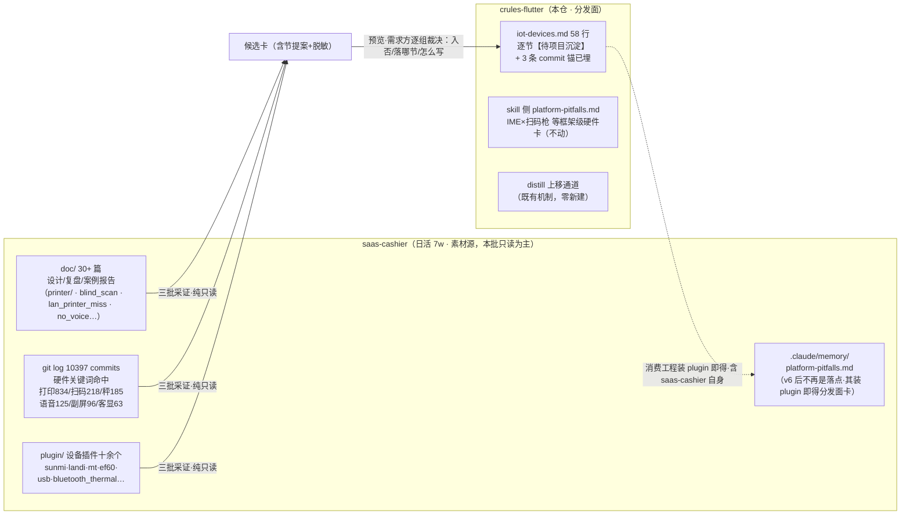
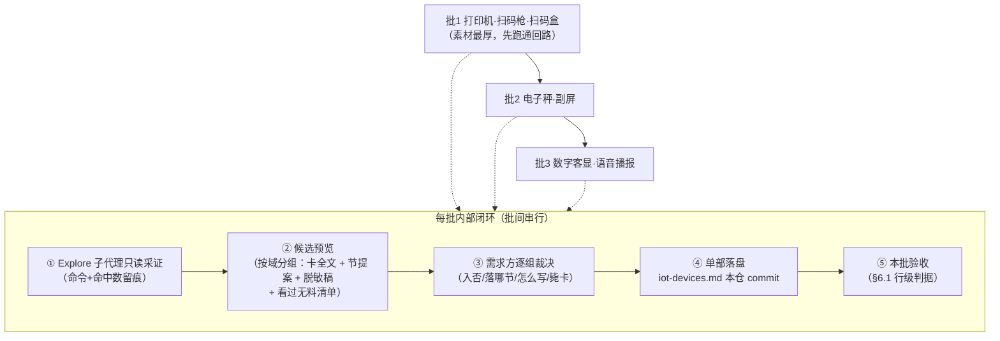

# 方案 · 2026-09-23 · 硬件外设知识沉淀（saas-cashier 实证 → 知识库三批）

> 状态：**已确认（2026-09-24 终审裁决：Q1=修订·单一落点分发面 / Q2=甲·钱箱独立成节 / Q4=乙·stub 仅终报带建议）· 批1 采证进行中** · 日期：2026-09-23（终审 2026-09-24） · 关联需求：需求方 2026-09-23 口头立项 · 面向：维护者/需求方
> **评审记录**：v5 外部 plan-reviewer 独立评审（I9）裁决「修后实施」，12 项发现已全部处置（F1–F12 → §0 I5 纠 / §1 消双读 / §4.0 矿①重定义 + distill 关系申报 / §4.1②③④ / §4.4 / §6 V2 V3 T6 T7 / §7 阶段1 / §8 R8 R9 / §9 Q2 Q4）；其无 git 能力项（F11）已由既有 T1/T6 闸覆盖。
> **v6 终审改判（2026-09-24，I10）**：需求方 Q1 反问「这类坑应该是做 Flutter 应用开发的实际坑」→ **取消两部落，单一落点 = 本仓分发面**（saas-cashier 已装本 plugin，分发面卡其会话同样可检索；型号不再是不入仓理由，转为主检索键）。跨仓写全链废止：D6/R2/R9（含其 F12 系）/T5 跨仓部分/V5 取消，saas-cashier 回到纯只读。裁决详情见 §9。
> 版本：**分发面扩写 = 版本批（D9 第四轮修订：三批收口为一个版本批，一次 bump + CHANGELOG + 双 json）**；docs/ 过程文档零版本。正典先例 `d95862f` 0.6.0 / `c6935a9` 1.0.30。

## 0. 依据链（立项输入，逐条标级）

| # | 输入 | 核实 | 分级 |
|---|---|---|---|
| I1 | saas-cashier（日活 7w 消费工程）存有大量打印/扫码等硬件实战知识，散在 `doc/` 30+ 篇设计/复盘/案例报告 + git 日志 + `plugin/` 十几个设备插件 | 实测：`doc/` 目录清点（printer/、blind_scan、lan_printer_miss_print、ios_bluetooth_print_crash、pic_print_png_codec、takeaway_auto_accept_no_voice 等）；`plugin/` 含 sunmi_printer / landi_print_plugin / mt_printer / print_bluetooth_thermal / flutter_usb_printer / esc_pos_printer / elec_scale_plugin / electronic_scale_plugin / flutter_subscreen_plugin / ef60_subscreen / android_devices_sn / qr_code_scanner / mobile_scanner；`lib/` 含 sub_screen / module/{electronic_scale,digital_display,voice_play,scanner,scanner,pub/printer,call_food_pick_up} | ✅ 亲验（目录清点 + commit 计数见 I3） |
| I2 | 本仓分发面已有承接位：`skills/flutter-rules/references/iot-devices.md` 58 行，逐节留【待项目沉淀】，且文件头自述「来源：saas-cashier 8 类设备实证」——素材与坑位互为准备 | 实测：本仓文件全文读 | ✅ 亲验 |
| I3 | 素材量级：git log 关键词计数（口径 `git log --oneline --grep`，均 master 单线）：打印 834 / 扫码 218 / 电子秤·体重秤 185（宽口径含单字「秤」208）/ 语音·播报 125 / 副屏 96 / 客显 63；打印机·print -i 769。**复核实测补**：钱箱 40（另 drawer·cashbox 36）/ 扫码盒 7（薄，见 §4.4 注） | 实测：`git log --grep -c` 计数两轮（第二轮复核钱箱/扫码盒/宽口径），命令可复跑，留档 §6.2 T1 | ✅ 亲验 |
| I4 | 高复现硬件坑已有入分发面先例：skill 侧 `platform-pitfalls.md` 症状速查「扫码枪扫不出、keyLabel 空串、numpad 无输出、IME 吞字符」即 Windows 扫码枪实证卡；`iot-devices.md` 内三条 commit 锚（`173e731c1` / `aaa9995fd` / `db82458e5`） | 实测：两文件读 | ✅ 亲验 |
| I5 | 私有仓 commit 哈希作实证锚的口径已被仓内明文背书（「对外视作信任声明」），优先补文档路径类可复核锚 | 实测：`checklist.md:6` + `memory/platform-pitfalls.md:7` 头部「实证口径」行（**独立评审 F1 纠：原稿误写「README 明文背书」——README 全文无此字样，主语失实即本批红线同型违反，已纠**） | ✅ 亲验 |
| I6 | 2026-09-23 会话内双裁决：目标位置 = **C 混合两部落**（通用→分发面、型号→saas-cashier memory、distill 上移联动）；分发面结构 = **C1 单文件扩写** iot-devices.md（膨胀后再拆不迟）。**（C1 维持有效；两部落部分被 I10 终审改判取代——裁决链 I6→I10 完整留痕）** | 需求方对话裁「你觉得哪种比较好→继续」，本方案即其落档 | ✅ 亲验（对话内裁决，白纸黑字自本方案起） |
| I7 | **消费工程已有一份蒸馏成品**：`doc/pitfall_knowledge_base_2026.md`（99 行，「复盘核验版」）——打印坑七条**已带 commit 证据 + 外部佐证链接**（StackOverflow / escpos-php issue / MS Q&A），且有「⚠️ 待修正认知」节（自曝 memory 旧卡与代码现状张力）。这不是散料，是做过一轮采证+核验+对标的半成品 | 实测：文件全文读、打印坑节逐条核 | ✅ 亲验（第三轮自审发现，v1 稿低估——原方案把 git log 当主矿、此档当普通文档锚） |
| I8 | **存量分发面有幽灵锚**：skill 侧 iot-devices.md 网口打印机卡引 `173e731c1`——`git cat-file -t` 实测 **Not a valid object**（双仓皆无）；真锚为 `173e731c8`（feat(printer): 网口打印机兼容模式（漏打方案3.1 连发间隔保护），且 `doc/lan_printer_miss_print_case_report.md` 引的正是 173e731c8）。其余两条存量锚 `aaa9995fd`/`db82458e5` 实测存在。与仓内 1.0.40「幽灵版本清理」「引用须实测依据」红线同族缺陷 | 实测：8 个涉案哈希逐一 `git log -1` / `git cat-file -t`，命令可复跑 | ✅ 亲验（第三轮自审发现） |
| I9 | **第三方独立评审 v1**（plan-reviewer 会话，只读核证）：真实性核验主体通过（I2/I7/I8 旁证/D9 先例/Q4 分叉等逐项开文件核对属实）；报 12 项发现 = P1×7（F1 主语失实 / F2 条款自相矛盾 / F3 成品档跨节漏挖含**称重资损卡** / F4 distill 闸冲突未申报 / F5 商户实名出仓 / F6 本仓并发零防护 / F12 型号卡单机持久性）+ P2×5 + Q4 默认项与自身论证打架；裁决建议**修后实施**（无重做级、技术骨架未动摇）。本稿 §0 I5、§1、§4.0、§4.1、§4.4、§6、§8（R8/R9）、§9（Q2/Q4）为其处置落点 | 评审报告全文在会话记录；其无 git 能力项（计数/哈希终验）方案侧本已 T1/T6 设闸，与 F11 提示一致 | ✅ 亲验（第五轮 = 外置换评审，非自审） |
| I10 | **终审改判（2026-09-24）**：需求方裁 Q1 时反问「有更好的方式吗？这类坑应该是做 flutter 应用开发的实际坑」——成立：saas-cashier 自身即装本 plugin，分发面卡其 AI 会话同样检索得到，「型号坑必须落其本机 memory」的前提是假的；硬件型号怪癖（芯烨重试重复打、位图不跟 ESC a 对齐等）换任何 Flutter 工程照踩，属「Flutter 接硬件的实际坑」= 领域特性。**两部落取消，单一落点 = iot-devices.md** | 对话内裁决（AskUserQuestion 答复 + 修订提案获「继续」确认），本行为其落档 | ✅ 亲验 |

## 1. 目标与范围

**目标**：

- **G1** 把 saas-cashier 七类硬件设备（打印机、扫码枪、扫码盒、电子秤、副屏、数字客显、语音播报）的实战知识，采证、提炼、沉淀为可检索知识库——**单一落点：本仓分发面 `iot-devices.md`**（I10 终审改判；型号即检索键，通吃所有消费工程含 saas-cashier 自身）。
- **G2** 沉淀后 iot-devices.md 中各域的【待项目沉淀】要么填实、要么显式标「无实证不预置」——不留含糊占位（入预置门槛沿用 skill 侧平台坑库纪律：宁缺毋滥）。
- **G3** 每张卡检索路径成立：症状词 → 域节 → 卡 → 实证锚（commit 哈希 / saas-cashier `doc/` 路径）。
- **G4** 回路本身可复用：三批走完即固化「外部采证 → 候选预览 → 逐组裁决 → 单一落点落盘」的标准流程，为后续跨仓知识蒸馏立样板。

**不做什么**：

- 不改 saas-cashier 任何代码、不动其 `doc/` 既有文档本体（只引用、收编，不重抄——防「抄一份烂一份」，README 实证先例）。
- 不新建 iot agent（iot-devices.md 升格触发条件未满足——本批是知识沉淀，非多轮自持调试任务）。
- 不做行业对标外部查证（本批全部素材来自自有生产实证，非「提为分发规则需对标行业基线」的沉淀类——§3.5 行业基线节据此裁剪，替代为 §3 两仓分工基线）。
- 不预设型号卡数量 / 不规定通用 vs 型号的机械判据（裁决权在预览逐组环节，判据为 §4.2 引导问句）。
- 本批不动 hooks / SKILL.md **触发结构·frontmatter·references 文件增删** / test-self 闸面（例外处置见 §8 R4）；**SKILL.md :23 索引行与 backend.md :52 分节列举的文字同步除外**（属分发面一致性义务，非挂载结构变更，见 §4.1④——独立评审 F2 消双读）。

**老行为变更清单**：`iot-devices.md` 单文件从 58 行扩写为多节详版（v6 单部落口径预计 400–600 行，见 R6），原「外设类/多屏类」骨架结构保留、各【待项目沉淀】占位逐一处置，文件头分工句按 D1 v6 改写，新增「钱箱」「语音播报」独立节；其余零行为变更。

## 2. 核心决策（编号，每条一句话可独立成立）

- **D1** ✅ **（v6 终审改判，I10）** 知识单一落点 = 本仓 `iot-devices.md` 随 plugin 分发：硬件型号怪癖即「Flutter 接硬件的实际坑」，属领域特性，型号是主检索键而非不入仓理由；saas-cashier 自身装有本 plugin，分发面卡其会话同样可检索——原「两部落」的落点分离前提（型号坑须住其本机 memory）不成立。**连带**：文件头既有分工句「具体型号坑住消费工程 memory」随批1 改写为本判据。
- **D2** ✅ **（v6 收缩）** 预览环节不再裁「通用 or 型号」（两部落取消后此问消失），只裁三件事：**入不入**（有实证锚才入，宁缺毋滥）、**落哪节**（节提案）、**怎么写**（措辞/脱敏/合并修订）。「通用性判据」行降为节提案的论据之一。裁决权仍在需求方、逐组进行（I10）。
- **D3** ✅ 分发面采用 C1 单文件扩写：触发场景单一（接/调外设前 Read），拆文件是为拆而拆；膨胀信号出现（单域 >200 行或与 platform-pitfalls 对账面纠缠）再按域拆，拆分是后续独立批。
- **D4** ✅ 批次串行、每批独立闭环：第一批 打印机+扫码枪+扫码盒 → 第二批 电子秤+副屏 → 第三批 数字客显+语音播报；每批走完「采证 → 预览 → 裁决 → 落盘 → 本批验收」再开下一批，批间不攒裁决。
- **D5** ✅ 采证覆盖面声明外置：候选预览头部必附检索命令 + 命中数 + 「看过无料」清单，机械证据先行，禁裸报「已全面梳理」。（仓内教训：自报覆盖面系统性高于实际）
- **D6** ✅ **（v6 废止）** 原「型号层落盘授权」问题随单一落点消解：本任务对 saas-cashier **纯只读**（采证不写），Q1 已裁（§9）。
- **D7** ✅ 实证锚双轨：commit 哈希按仓内口径视作信任声明；凡 saas-cashier `doc/` 有对应设计/复盘文档的，锚必含文档路径（可复核锚优先）。
- **D8** ✅ 与 skill 侧 platform-pitfalls.md 的分工：框架级坑（OS/SDK/依赖版本交叉，如 Windows IME 吞扫码枪字符）住坑库不动，iot-devices.md 只留指针；硬件协议/设备行为级坑住 iot-devices.md。判据：症状是否绑「某类外设接入」这一触发场景。
- **D9** ⚠️ **（第四轮修订）** 版本策略分两栏：**本仓 docs/ 过程文档零版本**（仓规）；**分发面扩写 = 版本批**——v1 稿引 `0d19f1f` 先例系错误类比（那是本仓自有 memory 模板、非分发面），仓内正典先例 = `d95862f` 0.6.0（IoT 抽层 iot-devices.md 本身）与 `c6935a9` 1.0.30（坑卡上移 6 张）均 bump + CHANGELOG + 双 json。**采「三批收口为一个版本批」**（一次 bump + 一条 CHANGELOG）而非逐批 bump——三批间有号段消耗与在途批次撞号风险（让位条款虽在，膨胀可免）；CHANGELOG 补记随版本批必含，不再是裁量项（Q3 据此关闭）。commit 信息风格遵仓规（无图标、精炼），本仓侧批间 commit 照文档纪律、版本收口批单独 bump。

## 3. 现状

### 3.1 知识分布（两仓现状）

### 3.2 问题表

| # | 问题 | 后果 |
|---|---|---|
| P1 | 硬件知识困在单一消费工程：`doc/` 文档人读可、AI 检索不可达，git 日志知识无人提炼——**且其中已有一份高质量蒸馏成品（I7 `pitfall_knowledge_base_2026.md`，带外部佐证与自省节）同样困在 `doc/` 里，plugin 消费面完全无感** | 下一个 POS 工程接入外设时，plugin 侧 AI 查到的 iot-devices.md 全是占位，等于零资产——「领域内容是特性」未兑现；已付过一轮采证成本的成品被重复浪费 |
| P2 | 高复现坑（扫码枪、网口漏打）个别已入分发面，但系零散装丁，无系统采证 | 分发面覆盖率靠运气，同域新坑无沉淀路径 |
| P3 | 硬件级知识在 skill 侧无权威位：平台坑库检索键只有 OS/SDK/依赖三档枚举，设备型号怪癖无处安身（v6 注：原表述「型号知识连其项目侧权威位都没占住」随两部落作废，问题改为本文件自身的结构缺位） | 分发面读者（含 saas-cashier 自己的 AI 会话）接外设时无坑可查 |

## 4. 目标方案

### 4.0 采证策略裁决：矿脉排序（I7 驱动的修订）

三轮自审发现 v1 稿把「git log 万条」当主矿，这是次优。候选策略对比：

| 选项 | 做法 | 评估 |
|---|---|---|
| 甲 · 日志主扫（v1 默认） | 每批从 git log 关键词命中全量下钻 | ✗ 834 条打印 commits 里大量是 merge/feat 噪音；且会把 `pitfall_knowledge_base_2026.md` 已核验过的结论重新刨一遍——浪费，且二次提炼易丢其一手的「外部佐证」维度 |
| 乙 · **分层采证（推荐）** | **先筛后炼**：每批采证顺序 = ①`pitfall_knowledge_base_2026.md` 对应节 + 域专题文档（人写的成品，直接作候选卡基线，连外部佐证一并继承）→ ②git log 扫**成品未覆盖**的增量（用 ①已收编清单做排除项）→ ③plugin/lib 代码面定点回读补根因。git log 降级为「增量发现器」而非主矿 | ✅ 成品档已做过一轮采证+核验+「待修正认知」自省，站在其上采增量，覆盖率反而更高、锚质量更高 |
| 丙 · 纯成品搬运 | 只把 pitfall KB + 专题文档誊进知识库，不扫日志 | ✗ 成品档覆盖不均（打印坑厚、秤/副屏/客显/播报近零——实测其目录仅打印域成表），且违背 D5 覆盖面外置 |

**采纳乙**。§4.4 各批锚清单据此重标优先级：成品档 = 第一矿，专题文档 = 第二矿，git log = 第三矿（增量核对）。

**矿①检索面定义（独立评审 F3 纠——v4 稿原写「成品档对应节」过窄）**：成品档是跨域混排的，高价值料不在域专节——副屏卡藏在「Android 14+」节（`f65fd7234` 旁还有同根因两卡）、**连续称重资损卡**在「四、业务坑」（8068d7616 等四锚 + 「delta 措辞」辨析）、电子秤 Timer 泄漏在「五、并发/状态坑」（05cb54b66）、盲扫三条在业务坑。矿①执行 = **成品档全文按域关键词过一遍**，不按节切；批2 采证启动清单显式点名 :36（副屏）/:69（称重资损）/:82（秤 Timer）三处为已有一手条目。此纠不推翻矿序本身——甲/丙两案被否的理由（重刨浪费、丢外部佐证维度）恰因 F3 而更成立：漏挖资损级已核验料就是最贵的浪费。

**与 `/crules-flutter:distill` 闸的关系（独立评审 F4 申报——本回路非静默 fork，系显式复用其纪律 + 申报一处差异）**：

| distill 既有纪律 | 本回路处置 |
|---|---|
| §5「矛盾必须消解、禁止并排」「写前查重、相近合并修订」（`commands/distill.md:50/:52`） | **采纳**：落盘前与目标文件既有条目 grep 查重，相近即转修订合并——「只追加不重排」（§4.3）仅指**结构不重排**，不含**内容不合并**，两条款以本行为序（追加式是回退优点的 R1 论证不受影响） |
| 入库资格五问 + 三操作（新增/修订/建议废弃，distill.md:24-32） | **部分采纳**：裁决三操作从「通用/型号/毙」扩为含**修订既有卡**维度——成品档「⚠️ 待修正认知」节的张力项本质即修订场景（§4.1① 已要求按现码裁定，产物按 distill「修订」而非「新增」计） |
| 台账（`.review-ledger`）+ 档位条款（distill.md:65） | **v6 简化**：单一落点后不再直写消费工程走闸落点，原 F4「绕开其仓 distill」差异申报随 Q1 裁决作废；本回路对自身仓侧仍走预览=裁决=落盘语义（distill 闸的输入形态不覆盖外仓历史批量反向提炼，此判断不变——回路独立成立） |

**存量锚治理（随批1）**：I8 幽灵锚 `173e731c1`→`173e731c8` 修正，批1 落盘时随带（一行修，不另立批）；**历史 CHANGELOG 叙事面的同值残留（`CHANGELOG.md:586`）不回改**——仓内既有口径（ac2c7a8 已将 verify-cache grep 面排除 CHANGELOG 叙事面），只改正文件（独立评审 F9 补申报）。其余分发面全部引用锚（含本方案新埋的），**落盘前逐一 `git cat-file -t` 实测**——这是把仓内「引用须实测依据」红线具体化到本批的机械验收，进 §6.2 T6。

### 4.1 三批管线（D4）

- **①采证（按 §4.0 乙·分层）**：每批 1–2 个 Explore 子代理（只读，不碰工作区），检索面三级 = 成品档全文按域关键词过一遍 + 域专题文档全读 → git log 增量扫（排除已收编项）→ plugin/lib 代码面定点回读。commit 计数类证据由主控本地命令复核后入档（子代理报数须抽查）。成品档「⚠️ 待修正认知」节的张力项：采证时按现码实测裁定，不得直接照抄旧结论（R7）。
- **②预览（v6 收缩）**：候选卡 = 全字段（归属/触发场景/症状/根因/规避/区间/状态/出处）+ **节提案**（落 iot-devices.md 哪节、新增小节还是修订既有条目；「通用性判据」降为节提案论据）。**归属字段**在分发面语境统一填「硬件设备/厂商 SDK（括注设备插件）」——本文件自成一套按通信方式/设备分域的检索键，不复用平台坑库的 OS/SDK/依赖枚举（原 F10 映射问题随两部落作废）。saas-cashier 已有文档覆盖的坑，卡内出处指向该文档，不重抄正文。**每卡自带脱敏稿**（R8：入分发面即对外，商户实名/内部工单号一律泛称化）。
- **③裁决（v6 重写）**：逐组（按设备域）裁三件事——**入不入**（有 commit 锚 或 doc/ 路径实证才入，宁缺毋滥）、**落哪节**、**怎么写**（含与既有条目的合并修订、毙卡合法、脱敏复核）；操作集含**修订既有卡**（F4：张力项按 distill「修订」计）。
- **④落盘（v6 单部）**：仅改本仓 iot-devices.md 单文件 + 指针面同步（SKILL.md :23 索引行 + `agents/backend.md:52` 设备分节列举，两者按节名枚举、新增节须同步补，防 1.0.38 死指针闸同族缺陷）。**分发面每次落盘后必须 `git add`**（本仓 skills/ 进 git 即进包）。版本号与 CHANGELOG 按 D9 于**批3 收口时一次处置**。

### 4.2 节提案引导判据（v6 收缩——原「通用 vs 型号」判据随两部落作废，改为「落哪节」）

| 判据 | 特征 |
|---|---|
| 修订既有条目 | 成品档/分发面已有同坑描述（含「⚠️ 待修正认知」张力项）——优先合并修订，禁止并排矛盾（distill §5 纪律采纳） |
| 落通信方式节 | 坑绑传输通道而非设备品类（BLE MTU/先订阅后写、RS232 粘包拆帧、USB 枚举与权限、网口 socket 时序） |
| 落设备专项节 | 坑绑设备品类（打印专项/扫码专项/钱箱/秤/副屏/客显/播报），与通信方式节交叉时**设备节为主、通信节留指针**（单点权威，防双份漂移） |

### 4.3 落点文件与结构

| 落点 | 文件 | 动作 |
|---|---|---|
| 分发面（唯一落点，I10） | `skills/flutter-rules/references/iot-devices.md` | 单文件扩写：保留现骨架（通用铁律/外设类/多屏类/独立 App 类），各【待项目沉淀】→ 填实或标「无实证不预置」；**批1 新增独立「钱箱」节**（Q2=甲终审）+ 文件头分工句按 D1 v6 改写（具体型号坑不再外放消费工程 memory，型号即检索键）；**批3 新增「语音播报」节**（现文件无该节，素材驱动的结构增补，非违背 D3 保留骨架）；各域小节内允许「坑列表」形制，文件头更新素材来源与核验日期 |
| 不动面（v6 扩列） | saas-cashier **全部文件**（含其 `.claude/memory/` 与 `docs/` stub——Q4=乙终审：本任务零触碰，仅在批3 终报附一行 stub 处置建议）、skill 侧 `platform-pitfalls.md`、SKILL.md、hooks、memory/ 模板、checklist | 零触碰（R4 例外处置除外） |

### 4.4 各批预估检索关键词面（采证启动清单；§4.0 乙·三级矿序）

> **第一矿 = 成品档** `doc/pitfall_knowledge_base_2026.md` **全文按域关键词过一遍**（不按节切——矿①定义经 F3 修正，料跨节分布，见 §4.0）；**第二矿 = 下表"已知文档锚"**（专题设计/复盘全读）；**第三矿 = git log 关键词**（增量发现器，排除已收编）。成品档覆盖不均但非「仅打印域」：打印域成表最厚，秤/副屏/盲扫/并发各有散卡（:36/:69/:82 等），客显/播报近零——后两域实际以第二、三矿为主。

| 批 | 域 | git log 关键词（第三矿·示例，实施时补全） | 已知文档锚（第二矿） |
|---|---|---|---|
| 1 | 打印机 | 打印、打印机、print、小票、票据、escpos、纸、缺纸 | doc/printer/{debugging,decisions}.md、print_image_governance_roadmap、pic_print_png_codec、print_logo_quality、hybrid_multicol_image_row_wrap、lan_printer_miss_print_case_report、ios_bluetooth_print_crash_fix、bluetooth_print_log_*、docs/superpowers/specs/2026-06-17-esc-pos-hybrid-print、docs/crash-reports/windows-deviceid-changed-after-upgrade |
| 1 | 扫码枪/扫码盒 | 扫码、扫码枪、扫码盒、barcode、scan、盲扫、HID、核销 | doc/blind_scan_dup_guard_design、code_review_windows_blind_scan、docs/superpowers/plans/2026-05-09-blind-scan-feature、search_bar_69code_no_search_fix_design、docs/复盘-windows-ime-69code（框架级已入坑库→指针）、group_purchase_verify_consistency_design、scan_pay_dup_init_freeze_*。**扫码盒素材薄（实测仅 7 commits）**——其知识大概率并在大「扫码」218 条与核销文档内；若采证后仍薄，该节按 V2 允许标「无实证不预置」，不为凑卡降低门槛 |
| 1 | 钱箱（Q2=甲终审·独立采证子域+独立成节） | 钱箱、cashbox、drawer、弹箱 | 实证线索：`3ae4316da`（网口打印机开钱箱）、`cd88b2717`（钱箱延时+USB 打印 200ms 初始化等待）、`5c8944369`（rum 打印机空指针×USB 钱箱）、`32bb147da`（商米 T1 副屏×钱箱互斥，与批2 副屏卡互斥查重——按 §4.2 钱箱节为主、副屏节留指针）；计数实测 40——素材非薄 |
| 2 | 电子秤 | 电子秤、秤、weight、scale、克重、COM口 | plugin/elec_scale_plugin、plugin/electronic_scale_plugin、lib/module/electronic_scale |
| 2 | 副屏 | 副屏、subscreen、second screen、投屏 | plugin/flutter_subscreen_plugin、plugin/ef60_subscreen、lib/sub_screen；实证线索：`f65fd7234`（Android 14 副屏 Window type mismatch）、`32bb147da`（商米 T1 副屏×钱箱互斥） |
| 3 | 数字客显 | 客显、数字客显、led、点阵、COM口 | lib/module/digital_display；实证线索：`89bc52b2b`（Windows 客显×电子秤共享 COM 口缓存/释放——**跨批 2/3 耦合素材，两批采证互斥查重**） |
| 3 | 语音播报 | 语音、播报、voice、tts、notify、到账 | doc/takeaway_auto_accept_no_voice_case_report、plugin/android_devices_sn、lib/module/voice_play、lib/module/call_food_pick_up/voice_play_setup |

## 5. 影响面

- **本仓**：仅 iot-devices.md 内容增长 + 本方案与批记录文档；消费工程升级时获得硬件知识分发资产（正向）；plugin 包体增大 < 30KB 量级（文本，无 token 常驻成本——references 按需 Read）。**saas-cashier 升级 plugin 后同样获得**（单一落点设计意图：素材源仓也是消费面）。
- **saas-cashier**：**零触碰**（v6：纯只读素材源；Q4=乙——其 stub `docs/platform-pitfalls.md` 本批不处置，批3 终报附一行建议）。
- **已有功能**：零代码触碰、零闸触碰；`/distill` 通道复用不改造。
- **平台矩阵影响行**：本方案产物跨 Android/iOS/Windows 三发版线均有内容命中（商米=Android POS、Windows 扫码枪/打印机、bluetooth 打印 iOS），但沉淀物为知识非代码，无运行时影响。

## 6. 测试与验收

### 6.1 验收标准表（WHAT）

| # | 判据 | 批次 |
|---|---|---|
| V1 | 每批预览必附采证留痕：检索命令 + 命中数 + 看过无料清单（D5） | 批1–3 |
| V2 | 批3 终验：iot-devices.md 内「打印专项/扫码专项/**钱箱（批1 新增节，Q2=甲）**/蓝牙（秤）/串口 RS232/USB/网口（打印机）/副屏·数字客显/**语音播报（批3 新增节，F7 补列）**」各节**无裸【待项目沉淀】**——要么填实、要么「无实证不预置」 | 批3 |
| V3 | 抽查检索路径成立：任取 3 卡，从症状词能在文件内定位到卡与实证锚。**拆两级**：批内抽查（每批落盘后任取 1 卡）+ 批3 终验抽查（任取 3 卡）（F7：原「批内」无定义） | 批1–3（批内级）+ 批3（终验级） |
| V4 | **每卡**实证锚齐（commit 哈希 或 doc/ 路径，满足其一；D7；v6 后「每卡」= 全部卡，不再分通用/型号层） | 批1–3 |
| V5 | **脱敏终验（v6 改造：原「saas-cashier 侧验收」随两部落作废）**：批3 收口前对 iot-devices.md 全文 grep 商户实名清单（茶元素/鼎鸿/折氏/Xprinter 商户个案描述等已知实名 + 采证中新出现的），命中 = 0；泛称化（「某商户个案」）合法 | 批3 |
| V6 | 本仓 commit 面：批1/批2 各一笔知识 commit（docs 纪律，不动版本三件套）；批3 收口 = 版本批（bump + CHANGELOG 一条 + 双 json，D9）；分发面每次改随 SKILL.md :23 索引行同步 | 批1–3 |

### 6.2 自测用例表（HOW）

| # | 前置 | 步骤 | 预期 | 结果证据 |
|---|---|---|---|---|
| T1 | saas-cashier 只读 | 主控本地复跑 §4.4 关键词的 `git log --grep -c` 全表并贴输出 | 数字与 I3 一致或差异有解释（分支/时间窗） | 批1 预览附原始输出 |
| T2 | iot-devices.md 现 58 行基线 | 每批落盘后 `wc -l` + 原【待项目沉淀】占位 `grep -c` 重跑 | 占位数逐批单调下降至 0（V2） | 各批 commit 附两数 |
| T3 | 预览卡集 | 需求方裁决前跑一遍模板字段完整性自检（归属/触发/症状/根因/规避/区间/状态/出处/判据九项逐卡） | 缺字段卡当场补齐或标缺（根因未查明合法标「未查明」） | 预览表列标全 |
| T4 | 本仓 | 落盘批跑仓内既有机械验证（无编译件可 build 时 = `git diff --check` + 链接路径存在性抽检） | 绿 | commit 信息附注 |
| T5 | ~~（若 Q1=直写）saas-cashier 工作区写前 status~~ **v6 作废**：单一落点后对 saas-cashier 零写，无跨仓留痕对象；其仓 git 证据仅在裁决记录引用处留存（F11，已留） | — | — | — |
| T6 | **每卡（v6：单一落点，即全部卡）**落盘前 | 卡内全部 commit 锚逐一 `git -C ~/project/saas-cashier cat-file -t <hash>`（只读命令，不构成写触碰），贴输出 | 全部 `commit`；幽灵/短前缀误配 = 0（I8 幽灵锚即此闸反例，存量 `173e731c1`→`173e731c8` 随批1 修正同法验证） | 各批预览附逐一核验输出 |
| T7 | **本仓**版本收口批落盘前（F6；v6 删跨仓半） | 写前本仓 `git status --short` 贴输出核异动归属；本仓版本三件套（plugin.json/marketplace.json/CHANGELOG）现势 = 1.0.41 干净（亲验），若届时不干净即让位 | 无未核实异动才动笔；版本号以收口时 main HEAD 现值 +1 重取（D9 让位可执行化），不沿用本方案预设号段 | 收口批附 status 输出 |

## 7. 分阶段落地

| 阶段 | 内容 | 出口条件 |
|---|---|---|
| 0 | 方案评审 + Q1/Q2/Q4 裁决 | ✅ 2026-09-24 完成（状态→已确认，§9 三项全裁） |
| 1 | 批1（打印+扫码）采证→预览→裁决→落盘 | V1/V3(批内级)/V4/V6(批内 commit 面) 达成；回路问题当场修 |
| 2 | 批2（秤+副屏）同管线 | 同上 |
| 3 | 批3（客显+播报）同管线 + 终验 V2/V3 | 全部 V 达成；回炉批独立开 |

## 8. 风险与回退

| # | 风险 | 缓解 | 回退 |
|---|---|---|---|
| R1 | 预览规模大、裁决疲劳 → 橡皮图章化（自报可靠度教训的反面：裁决质量不可测） | 按域分组、每组卡数上限预警（>15 张拆组）；裁决可整组过/整组打回 | 任何一张事后被毙，单卡回滚删卡（追加式结构使删除无连带） |
| R2 | ~~跨仓写 saas-cashier：工作区异动归属不明~~ **v6 消解**：单一落点后本任务对其仓纯只读，风险归零（原多会话并发教训仅在其仓 git 证据引用时注意） | — | — |
| R3 | 素材过期：doc/ 写于当时版本，结论可能已被后续 commit 推翻（commit 计数即证日志面 834 条） | 采证时 git log 按文件/关键词核末次变更；状态字段「最后核验」必填；被推翻的不入卡或标已失效 | 卡有出处可溯，单卡证伪即改 |
| R4 | 本批不动闸面 → 知识批的占位清零无机械看守，V2 靠人工终验 | 接受：本批为内容资产非机制；若批实施中动了 skill 侧 platform-pitfalls 症状速查（R 项联动），**必须**当批同步对账表并跑 test-self，届时该批升版本占号重裁 | V3 抽查兜底 |
| R5 | **（v6 重定义：原「型号混进通用层」随两部落作废）** 分发面信息密度失控——型号卡全入后单文件行数与噪音上升，通用铁律被淹 | 节提案纪律（§4.2：通信方式节与设备节分层、交叉留指针）+ 每节坑列表条数预警（>10 条拆子节）；D3 拆分预案门槛从 500 行降至 400 行（I10 连带：单文件承载全部知识） | 触发即立独立拆分批 |
| R6 | iot-devices.md 膨胀超可读性（**v6 上调敏感度：预计 400–600 行，原估 300–500 系两部落口径**） | D3 预留拆分预案：触发即立独立批 | 不阻塞本批 |
| R7 | 成品档/专题文档结论过期：`pitfall_knowledge_base_2026.md` 自曝「待修正认知」（蓝牙打印旧卡 vs 现码 contentType 分流），说明成品档本身即有历史版本混入 | 分层采证（§4.0 乙）继承其核验的同时，张力项逐条按现码实测裁定后才入卡；卡状态「最后核验」填采证日而非文档撰写日 | 单卡证伪即改/删（追加式结构） |
| **R8** | **分发面脱敏（独立评审 F5 新增·v6 升级：全部卡皆对外）**：成品档继承（§4.0 乙「连外部佐证一并」）会把**内部商户实名**（`pitfall_knowledge_base_2026.md:25` 茶元素、`:55` 芯烨 XP-A160H 商户个案、`:80` 鼎鸿/折氏）带进 iot-devices.md，随 plugin 分发给**所有**消费工程。**v6 变化**：原「saas-cashier 本机型号层可保留实名」豁免取消——单一落点下没有任何卡能出仓 | 全部卡**入分发面前逐张过实体脱敏**：商户名/内部工单号 → 泛称（「某商户个案」）；预览即附脱敏稿（§4.1②），裁决复核，批3 终验 grep（V5） | 漏卡删卡重发版（分发面 commit 可回退）；**实名一旦发布，撤回后仍可能已被缓存——不可逆，前置到裁决步** |
| **R9** | ~~型号卡持久性盲区（F12）：gitignore 目录单机唯一份~~ **v6 消解**：单一落点 = 进本仓 git、随 plugin 版本分发天然多机冗余，F12 指的问题不存在了（这正是终审改判的收益之一） | — | — |

## 9. 裁决记录（2026-09-24 终审，三项全裁·方案转「已确认」）

| # | 问题 | 终审裁决 | 落点 |
|---|---|---|---|
| Q1 | 型号层落盘授权（D6）：直写 saas-cashier memory，还是移交？ | **修订·两案皆废**——需求方反问「这类坑应该是做 flutter 应用开发的实际坑」→ 采纳更优路径：**单一落点 = 本仓 iot-devices.md**，对 saas-cashier 纯只读（I10）。原甲/乙二选一的前提（型号坑须住其本机）被推翻 | 全篇 v6 改判：D1/D2/D6 重写、§3.1 图、§4.1④、§4.3、§5、§8 R2/R5/R9 消解、T5 作废 |
| Q2 | 钱箱纳入方式 | **甲·随批1 独立成采证子域 + 分发面独立「钱箱」节**（40 commits 实测非薄；与副屏交叉的 `32bb147da` 按 §4.2 设备节为主、通信节留指针） | §4.3 / §4.4 批1 / V2 补列 |
| Q4 | saas-cashier 9/14 停更 stub `docs/platform-pitfalls.md`（与真身分叉、误导检索） | **乙·本任务零触碰，仅在批3 终报附一行处置建议**（其仓自治；v6 单一落点下连「直写真身」选项都不复存在，问题域从「落哪」缩为「其仓旧档是否提示处置」） | §4.3 不动面 / §5 |

（Q3 CHANGELOG 已于第四轮随 D9 关闭：版本批必含条目，批3 收口一次性。）

---

## 附：本方案未覆盖、故意后置

- KDS/叫号大屏等独立 App 类指针节（iot-devices.md 既有声明归网络域）——非本机设备通信，本批不扩。
- 设备支持矩阵【待填】（saas-cashier 侧坑库头部）——属其工程接入欠账，非知识沉淀，不顺手代填。
- iot agent 升格评估（触发条件未满足：需多轮自持 IoT 调试任务实证，本批为知识沉淀非调试任务）。
