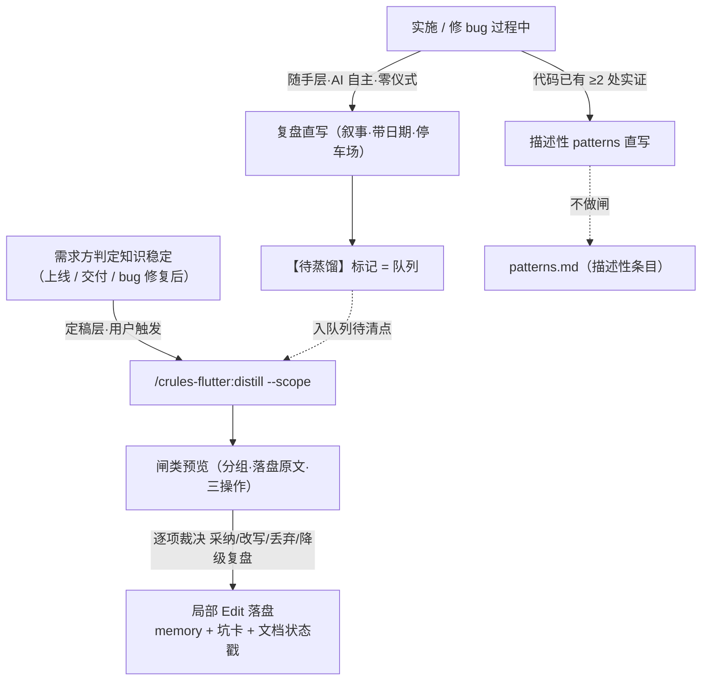
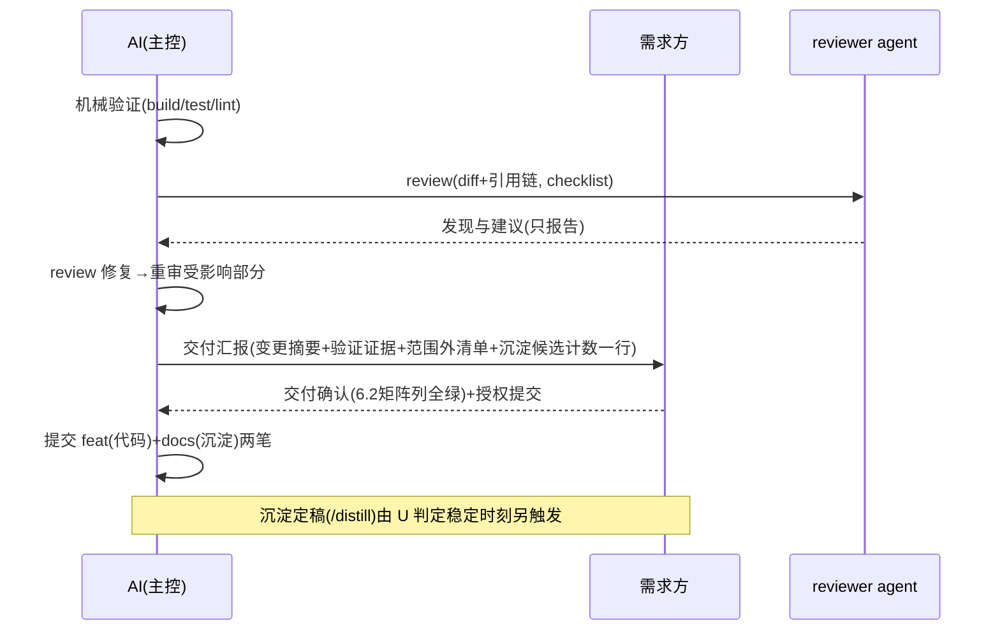

# crules-flutter 易用性与知识沉淀体系设计方案

> 文档状态：讨论稿（待需求方评审）
> 编制日期：2026-09-04 · 基于 0.3.0（commit 161cf92）
> 目标版本：0.4.0（minor）· 落仓：仅 crules-flutter
> 面向对象：本包维护者、消费工程开发者
> 备注：本文档自身按本设计 §4.3 方案骨架写成（元数据头 / 核心决策前置 / 图表化 / 验收标准独立成节）——dogfood 示范；裁剪说明：未用 §3.5 行业参考（机制设计非成熟域方案）、未用 §6.2 自测用例表（机制验收即用例，§7 验收表承载）
> 修订：v2（2026-09-04）——吸收独立评审 21 条（全采纳）+ 探讨追加三项（坑卡归属字段 / skill 坑节预置首批 / 矩阵 init 自动初稿），修订记录见文末

---

## 1 目标与范围

### 1.1 要解决的问题

三个原始痛点 + 探讨中确认的三个延伸域：

| # | 痛点 | 本设计对应 |
|---|---|---|
| 1 | init 之外不知道怎么用（能力存在但不可发现、不可触发） | §4.1 命令层 + 场景地图 |
| 2 | 完成需求后缺知识沉淀落地 | §4.2 沉淀体系 + §4.9 收尾嵌合 |
| 3 | 文档纯文案、可读性差 | §4.3 骨架模板 + §4.4 配图约定 |
| 4 | 重复输入项目背景/同行参考（saas-cashier、美团商家版/银豹/纳客/客如云、芯烨/佳博） | §4.5 reference-map |
| 5 | 各平台坑无处管理（Win7 permission 闪退、iOS 26.x tabbar、Android 版本兼容、Flutter 升级坑） | §4.5 platform-pitfalls + §4.6 检查时序 |
| 6 | code review 内容与时机不成体系 | §4.7 review 增强 |

### 1.2 不做什么（范围外，均有触发条件）

- 不反哺 crules 母版——本包独立演进，通用机制的母版吸收留待另议（fork-coverage 记账）
- 不做轻量模式 / 装配档位——触发条件写死（§4.8），等真实试点观测
- 不做 Stop-hook 硬提醒沉淀——hooks 是本包声明的供应链敏感面，等软规则用出痛感
- 不做 custom_lint 机械化坑检查——二期，等某条坑复现两次且 Gate 拦不住
- 不做 `update-memory --audit` 腐化体检——缓办，等痛感（R1 同款哲学）
- 不动批 3b（saas_pos 瘦身）——继续等新规则稳定运行期
- 不做测试管理系统——自测用例 = 方案文档内 markdown 表

---

## 2 核心决策

1. 落仓仅 crules-flutter，一次 0.4.0（minor）收口。
2. 新命令 ×3：`/crules-flutter:help`（场景使用地图）、`/crules-flutter:distill`（沉淀定稿，用户触发，支持 `--scope`）、`/crules-flutter:diagram`（存量文档补图）——与既有 init / update-memory 组成 5 命令面板。
3. 沉淀闸形态 = 分组预览（**落盘原文**，非摘要）→ 需求方逐项裁决 → **局部 Edit** 落盘；预览含三操作（新增 / 修订 / 建议废弃），禁止并排矛盾。
4. 闸按「**证据在哪**」分流：描述性条目（代码 ≥2 处实证）直写，规范性条目（未来意图，只在人脑中）走闸——代码对「约定」有权威性，对「业务语义」没有，故仅 patterns 享描述性快车道。
5. 触发双层：**随手层**（AI 自主：复盘直写、描述性 patterns 直写、【待蒸馏】标记）+ **定稿层**（用户 `/distill`，判定知识稳定时刻——上线/交付/bug 修复后）；交付汇报只带一行候选计数提示，不强制预览。
6. memory 模板 6 → 8：`reference-map.md`（分域参考系，**只存指针不存结论**）+ `platform-pitfalls.md`（支持矩阵【装完必填第三处·init 自动初稿】+ 结构化坑卡带**归属字段**）。
7. 方案骨架 = **单一模板 + 裁剪档位**（极简 4 节 / 标准 9 节 / 大需求全节+独立评审），载体 = flutter-rules skill 内嵌 + CLAUDE.md 方案 Gate 一行指针——索引常驻、内容懒加载。
8. 配图约定：**人读文档**按内容形态配图（流程→flowchart、调用链→sequence、数据模型→ER、状态流转→state、规则枚举→表格）；**AI 常驻文件**（CLAUDE.md / memory）不加图；`/diagram` 兜底存量。
9. 坑检查挂靠既有 Gate（T0–T5 六时刻，见 §4.6），不设独立仪式；深查按涉平台能力词触发（涉域触发）。
10. review 主工位 = 机械验证后 / 自测前 / 交付汇报呈现前（**交付汇报必含 review 结论**）；范围 = diff 为圆心、引用链为半径；分级触发（极简自查 / 普通 reviewer agent / 涉资损跨模块强制）。
11. 常驻 token 治理 = 晋升制（教训复现 ≥2 或需求方拍板才入常驻；降级**仅人工触发**——复盘 / distill 清点时标记，不设自动判据）+ 加法纪律（新增规则声明常驻行数，>5 行须懒加载方案）。
12. 收尾嵌合：superpowers finishing 的 summarize ≙ 原生交付汇报，**同位等效二选一不双跑**，沉淀候选提示必含；git 动作维持既有降级（按本包 §二「skill 内建 commit/push 一律不执行」）；提交粒度 feat(代码)+docs(沉淀) 分两笔、一次授权。
13. 坑库三维设计：坑卡必填**归属字段**（OS 平台 / Flutter SDK / 三方依赖 / 未定性——**层级归属独立于根因查明可填**，根因黑盒不挡过闸；作 T0–T5 检索键）；skill 平台坑节**初始态 = 维护者策展预置**（必遇域知识出厂自带，三级梯降位为更新流）；支持矩阵 init **三段式自动初稿**（机械读平台目录 + minSdk + Podfile → 人核对 → 人补实测上限）。

---

## 3 现状与差距

### 3.1 现有能力（0.3.0）

| 层 | 现状 |
|---|---|
| 命令 | `/crules-flutter:init`、`/crules-flutter:update-memory`（共 2） |
| agents | 7 角色自动挂载（frontend / backend / i18n / platform / error / reviewer / plan-reviewer） |
| skill | flutter-rules（按需加载的 Flutter 技术规范参考库） |
| hooks | 三件（deny-list 同步自 crules 单一权威等） |
| 模板 | app / plugin 两份 CLAUDE.md（十二节）+ checklist + 进阶 5 篇 |
| memory | 6 模板（NAVIGATION / MAINTENANCE / patterns / business-rules / INVARIANTS / README） |

### 3.2 差距 → 设计映射

| 差距 | 表现 | 映射 |
|---|---|---|
| 能力不可发现 | 7 agents / skill / hooks 何时出场无地图 | §4.1 help |
| 沉淀无流程 | MAINTENANCE「顺手更新」缺结构化通道与质量闸 | §4.2 |
| 方案文档形态随机 | 章节结构随会话波动，读者反复适应 | §4.3 |
| 重复上下文输入 | 项目域 / 同行 / 厂家参考每次手输 | §4.5 reference-map |
| 平台坑靠记忆 | Win7 闪退类事故在 T5 才暴露 | §4.5/§4.6 |
| review 未嵌位 | reviewer 存在但无必经时刻与范围定义 | §4.7 |
| 常驻单向棘轮 | 每次复盘教训固化常驻行，只进不出 | §4.8 |

---

## 4 目标设计

### 4.1 命令层：5 命令面板 + 场景地图

| 命令 | 触发者 | 用途 | 状态 |
|---|---|---|---|
| `/crules-flutter:init` | 人 | 工程接入（落位物安装 + 必填引导） | 已有 |
| `/crules-flutter:update-memory` | 人 | 记忆库索引全量刷新（兜底） | 已有 |
| `/crules-flutter:help` | 人 | **场景使用地图**：什么场景用什么（命令 / agents / skill / hooks / 模板全景 + 收尾时序一图） | 新增 |
| `/crules-flutter:distill [--scope <需求/上线批次>]` | 人 | **沉淀定稿**：闸类预览裁决 + 文档状态戳 + 坑卡提炼 + 【待蒸馏】队列清点 | 新增 |
| `/crules-flutter:diagram <文件>` | 人 | 存量人读文档补图（按 §4.4 图型对照） | 新增 |

help 地图结构（同时是 README 使用面骨架）：`场景 → 动作 → 用什么` 三列表覆盖——新工程接入 / 日常开发（双 Gate）/ 方案写作（骨架）/ 引依赖（坑库×矩阵）/ 交付收尾（review+自测+沉淀）/ 升级（区间穿越）/ 知识维护（distill / update-memory）/ 排障（error agent / 坑库）。

### 4.2 知识沉淀体系（核心）

#### 4.2.1 双层触发模型



#### 4.2.2 入库资格五问（所有条目前置过滤器）

| # | 测试 | 拦截的污染形态 |
|---|---|---|
| 1 | 行为测试：未来会话会因此改变行为吗 | 复述 diff（git 自答的废话） |
| 2 | 自答测试：git log / grep / 读代码能回答吗 | 同上 |
| 3 | 时效测试：一年后还成立吗 | 临时当永久（版本号类事实） |
| 4 | 证据测试：来源链（需求方原话 / 写入点 file:line） | 推测当事实（命名推断） |
| 5 | 归位测试：是 memory 的事吗（协作规则归 CLAUDE.md、代码风格归 skill） | 错家双份维护 |

#### 4.2.3 目的地 × 闸级

| 目的地 | 条目性质 | 闸级 | 必填字段 |
|---|---|---|---|
| `docs/复盘-*.md` | 踩坑叙事 / 演进时间线 | **直写** | 日期 |
| NAVIGATION.md | 机械索引 | **直写** | — |
| patterns.md · 描述性 | 现状如此（代码 ≥2 处） | **直写** | 两处 file:line + 日期 |
| patterns.md · 规范性 | 以后这么写（新决策） | **走闸** | 需求方拍板记录 |
| business-rules.md | 业务事实 | **全走闸** | file:line 或需求方确认+日期 |
| INVARIANTS.md | 硬约束 | **全走闸** | 可执行检查（模板既有字段） |
| platform-pitfalls.md | 坑卡（§4.5） | **走闸**（distill 提炼） | 归属/区间/状态/最后核验/出处 |
| reference-map.md | 新领域参考系 | **走闸**（规范性） | 查证源指针 |

#### 4.2.4 闸运行规则

- 预览展示**落盘原文**（所见即所得，禁摘要），按目标文件分组编号
- 三操作：新增 N / 修订 M / 建议废弃 K——新知识与既有条目矛盾必须消解，禁止并排矛盾
- 裁决选项：采纳 / 改写后采纳 / 丢弃 / 降级到复盘；分组呈现 + 组内逐条标例外
- **局部 Edit** 落盘，禁整文件重写；写前查重，相近条目合并修订
- 闸类**新条目正文** ≤5 行（写不进五行往往没想清楚）；既有模板格式化条目（坑卡、INVARIANTS 带可执行检查等）按其模板字段走，不受此限
- 字段强制 = 结构性过滤器：字段凑不齐自动不过闸

#### 4.2.5 沉淀闸档位（独立字段，与「信任档位」区隔——同靠「仅凭需求方显式声明生效」机制，不同配置项，勿混写）

| 档位 | 语义 | 变更方式 |
|---|---|---|
| 分流（默认） | §4.2.3 表 | — |
| 全闸（收紧） | 蜜月期校准（上线前 N 次建议全闸，人工改写条目 = AI 判准偏差信号）/ 敏感项目 | 随时，需求方声明 |
| 降级宽松 | 规范条目落复盘标【待升格】，等人认领 | 需求方声明 |

「规范条目直写 patterns」**不设档**——信息来源边界，非偏好。档位变更仅凭需求方显式声明（项目附录「协作偏好」的**「沉淀闸档位」字段**一行），AI 不得自行升降档。

#### 4.2.6 两条硬线

1. **无人值守场景**：后台 agent 独立完成的需求——闸类目的地（patterns 规范性 / business-rules / INVARIANTS / 坑卡 / reference-map）一律不写，复盘直写等人回来过闸；**NAVIGATION 机械索引豁免**（保持索引与文件同步防检索断链，内容漂移由 `/crules-flutter:update-memory` 兜底）
2. **演进/时间线**：只进人读文档（可配 mermaid timeline）；memory 只收无时间态规则 + 一行历史佐证注脚

### 4.3 方案骨架模板

**单一模板 + 裁剪档位**，进 flutter-rules skill（写方案时按需加载），CLAUDE.md 方案 Gate 节加一行指针（常驻 +1 行换检索确定性）。**可达性前提**：SKILL.md frontmatter `description` 同步补「写设计方案 / 出方案」触发词——description 是 skill 自动出场的唯一开关，不扩则骨架永不可达。

```text
# <方案名>
> 状态（讨论稿→已确认→已落地/已废弃·指向取代者）· 日期 · 关联需求 · 面向对象

1 目标与范围        要解决什么 / 不做什么 / 老行为变更清单        [需求 Gate ①②③④]
2 核心决策          编号，每条一句话可独立成立                    [方案浓缩·前置]
3 现状              timeline / sequence / 问题表                  [新功能可整节省略]
3.5 行业参考        参考对象 / 关键做法 / 对本方案的启示 / 出处链接 [涉成熟领域必填·查 reference-map]
4 目标方案          候选对比（含矩阵可行性列）→ flowchart / 组件职责表 / 规则表 / ER / 接口定义
5 影响面            用户 / 数据 / 已有功能 + 平台矩阵影响行         [方案 Gate ⑤]
6 测试与验收
  6.1 验收标准表    WHAT——业务级判据                              [需求 Gate ⑤]
  6.2 自测用例表    HOW——前置/步骤/预期/平台(矩阵)/结果证据        [涉平台/资损强制]
7 分阶段落地        大需求保留                                     [裁剪点]
8 风险与回退                                                      [方案 Gate ⑦]
9 待确认事项        问题 / 责任 / 是否阻塞                         [需求 Gate ⑥]
```

**裁剪档位**：极简改动 = 1/2/6.1/8 四节；标准 = 全 9 节；大需求（新页面/跨模块/多端）= 全节 + 独立评审（既有规则）。

**6.2 自测用例表的生命周期**：方案期写（test-first 前移，写不出用例 = 验收标准不合格）→ 交付期执行（结果列挂 §四证据分级，矩阵列全绿 = 完成定义达标）→ 回归期复用（修 bug / 升级后重跑，成为功能常驻回归资产）。可自动化项优先固化真测试代码，表内记指针。

**行业参考查证纪律**：参考条目必须查证带链接出处；查不到标「未查证·凭记忆」——防 AI 凭训练记忆编造同行行为。

### 4.4 配图约定与 /diagram

| 内容形态 | 图型 |
|---|---|
| 流程 / 决策 | flowchart |
| 调用链 / 交互时序 | sequenceDiagram |
| 数据模型 | erDiagram |
| 状态流转 | stateDiagram |
| 演进编年 | timeline |
| 规则 / 枚举 / 对比 | 表格 |
| 命名 / 协议 / 正则 | 代码块 |

边界：**AI 常驻上下文文件不加图**（CLAUDE.md / memory——图对 AI 无增益、白耗每会话 token）。`/diagram <文件>` 服务存量文档与人工审后补图，流程内置机械守门：目标命中 CLAUDE.md / memory/* 时**显式拒绝并说明原因**，不静默跳过。

### 4.5 memory 扩容 6 → 8

**`reference-map.md`（第 7）——分域调研参考系**

```markdown
# reference-map.md · 分域调研参考系
> 用途：需求/方案涉及成熟领域时先查本图——看谁、查什么、去哪查。
> 纪律：只存指针不存结论（结论会过期，指针指向活的源）。
## 项目域：saas-cashier · 餐饮 SaaS 收银（Android / iOS / Windows 多端）
## 餐饮 SaaS 产品参考：美团商家版 / 银豹 / 纳客 / 客如云 —— 官网功能页 / 帮助中心
## 打印领域：芯烨 Xprinter / 佳博 Gainscha —— 云打印协议 / ESC/POS / 厂家开放平台
## 平台坑调研源：Flutter issue tracker / 包 repo issues / 平台厂商文档
```

触发：涉成熟领域做方案时读（NAVIGATION 索引）；维护走 distill 闸（新参考系 = 规范性条目）。分工：技术栈参考 → flutter-rules skill；业务域参考系 → reference-map。

**`platform-pitfalls.md`（第 8）——平台坑库**

头部 = **支持矩阵【装完必填·第三处】**——模板只发占位符（`【待填·init 三段式生成】`，**不含版本数字**——防快路径照抄使占位符消失、顶回兜底失效；格式示例放 init.md 文档内），**禁止预填任何具体值**（模板面向任意工程，预填 = 静默错判据；项目真值装完由该工程填入自己那份）。init 三段式生成初稿：①**机械读**（平台目录存在性 + `android/app/build.gradle` minSdk + `ios/Podfile` `platform :ios`；间接引用如 `flutter.minSdkVersion` 解析到具体值；覆盖 groovy / Podfile 标准工程，`build.gradle.kts` 等变体或解析失败 → **保留占位符 + 报告未解析原因**，不瞎填）→ ②**人核对**（生成了目录但从未发版的平台划掉；构建下限 ≠ 实际支持下限的改正）→ ③**人补**（实测上限 + 现场设备实态——工程内查不到的测试 / 业务事实，通常一行）。**消费端兜底**：坑检查读到占位符 = 判据缺失，当场顶回「请先填矩阵」，不静默盲查；矩阵与 build.gradle / Podfile 打架 = 配置漂移信号，须报告。
条目 = 结构化坑卡（模板为**全字段权威**——症状 / 规避必填、根因查明后填；归属字段为 T0–T5 检索键，§4.2.3 闸表标注的是关键校验子集）：

```markdown
## [<暴露平台>] <一句话症状>
- 归属：OS 平台 / Flutter SDK / 三方依赖 / 未定性 ← **层级归属，独立于根因查明可填**（提闸必填，T0–T5 检索键；「未定性」不参与 T1/T3 精确检索、T2 可见）
- 触发场景：<何时踩到> ｜ 症状：<现象> ｜ 根因：<查明后填> ｜ 规避：<换库/条件引入/钉版本等>
- 区间：<平台 × 依赖或 SDK × 版本，交叉积>
- 状态：未修复｜已修复于 vX（不删卡，老环境仍在） ｜ 最后核验：<日期>
- 出处：复盘链接 + 官方 issue
```

> 示例条目（Win7 permission_handler 卡）已移入 skill 平台坑节预置首批——框架级通用坑住 skill，项目模板不自带样例。

**三级梯**（降位为**更新流**）：复盘直写（停车场）→ `/distill` 提炼坑卡入库（闸）→ 跨项目复现/框架级 → fork 维护者提名进 skill 平台坑节。通用性住 skill，相关性住项目。

**初始态 = 维护者策展预置**：必遇域知识不等各消费项目自己踩（Flutter 开发出厂就该知道 iOS 26.x tabbar 这类坑）——skill 平台坑节出厂自带首批，按归属分三节：

| 归属 | 首批条目 | 来源与查证 |
|---|---|---|
| 三方依赖 | permission_handler × Win7 启动闪退 | 实证复盘（原模板样例卡升格） |
| Flutter SDK | iOS 26.x tabbar/draw 渲染问题 | 实证 + Flutter issue tracker 查证补区间 |
| OS 平台 | Android 高频版本兼容基线（scoped storage / photo picker / back gesture 等，**允许一卡多区间合并**守 ≤10 配额） | 调研补齐，官方文档出处 |

入预置门槛（满足其一，防 stale 大杂烩）：①我们 / 同行实证踩过 ②官方 issue / release notes 明示版本区间 ③常见矩阵区间内高概率触发；每条带出处与「最后核验」，查不到出处的标「未查证」**不预置**；首批 ≤10 条宁缺毋滥。
**维护义务**（进 README 维护节）：Flutter / 平台大版本出现 → 扫 skill 坑节标【待重验】→ 核验刷新——此后每次 minor 的例行内容（「技术栈相关 → 只进本包」查表逻辑）。

**时效**：已修复不删（标「已修复于 vX」——老版本环境仍在）；项目坑库同规则。
**系统性防线**：坑卡治标，前置 Gate 治本——「原生依赖引入前过坑库×矩阵检查」可升格 INVARIANT（带可执行检查：checklist 项 + 引依赖 Gate 步骤）。

### 4.6 坑检查时序（T0–T5）

```text
T0 方案 Gate ──► T1 引依赖 Gate ──► T2 写平台代码 ──► T3 升级 Gate ──► T4 发版 ──► T5 踩坑回写
 改设计免费      换库钉版本         写码时避开        升级前预知      最后防线      供前五者用
```

T0 内部三道工序：**需求 Gate 粗筛**（支持矩阵入「已知约束④」，一行成本）→ **选项生成细筛**（候选方案逐个过坑筛，选项卡呈现的候选集不含矩阵死路 + 对比表含矩阵可行性列）→ **文档落点**（§5 平台矩阵影响行）。
T1 = 既有「外部依赖先确认」红线 +1 步（坑库×矩阵筛**归属=三方依赖**卡 + 包 issue 区按平台筛）。
T2 = 涉域触发（NAVIGATION 索引坑库）+ skill 平台坑节（预置首批在此消费）。
T3 = 坑库筛**归属=Flutter SDK**卡做版本区间穿越 + 重跑相关自测用例；矩阵 / targetSdk 变化时筛**归属=OS 平台**卡。
T4 = 【待重验】清零 + 矩阵全平台冒烟。
T5 = 复盘直写 → distill 提炼。
深查按涉平台能力词触发（权限/打印/蓝牙/后台/通知/文件系统/硬件）；纯 Dart 层需求免仪式。

### 4.7 review 增强

**时机主工位**（嵌交付流水线，非独立仪式）：

```text
方案 Gate ──► 实施 ──► 机械验证 ──► ★review ──► 自测执行 ──► 交付汇报 ──► 授权提交
(plan-reviewer)   (AI边写边自查)  (build/test   (主工位)   (6.2×矩阵)  (必含review   (feat+docs
                                  /lint/CI)                           结论+证据)    两笔)
```

- 卡位理由：review 是静态问题的最晚便宜点；先审后测省一轮真机重跑
- **交付汇报必含 review 结论**（做进完成定义）
- 三个特殊时机：后台 agent 完成即审（§六 diff 展示即 review 面）/ 大需求分阶段节点审 / review 修复后只重审受影响部分
- 分级：极简改动 = 主 agent 对照 checklist 自查；普通需求 = reviewer agent 独立上下文 + 人审关键 diff；涉资损 / 跨模块 = 强制 reviewer agent + 人审
- **与进阶/工程化流程的关系**：两阶段审查指实施前 plan-reviewer（方案评审，既有闭环）+ 实施后 reviewer（代码评审，即本主工位）；工程化流程 §5 两轮（规范合规 / 代码质量）= 本主工位 review 的内部结构，其「两阶段都通过后执行最终编译校验」对齐为「review 修复后的复验」——两文件表述同步改（见 §5）；**交付汇报单一权威** = 根规则 §三「交付汇报」概念 + 工程化流程 §7 模板为载体（模板并入 review 结论位与沉淀候选位，消解双权威）

**范围定义**：diff 为圆心、**引用链为半径**——改共享物（组件/签名/公共配置/文案 Key）时引用点全工程级纳入（教训：只分析被改文件校验不到其他调用方）。

**checklist 增补**（既有实为 9 类、编号 0–8，见 `checklist.md`「通用 Review Checklist」节——实施时逐项差集标注「并入既有条 / 新增 / 改写」，验收看标注归位，不做「8 大类」计数假设）：

| 增补项 | 要点 |
|---|---|
| 吞异常形态学 | `catch (_) {}` / catch 无日志 / unawaited Future 静默失败 / errorBuilder 返回空不记录；处置三态：处理 / 上抛 / 记录后降级，禁止第四态（吞） |
| 资损红线 | 金额计算（精度/舍入）、幂等（重复提交/重试）、状态机非法迁移、并发扣减——涉钱 diff 强制 |
| 关键节点日志 | 资损线（支付/订单/打印/同步）结构化日志带追溯上下文（orderId 等） |
| 敏感数据交叉引用 | 日志红线撞敏感红线：orderId 可记，token/密钥/完整卡号永不入日志 |
| 边界场景 Flutter 化 | null / async 时序（取消/竞态）/ 生命周期（dispose 后回调）/ 弱网离线 / 超长列表 / 权限拒绝 / 多语言长度 / 平台矩阵各端 |
| 兼容性硬判据 | 老行为变更清单（方案 §1）外的行为变化 = 回归 bug |
| 机械项归位 | analyzer/lint 违规归 CI 基线，不占人审注意力 |

### 4.8 常驻 token 治理（遵循度）

**晋升制**（治「单向棘轮」——每次教训固化常驻行只进不出）：

```text
新教训/新规则 → 先落复盘（懒加载，零租金）
  ↑ 晋升（二选一）：同类教训复现 ≥2 次 / 需求方拍板「必须常驻」
  ↓ 降级：仅人工触发——复盘 / distill 清点时人工标记「从未被引用」→ 降回进阶/ 或归档（无引用数据源，不设自动判据）
```

**加法纪律**（本包治理新规，管维护者自己）：任何新增规则须声明——①常驻行数（>5 行必须给懒加载方案）②enforcement 机制（hook / gate / 结构槽位 / 纯 prose——纯 prose 额外警惕）③晋升证据。**优先做成结构而不是 prose**：沉淀步做进命令流、配图做进骨架槽位、参考系做进 memory。

**轻量模式不做**，触发条件写死：真实试点实测常驻 >15K tokens，或同一红线级规则被跳过 ≥2 次 → 届时启动瘦身/档位。配套**裁剪指引**：模板标注「个人项目可删 §六/进阶引用/agents 节」，装时人手剪。
**观测挂真实试点**：`/context` 常驻快照 + 「哪些规则被跳过」日志（复盘记一行）+ **skill 触发体积**（description 扩词后出场频率上升，单次加载成本）——试点观察清单组成部分。

### 4.9 收尾时序嵌合



- 交付汇报组成四件：变更摘要（后台 agent 场景 = §六完整 diff）/ 验证证据（分级）/ 范围外问题清单 / **沉淀候选计数提示**（一行：候选 N 条已暂存复盘，待稳定后 `/distill`——提示与仪式分离）
- superpowers 嵌合：finishing-a-development-branch 的 summarize ≙ 原生交付汇报，**同位等效二选一不双跑**，沉淀候选提示必含；merge/PR/keep 选项中的 git 动作维持既有降级（按本包 §二「skill 内建 commit/push 一律不执行」）；优先级链不变（需求方指令 > skill > 默认）
- 完成定义 +1 条判据（约 2 行常驻）：交付汇报含 review 结论与沉淀候选提示；直写类随手、闸类待用户蒸馏；可显式跳过记 Gate 例外

---

## 5 受影响文件清单

| 文件 | 变更 | 量级 |
|---|---|---|
| `app/CLAUDE.md` + `plugin/CLAUDE.md` | 完成定义 +1 判据 / 方案 Gate +1 指针行 / 依赖红线 +1 步（坑库×矩阵）/ 收尾时序注 | 各 ≤10 行（逐项预算 7–9：判据 2 / 指针 1 / 依赖步 2 / 时序注 2–4）；**两模板同源对照改**（孪生警讯） |
| `commands/help.md` | 新增：场景使用地图；头注声明与 README 使用节**同源**（双侧同步，防新孪生） | 新文件 |
| `commands/distill.md` | 新增：沉淀定稿流程（五问 / 闸表 / 三操作 / 档位 / 坑卡提炼含归属字段 / 文档状态戳 / 队列清点） | 新文件 |
| `commands/diagram.md` | 新增：图型对照 + 补图流程 + 常驻文件拒加图守门分支 | 新文件 |
| `commands/init.md` | 必填引导两处 → 三处（+支持矩阵）；矩阵三段式自动初稿（机械读 → 人核对 → 人补） | +1 小节 |
| `skills/flutter-rules/SKILL.md` | 方案骨架全文（裁剪档位 / 图型 / Gate 映射 / 行业参考槽位 / 自测用例表）+ 配图约定 + 平台坑节**预置首批**（按归属三分节）+ frontmatter `description` 补「写设计方案」触发词（可达性前提） | 扩充 |
| `memory/reference-map.md` | 新模板（第 7） | 新文件 |
| `memory/platform-pitfalls.md` | 新模板（第 8：矩阵占位符 + 坑卡结构含归属字段，**不带项目样例**） | 新文件 |
| `memory/NAVIGATION.md` | +2 索引行（新文件触发条件） | 2 行 |
| `memory/MAINTENANCE.md` | 直写/走闸分类 + 【待蒸馏】标记格式 + 坑卡归属说明 | 小节 |
| `memory/README.md` | `twin:mem-files` 表 +2 行（新模板入清单，防漂移） | 2 行 |
| `checklist.md` | §4.7 增补表逐项差集标注（并入 / 新增 / 改写），「8 大类」计数表述改 9 类 | 小节 |
| `README.md` | 使用面重写（场景地图 + mermaid + 5 命令 + 收尾时序图）；落位物表 memory **6→8 点名**；必填**两处 → 三处**；维护节 + skill 坑节维护义务 | 重写使用节 |
| `进阶/审查与复核纪律.md` | review 范围定义 + 主工位流水线 | 小节 |
| `进阶/工程化流程.md` | §5 两阶段审查时序表述对齐（「最终编译校验」= review 修复后复验）+ §7 交付汇报模板并入 review 结论位 / 沉淀候选位 | 小节 |
| `进阶/` 其余关键篇 | 配图示范改造（flowchart / sequence 各 ≥1） | 示范 |
| `进阶/记忆库体系.md` | memory 模板清单 6→8（`twin:mem-files` 另一侧同步） | 2 行 |
| `scripts/install.sh` | 近零改动：glob `memory/*.md` 自动收录新模板（头注无计数硬编码，不动）；+1 行——尾部「下一步」echo 补矩阵必填项（现枚举必填两处，须与 README 三处同步） | +1 行 |
| `scripts/check-imports.sh` | +memory 模板演进提示：按「源侧新增文件 + 两版本间模板 diff」报告，**不做目标全量比对**（项目自定义内容会全成噪音）；KEEP 语义下机制演进靠人合并 | 小节 |
| `scripts/test-self.sh` | 断言扩展：落位 8 模板 / init 三处必填引导 / twin 一致性（MAINTENANCE · memory README · 记忆库体系 vs 实际模板） | 小节 |
| `.claude-plugin/plugin.json` + marketplace json | 版本 bump 0.4.0（commands 自动发现，无注册动作） | bump |
| `CHANGELOG.md` | 0.4.0 条目 | 新增段 |
| `docs/fork-coverage.md` | 本轮边界记账（通用机制不反哺母版的决议） | 追加 |

## 6 分阶段落地

| 批 | 内容 | 验收 |
|---|---|---|
| **批 1 机制与模板** | CLAUDE.md 两模板改 / memory ×2 新模板 + NAVIGATION·MAINTENANCE·memory README / install.sh 头注 / check-imports 提示 / test-self 扩 / commands ×3 + init 改 / 版本 bump + CHANGELOG | test-self 断言全绿（落位 8 模板 / init 三处必填 / **twin 一致性人肉核对**——CI 无 twin 步属既有缺口，本轮不新造，核对记录留痕）；模拟消费态首验 |
| **批 2 内容与命令** | skill 骨架全文 + 配图约定 + **平台坑节预置首批（含调研查证）**+ description 触发词 / checklist 增补（逐项差集标注）/ 审查纪律 + 工程化流程进阶篇 | 骨架可达性验证（新会话写方案实际用到）；checklist 标注归位；预置条目出处齐全（无「未查证」入预置）；「复验」改写同含重跑构建 + 重审（防两文件再生时序矛盾） |
| **批 3 示范与验证** | README 场景地图重写（落位物 6→8 + 必填三处 + 维护义务）/ 进阶配图 / help 地图全量内容 / 消费态模拟首验 + 蜜月期校准启动说明 | README 与实际行为一致；整体走查 |

每批独立可回退（文件级）；批间无硬依赖但建议顺序执行。

## 7 验收标准

| 类别 | 验收条件 |
|---|---|
| 命令面板 | 5 命令全部可用（commands 自动发现，无注册动作）；`/help` 输出全景地图（场景→动作→用什么，覆盖命令/agents/skill/hooks/模板 + 收尾时序） |
| 沉淀闸 | 模拟会话跑 `/distill`：产出分组预览（落盘原文、三操作、出处字段）；裁决后局部 Edit 落盘；描述性条目含两处 file:line；规范性条目必走预览 |
| 直写边界 | 无人值守场景产物只落复盘（memory 无写入）；AI 常驻文件无 mermaid |
| memory | 新装工程落位 8 模板；NAVIGATION 含新增两文件索引及触发条件；坑卡含**归属**/区间/状态/最后核验字段 |
| init 引导 | 必填三处引导存在；矩阵机械读生效（占位符被初稿替换呈「待核对」态；kts / 非常规工程 → 占位符保留 + 未解析原因显式报告） |
| 坑节预置 | skill 平台坑节含三归属分节与预置条目，每条带出处与最后核验 |
| 骨架 | skill 内骨架含裁剪档位 / 图型标注 / Gate 映射 / 行业参考槽位 / 6.2 自测用例表；方案 Gate 指针行存在 |
| review | checklist 增补项逐项标注（并入/新增/改写）且归位；交付汇报模板含 review 结论位与沉淀候选提示位 |
| 常驻纪律 | 两 CLAUDE.md 模板常驻增量各 ≤10 行；**>5 行的新增规则均有懒加载方案**（对齐 §4.8 加法纪律；≤5 行者不强制载体） |
| 一致性 | README 使用面与实际行为一致（0.2.4 教训）；fork-coverage 记账本轮决议 |
| 证据 | 每批交付按 §四分级报告；消费态模拟首验（含旧版 cache 陷阱规避——先 bump 再验） |

## 8 风险与回退

| 风险 | 缓解 | 回退 |
|---|---|---|
| 命令面变复杂（新痛：不知道用哪个） | help 是第一入口；README 场景地图 | 命令独立存在，不装不碍事 |
| 沉淀闸摩擦导致弃用 | 双层触发已缓冲（高频路径零仪式）；蜜月期校准观测弃用率 | 直写层不受影响，砍闸不伤停车场 |
| 坑库/参考系无人维护 | 【待蒸馏】【待重验】标记即队列，distill 清点 | 空库不伤核心流程 |
| 双模板孪生漂移 | 同源对照改 + 覆盖 diff 验收（既有手法） | git 回退文件级 |
| 常驻 token 超标 | 本设计近零常驻（新增全部懒加载）；触发条件已写死 | 晋升制反向运行（降级常驻条目） |
| 规则遵循度不足 | 结构优先（槽位/命令流/Gate 步骤）而非 prose；观测挂试点 | 收紧档位（全闸）过渡 |
| 已装工程拿不到 memory 机制演进（KEEP 语义，0.4.0 改的 NAVIGATION/MAINTENANCE 到不了旧装工程） | check-imports 报告 memory 侧差异、人工合并；**当前零已装工程**（前提声明），属前瞻防线 | README 三步升级引导走 check-imports |
| twin 断言缺位（MAINTENANCE 自称「漂移即 CI 红」但本包 CI 无 twin 步——既有缺口被本设计放大） | 批 1 验收人肉核对 + test-self twin 比对断言兜底；CI twin 步留待痛感再上 | 人肉核对记录 |

## 9 待确认事项

| 事项 | 责任 | 阻塞 |
|---|---|---|
| memory git 分层既有规则与本设计提交粒度（feat+docs 两笔）衔接——核对母版 v61 收口后的单一权威原文 | 维护者 | 批 1 前核对 |
| checklist 既有条目（实为 9 类编号 0–8）未逐条核对，增补按差集设计——实施时逐项标注避免孪生 | 维护者 | 批 2 前核对 |
| 蜜月期 N 取值（建议 5 次 distill）与校准记录位置 | 需求方 | 不阻塞，可后定 |
| 【待蒸馏】标记的具体格式（行前缀标记 vs frontmatter 字段） | 批 1 实施时定 | 不阻塞 |
| 真实试点工程的选择与观察清单启动（含 /context 快照） | 需求方 | 不阻塞本设计，阻塞触发条件评估 |
| 预置首批调研条目清单定稿（Android 兼容基线收录哪些）与查证时间盒 | 维护者 | 批 2 前 |

---

## 修订记录

- **v2（2026-09-04）**：吸收独立评审 21 条（🔴2 / 🟡9 / 🟢10，全采纳）。要点：#1 矩阵改占位 + 装完必填第三处 + 坑卡样例移 skill；#2 check-imports 加 memory 演进提示 + 零已装前提声明；#3–#5 §5 补 9 文件 / checklist 按实数 9 类差集标注 / 工程化流程两阶段时序与交付汇报权威对齐；#6–#11 description 可达性 / ≤5 行限定闸类新条目 / 无人值守硬线豁免机械索引 / 懒加载口径改 >5 行 / 降级仅人工触发 / twin 缺口记账；🟢 类措辞与验收口径同步（#21 基线 161cf92 已核属实）。探讨追加三项：坑卡**归属字段**（OS 平台 / Flutter SDK / 三方依赖，T0–T5 检索键）、skill 坑节**预置首批**（初始态 = 维护者策展，三级梯降位为更新流）、支持矩阵 **init 三段式自动初稿**（机械读 → 人核对 → 人补）。
- **v2.1（2026-09-04）**：消解复审**技术通过**（21/21 已消解，三项追加修订无新增 🔴）——复审新发现 N1–N8 顺手消解：install.sh「下一步」echo 补必填项入清单（近零改动 → +1 行）/ 矩阵占位符去版本数字（`【待填·init 三段式生成】`）/ 机械读加失败分支与 kts 变体处理 / 归属 = 层级归属独立于根因查明可填 + 「未定性」逃生阀 / 坑卡模板定为全字段权威（症状·规避必填）/ skill 触发体积入观测 + Android 基线一卡多区间 / check-imports 按源侧 diff 报告 / 行数预算 7–9 + 「复验」同含重跑构建与重审。
