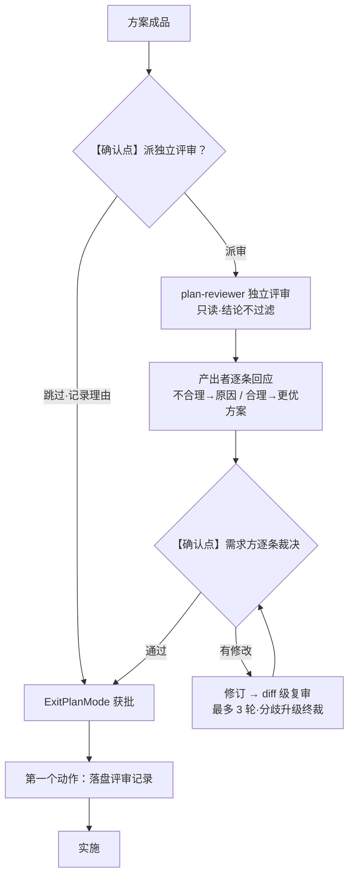

# 方案评审闭环

> **fork 声明**：本篇 fork 自 crules `v74-fork-base`，由 crules-flutter 独立演进。

> **启用条件**：大需求（新页面 / 跨模块 / 多端 / 大重构）要对实现方案做独立技术评审时按本篇走。极简改动（单字段 / 文案 / 明显单点修复）**跳过**，走 项目根 `CLAUDE.md` §三 简化流程。
> 配套根规则：项目根 `CLAUDE.md`。本篇是根规则「方案 Gate」在大需求上的**强化**——用独立 agent 评审增强人工确认。
> **记忆库关时**（轻量档 / 无 memory 基线）：评审输入 = 方案文档 + 代码现状，无 memory 可引——角色卡「启用记忆库时对照」两条款自然退化为不触发，不阻断本篇启用。
> **与代码审查的区别**：本篇审**方案**（实施**前**）；[`审查与复核纪律.md`](审查与复核纪律.md) 审**代码**（实施**后**）。两者角色、纪律、时机均不同，不混用。

---

## 核心区分

| 维度 | 方案评审（本篇） | 代码审查（审查与复核纪律） |
|---|---|---|
| 时机 | 实施**前** | 实施**后** |
| 对象 | 方案文档（PRD / spec / 任务拆分 / 实施计划） | 代码变更（commit / 文件） |
| 评审者 | `plan-reviewer`（独立上下文，**只读**） | `reviewer`（**只报不改**，修复由主控执行、需求方裁决） |
| 目的 | 方案是否站得住、有无更优解、风险是否暴露 | 代码成立 ≠ 业务可达、规范 / 质量是否达标 |

---

## 为什么需要

根规则 §三 的方案 Gate 由**需求方人工确认**——人审在，能拦方向错误。但缺一个维度：**独立技术评审**。主控自产方案、自交确认，没有第二个技术视角检查方案的可行性、遗漏、更优解。本篇补这个维度：派一个**看不到讨论过程、只看方案成品**的独立 agent 做技术评审，结论不被主控过滤。

> 不是「人审不够」，而是「人审 + 独立技术审」两层叠加：人审拦方向，技术审拦方案本身的技术漏洞。

---

## 技术边界：信息隔离，非物理绕过

Claude Code 里所有 subagent 都由主对话（主控）派发，物理上不存在「绕过主控的第三方」。「独立」靠**信息隔离**实现，对方案评审足够：

- 派发**独立上下文** subagent（看不到主对话历史）
- prompt 里**只喂方案文档成品**，不喂「方案怎么产的、谁的倾向、讨论过程」
- 评审结论**不经主控复核过滤**；plan-reviewer 无 Write 工具，结论作为返回值由主控**原样落盘**（主控只做机械转写，不修改 / 不过滤）

> 这与代码 `reviewer` 的「主控复核」（见 [Agent编排.md](Agent编排.md)）**显式区分**：代码 reviewer 结论经主控复核才上报；方案评审**不走复核**，直接落盘——一过复核就被稀释，失去「独立」意义。

---

## 角色四分

| 角色 | 由谁担任 | 职责 | 关键约束 |
|---|---|---|---|
| **方案产出者** | 主控（或 spec-kit） | 产方案文档；读评审**逐条回应**：不合理→给原因；合理→有无更优方案，有则给方案 + 原因 | 回应阶段**只提议不改**方案文档；需求方裁决后才改 |
| **第三方评审** | 独立 subagent `plan-reviewer`（见 `agents/plan-reviewer.md`，部署位 `.claude/agents/`） | 只读方案（启用记忆库时，对照 `memory/business-rules.md` 查业务假设 + `memory/INVARIANTS.md` 查不变量破坏），输出评审内容（返回值） | **只评审、不改码、不产方案、不调用修改工具** |
| **派发 / 转交** | 主控 | 派发评审 subagent；**原样落盘评审文档**（只机械转写返回值，不修改 / 不过滤）；转交评审文档给产出者与需求方 | **不过滤评审结论** |
| **裁决** | **需求方** | 确认改哪些；确认是否通过、是否进下一阶段 | 唯一有权拍板 |

---

## 闭环流转

```text
0. 【确认点】方案产出后，主控停下来问需求方「是否派独立评审？」——默认必须派审，仅需求方明确选择跳过才跳过（按 Gate 例外记录理由，方案 Gate 仍须走完）
1. 方案产出者输出方案文档（方案 Gate 产物 / PRD / spec / 任务拆分）
2. 主控派发第三方评审（独立上下文 subagent，prompt 只喂方案成品）
3. plan-reviewer 输出评审内容（返回值）；Plan 模式期间评审原文存会话，暂不落盘
4. 方案产出者读评审结论，逐条回应：
     · 评审不合理 → 指出 + 给原因
     · 评审合理   → 有无更优方案？有 → 给方案 + 原因（只提议，不改方案文档）
5. 【确认点】需求方逐条裁决（选项卡）；结论呈现后主控显式停下等待，禁止径直进实施
6. 改完 → 下一轮评审（可 diff 级）→ 循环
7. 判据：评审结论在手且无待消解项 + 需求方明示通过 → ExitPlanMode 请求批准 → 获批后第一个动作落盘评审记录 → 进实施
```



> 全程在 Plan 模式内：`EnterPlanMode` 进、`ExitPlanMode` 需求方批准才放行。Plan 模式拦一切写入（含 docs/），故评审原文在会话内流转、获批后统一落盘——多轮中间版本只存会话，最终一次性落盘（含首轮）。

### 循环守卫（防卡死）

- **最多 3 轮**：到第 3 轮仍有 🔴 未消，停止循环，把分歧点列清交需求方终裁（不再评审者 ↔ 产出者拉锯）。
- **同一问题反复**：评审者与产出者就同一点持续分歧，立即升级需求方裁决，不就地消耗。
- **消解 ≠ 闭环**：消解本身是修改动作，可引入回归（实战 13 条消解 2 条带新缺口）。每轮消解后必须复审（可 **diff 级**——只评本轮改动），直到评审结论为「无须消解」才进实施；把「没动码」当「没推进」是弱化重犯——闭环判据是**评审结论到手且无待消解项**，不是主控自评来得及改

---

## 评审纪律（钉死）

`plan-reviewer` 角色卡与每份评审文档头部**均声明**：

> **只评审、不修改**被评审方案 / 代码；**只输出**建议 / 方案 / 发现；**不调用**任何修改工具（Edit / Write / NotebookEdit / 写性 Bash）。

工具锁由角色卡 frontmatter 的 `tools` 字段强制。默认 `Read, Grep, Glob`（审纯方案足够）；**需联网查证时，在角色卡 frontmatter 的 `tools` 追加 `WebFetch, WebSearch`**（是改角色卡，非运行时切换）——默认不联网，避免评审者跑题做外部调研。

---

## 评审验证纪律（多轮防同轴空转）

多轮评审最大的浪费不是漏验，是**同轴空转**：后轮以前轮修正表为复核纲，参数越验越细，前提本身没人验过一遍——精度的累积伪装成真相的累积。四条（实证：消费工程挂账管理复刻设计五轮复盘，2026-10-09——四起事实错误其一存活四轮）：

1. **验边不验节点**——「A 用 X」类断言，实体存在性（接口在、参数对、行号准）≠ 关系存在性（A 真的调 X）；验边只需一次消费侧调用方反查（grep 消费模块，命中 0 即断言死）。**范围问题不得降级为参数问题**——「这接口根本不属于这个模块」被降级成「默认值传什么」写进开放点，等于给雷盖「已审」章（实证 E4：creditStatistics 统计条——接口与参数四轮验真、页面调用边零验，虚构前提存活四轮，第五轮需求方业务提问「交接班是否该模块前提？」换轴穿透；雷的坐标四轮前就写在文档自己的实参注释里）
2. **多轮换轴不重复**——复核纲不得 = 上一轮修正表（沿袭即锚定）；轴序参照：存在性 → 调用关系 → 因果反例（业务前提追问）→ 结构正向枚举。同轴加深（参数 → 更细参数 → 行号）不产出新真相
3. **负证据检查**——验证计划须含预期可能失败的检查（「这页面应该调它——去证实」）；**不能 fail 的 check 组不成验证计划**。特化先例：变异抽查（代码审查面）、closure 五类负证据行（parity 面），此处为方案验证面泛化形
4. **未核实前提不裸进结构化产出**——进了表格 / 开放点，外观上与已核实事实无法区分（结构化背书）；须带「已核实 / 推断」态标注，对齐项目根 `CLAUDE.md` 假设显式化

---

## 落档前独立确认轮（重大评审 / 复盘结论）

**动机**：同上下文复查带锚定包袱，「每次复查都抓出新毛病」的长尾收不住（实证：上述复盘 E3 存活 2 轮，复盘自查又抓出自身计数 / 措辞 2 处——**复盘自身也是产出，同样会错**）。独立上下文的子代理没有这条包袱。

1. **触发**：重大评审结论 / 复盘结论**落档前**，派独立子代理对全部事实主张逐条回源确认（计数、行号、唯一性断言、引文逐字、内部一致性）
2. **隔离要求**：任务单只给「待核文档路径 + 核验清单 + 代码路径 + 陷阱提示」，**不给「我们认为是对的」预设**；需跑检索的用带 Bash 的只读型子代理（纯文本核验可用 `plan-reviewer`）
3. **轮次上限 3 轮**：某轮**零新发现即提前收敛**（不凑轮数）；3 轮耗尽仍有新发现 → 停止循环**升级需求方**——产出存在结构性问题，重做而非继续抓虫
4. **台账**：每轮结论（含「零新发现」）记入结论文档末节，含子代理类型与证据摘要

> 先例：本篇 `plan-reviewer` 隔离评审（无 Bash 形态）；本机制补「带 Bash 可回源」确认形态并制度化。与「不引入多模型评审」（代码审查侧裁决）不冲突——彼指第三模型重复审码，此为**结论文档事实主张**的回源确认，不同对象。

---

## 适用范围

- **走**：大需求（新页面 / 跨模块 / 多端 / 大重构）——与 [工程化流程.md](工程化流程.md) §1 一致。
- **跳过**：极简改动（单字段 / 文案 / 明显单点修复）——派评审 agent 成本不值。

> 本篇属**工程化 / 重度流**。收尾任务档之极简档（任务轴）不启用本篇完整闭环——判据即本篇启用条件节「极简改动跳过」，不扩至标准档；**项目档位**（根规则 §十二 三档）不改变本篇启用条件——任何档位的大需求要方案独立评审均按本篇走（轻量档预设亦「plan-reviewer 大需求仍启用」，同源 `CLAUDE.md` §十二）。根规则 §三 的人工方案 Gate 仍是完整兜底。

---

## 设计取值

| 设计点 | 取值 | 理由 |
|---|---|---|
| **方案产出者** | 保持主控（或 spec-kit） | 评审者独立即满足「无利益关联」；要极致分离再拆专门 planner，简化起见不必 |
| **「完全通过」标准** | 无 🔴 = 技术通过，但仍**须需求方确认**才进实施 | 防评审与产出者达成共识、但方向本身错；需求方是领域专家，终裁归需求方 |
| **结论是否过主控复核** | **不过** | 信息隔离的核心；一过复核就被稀释，失去独立意义 |

---

## 与 spec-kit 的交集（待实测）

spec-kit 管 spec / constitution 产出，可能自带评审或验证步骤。启用 spec-kit 时：

- 若 spec-kit 自带方案级评审 → 评估能否替代本篇，避免重复
- 若 spec-kit 只产 spec 不评审 → 本篇 `plan-reviewer` 审 spec-kit 产出的 spec

> 具体「替代 / 互补」**待 spec-kit 实测后补充**。当前默认按「互补」处理：spec-kit 产 spec，plan-reviewer 审它。

---

## 落盘约定

- **落盘时机**：`ExitPlanMode` 获需求方批准后的**第一个固定动作**（Plan 模式拦一切写入含 docs/，评审原文在会话内流转，获批后统一落盘；方案文档内写明「第一步：落盘评审记录」）
- **落盘产物**：独立文件 `docs/评审-plan-<feature>.md`，含**各轮评审全文**（含首轮）与裁决记录，迭代标 v1 / v2 / …（与 `docs/评审-vN.md` 同风格）；方案文档只留路径 / 摘要，不承载评审正文
- 评审文档头部声明评审纪律（见上「评审纪律」）
- **写盘执行者**：plan-reviewer 无 Write 工具，评审文档由主控**原样落盘**（只机械转写返回值，不修改 / 不过滤）——独立性靠纪律保证，非靠 plan-reviewer 自己写盘
- **落盘即报**：落盘收尾必须附**文档名 + 可点击完整路径**（markdown 链接），需求方点开直接审阅
